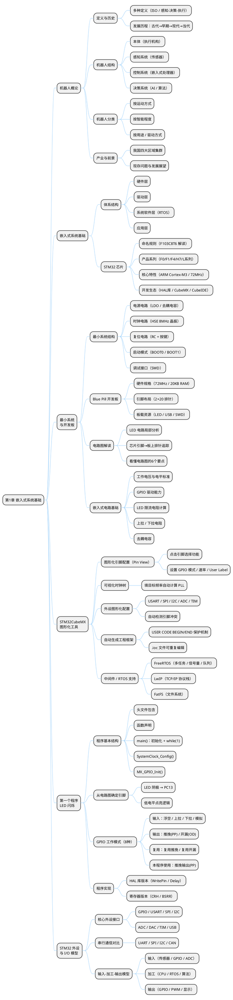

## 1 第 1 章 机器人系统基础

### 1.1 本章知识导图




**图 1-1** 从上述流程图可以看出本章知识导图的关键步骤与判断逻辑，这对正确实现相关功能至关重要。
<!-- fig:ch1-1 从上述流程图可以看出本章知识导图的关键步骤与判断逻辑，这对正确实现相关功能至关重要。 -->

### 1.2 课程学习的意义


**表 1-1** 学习机器人控制技术，能建立从**普通思维**到**计算机思维**，再到**机器人思维**的认知升级：
<!-- tab:ch1-1 学习机器人控制技术，能建立从**普通思维**到**计算机思维**，再到**机器人思维**的认知升级： -->

| 思维层次 | 解题示例 | 核心方法 |
|----------|---------|---------|
| 普通思维 | 代数求解 $y=f(x)$ 极值 | 数学公式推导 |
| 计算机思维 | 暴力搜索 / 梯度下降求极值 | 算法 + 算力 |
| 机器人思维 | 小车沿黑线行驶的 PID 控制 | 传感器 + 控制 + 执行 |

---

### 1.3 嵌入式系统的体系结构

嵌入式系统作为一种专用的计算机系统，其基本构成同样是**硬件和软件的综合体**。体系结构框架由下至上分为四个层次：

```bob
  ┌─────────────────────────────────────────────────┐
  │       "应用软件层 (Application Layer)"           │
  │  机器学习 / PID控制 / SLAM / 状态机             │
  ├─────────────────────────────────────────────────┤
  │       "系统软件层 (RTOS Layer)"                  │
  │  FreeRTOS / uCOS-II / 网络栈 / 文件系统         │
  ├─────────────────────────────────────────────────┤
  │       "中间层 (BSP / HAL)"                       │
  │  硬件抽象层 / 设备驱动 / 寄存器封装             │
  ├─────────────────────────────────────────────────┤
  │       "硬件层 (Hardware Layer)"                  │
  │  MCU + 存储器 + 时钟 + 电源 + GPIO + 通信外设   │
  └─────────────────────────────────────────────────┘
```


**图 1-2** 上图直观呈现了嵌入式系统的体系结构的组成要素与数据通路，有助于理解系统整体的工作机理。
<!-- fig:ch1-2 上图直观呈现了嵌入式系统的体系结构的组成要素与数据通路，有助于理解系统整体的工作机理。 -->

**表 1-2** 嵌入式系统的体系结构
<!-- tab:ch1-2 嵌入式系统的体系结构 -->

| 层次 | 对应通用计算机 | 嵌入式系统中的具体内容 |
|------|--------------|----------------------|
| 硬件层 | 硬件系统 | SOC/MCU、Flash/SRAM、GPIO、ADC/DAC、定时器 |
| 中间层 | 设备驱动 | BSP/HAL 库封装，隐藏寄存器细节 |
| 系统软件层 | 操作系统 | RTOS（FreeRTOS）、LwIP 网络栈、FatFS 文件系统 |
| 应用软件层 | 应用程序 | PID 控制、卡尔曼滤波、SLAM、机器学习 |

具体组成推导如下：

1. **硬件层**：相当于计算机的硬件系统。在嵌入式系统中，它主要包含微处理器（如 SOC 单片机）、存储器（ROM、RAM/Flash）以及外部设备和 I/O 端口等，是整个系统运行的物理与物质基础。
2. **中间层（BSP/HAL 硬件抽象层）**：这是嵌入式系统特有的承上启下层。由于嵌入式硬件种类繁多，中间层负责将硬件接口细节隐藏抽象化，相当于为上层的操作系统提供了一个统一的虚拟硬件平台，包含了底层硬件的初始化、设备驱动等功能。
3. **系统软件层**：对应通用计算机的操作系统。在嵌入式系统中，主要运行嵌入式实时操作系统（如 uCOS Ⅱ、FreeRTOS）、网络系统、文件系统及各种通用组件模块，负责系统资源的高速、并行调度及容错处理。
4. **应用软件层**：对应通用计算机的应用软件。它直接面向具体的应用需求，例如包含诸如机器学习、人工智能等"大脑"功能算法，或者 PID、卡尔曼滤波器、运动姿态控制等"小脑"功能算法。

---

### 1.4 最小嵌入式系统结构

**最小系统（Minimum System）** 是指能让微控制器正常上电运行、并可与外部进行基本通信的最简硬件电路集合。它是所有嵌入式产品的设计起点，只要最小系统工作正常，便可在此基础上扩展任意外设。

STM32 的最小系统由以下五个核心部分组成：

**表 1-3** 最小嵌入式系统结构
<!-- tab:ch1-3 最小嵌入式系统结构 -->

| 组成部分 | 作用说明 |
| ---- | ---- |
| **微控制器（MCU）** | 系统核心，执行程序、协调所有外设 |
| **电源电路** | 提供稳定的 3.3V 工作电压，含滤波去耦电容 |
| **时钟电路（晶振）** | 为 MCU 提供精确的工作频率基准 |
| **复位电路** | 上电自动复位或手动按键复位，保证系统从确定状态启动 |
| **输入/输出接口** | 调试烧录接口（SWD）及引出的 GPIO，用于程序下载与外设扩展 |

以上内容归纳了最小嵌入式系统结构的关键要素，为后续深入学习和工程实践提供了参考依据。

#### 1.4.1 最小系统结构图

```bob
                    ┌─────────────────────────────────────────────────────────┐
                    │                  STM32 最小系统                          │
                    └─────────────────────────────────────────────────────────┘

  ① 电源电路                          ② MCU 核心                      ③ 时钟电路（晶振）
  ┌──────────────────┐               ┌──────────────────────┐        ┌──────────────────┐
  │ 外部输入"(5V"USB │               │                      │        │  HSE 高速晶振    │
  │"或锂电池)"       │               │    STM32F103C8T6     │        │  8 MHz           │
  │       │          │               │                      │        │   ┌────────┐      │
  │  ┌────▼────┐     │               │  ┌───────────────┐   │◄───────┤   │ XTAL  │      │
  │  │ AMS1117 │     │    VCC 3.3V   │  │  ARM          │   │"OSC_IN"│   │ 8MHz  │      │
  │  │  3.3V   ├─────┼──────────────►│  │  Cortex-M3    │   │        │   └───┬────┘      │
  │  │稳压芯片 │     │               │  │  72 MHz       │   │"OSC_OUT"│      │           │
  │  └────┬────┘     │               │  └───────────────┘   ├───────►│ 负载电容"(20pF)" │
  │       │          │               │                      │        └──────────────────┘
  │  GND ─┴──────────┼──────────────►│ "VCC / GND"          │
  │                  │     GND       │                      │        ┌──────────────────┐
  │  滤波电容:        │               │"(每组VCC-GND引脚"    │        │  LSE 低速晶振    │
  │  100nF + 10uF    │               │  旁接 100nF 去耦     │        │  32.768 kHz      │
  └──────────────────┘               │ "电容至GND)"         │◄───────┤"(供 RTC 使用)"   │
                                     │                      │        └──────────────────┘
  ④ 复位电路                          │                      │
  ┌──────────────────┐               │                      │        ⑤ 启动配置
  │                  │               │                      │        ┌──────────────────┐
  │  VCC ─┬──────────┼──────────────►│  NRST（复位引脚）    │        │  BOOT0 ─── GND   │
  │  10kΩ │          │               │                      │◄───────┤"(从 Flash 启动)" │
  │       │          │               │  BOOT0               │        │                  │
  │  NRST─┼──────────┤               │  BOOT1               │        │  BOOT1 ─── GND   │
  │       │  100nF   │               │                      │        │"(正常运行模式)"  │
  │  按键 ─┤   │      │               └──────────┬───────────┘        └──────────────────┘
  │       ├───┘      │                          │
  │  GND ─┘          │               ┌──────────▼───────────┐
  └──────────────────┘               │  GPIO"/"外设引脚     │
                                     │  PA0~PA15, PB0~PB15  │
  ⑥"调试/烧录接口 (SWD)"              │  PC13~PC15 等        │
  ┌──────────────────┐               └──────────┬───────────┘
  │  ST-Link 调试器   │                          │
  │                  │               ┌──────────▼───────────────────────────┐
  │  SWDIO ──────────┼──────────────►│        外部扩展（可选）              │
  │  SWCLK ──────────┼──────────────►│ 传感器"/"电机驱动"/"通信模块"/"显示屏│
  │  VCC   ──────────┼──────────────►│"(在最小系统基础上按需添加)"          │
  │  GND   ──────────┼──────────────►└──────────────────────────────────────┘
  └──────────────────┘
```


**图 1-3** 上图以框图形式描绘了最小系统结构图的系统架构，清晰呈现了各模块之间的连接关系与信号流向。
<!-- fig:ch1-3 上图以框图形式描绘了最小系统结构图的系统架构，清晰呈现了各模块之间的连接关系与信号流向。 -->

#### 1.4.2 各部分说明

**① 电源电路**

- 通常使用 **AMS1117-3.3** 或同类 LDO 稳压芯片，将 5V（USB 供电）或锂电池电压稳压至 3.3V
- 每个 VCC 引脚附近需放置 **100nF 去耦电容**（滤除高频噪声）及 **10μF 电解电容**（稳定低频电压），缺少滤波电容会导致 MCU 工作不稳定

**② MCU 核心（STM32）**

- 芯片为整个系统的计算核心，内部已集成 Flash（程序存储）和 SRAM（运行内存），无需外挂独立存储芯片即可运行
- 所有功能模块（定时器、串口、ADC 等）均集成在芯片内部

**③ 时钟电路（晶振）**

- **HSE（高速外部时钟）**：接 **8 MHz 无源晶振**，通过内部 PLL 倍频至最高 **72 MHz** 系统时钟，是 MCU 运行的"心跳"
- **LSE（低速外部时钟）**：接 **32.768 kHz 晶振**，专供实时时钟（RTC）模块使用，保证掉电后时间继续计数
- 晶振两端需各接一个 **20 pF 负载电容**至 GND，否则晶振可能无法起振

**④ 复位电路**

- 由 **10 kΩ 上拉电阻 + 100 nF 滤波电容 + 手动复位按键** 构成
- 上电时电容充电，NRST 引脚先保持低电平完成复位，再拉高进入正常运行；按下复位键可手动重启系统

**⑤ 启动配置（BOOT 引脚）**

STM32 通过 BOOT0/BOOT1 引脚电平决定上电后的启动模式：

**表 1-4** 各部分说明
<!-- tab:ch1-4 各部分说明 -->

| BOOT0 | BOOT1 | 启动模式 | 说明 |
| :---: | :---: | ---- | ---- |
| 0 | × | **用户 Flash** | 正常运行用户程序（最常用） |
| 1 | 0 | **系统存储器** | 进入 ISP 串口烧录模式 |
| 1 | 1 | **内部 SRAM** | 用于调试，程序仅在 RAM 中运行 |

> 正常使用时 BOOT0 通过 10 kΩ 电阻下拉至 GND，保持 Flash 启动模式。

**⑥ 调试/烧录接口（SWD）**

- **SWD（Serial Wire Debug）** 是 ARM 的两线调试协议，仅需 **SWDIO、SWCLK** 两根信号线即可完成程序烧录与在线调试
- 相比 JTAG 的 5 线方案，SWD 占用引脚更少，是 STM32 开发的标准调试方式

---

### 1.5 嵌入式系统的"输入-加工-输出"模型

在嵌入式系统中，"输入→加工→输出"的模型具体体现在底层硬件接口、实时操作系统调度以及上层控制算法的协同工作上。具体涉及的方式和知识如下：

#### 1.5.1 输入信息的方式（Input）

嵌入式系统的输入主要负责感知外部环境、接收用户指令或获取网络数据，具体方式包括：

*   **传感器采集（环境感知）：** 外部物理量通过传感器转化为电信号，再经由微控制器的 ADC（模数转换器）采集，或通过数字接口读取。例如超声波、激光雷达、S3 视觉传感器、麦克风（Mic）等。
*   **人机交互输入：** 通过通用输入输出端口（GPIO）配置为输入模式来读取外部电平变化，如按键（通常配置为上拉输入并配合软件消抖或中断触发），以及触摸屏等设备。
*   **通信接口接收：** 通过串行或并行通信总线接收外部设备或网络的数据。例如通过串口（USART/UART）的 RX 引脚接收 GPS 模块、北斗模块发送的数据，或通过 I2C、SPI、以太网（ETH）、USB 等接口接收外部指令。

#### 1.5.2 加工信息涉及的知识（Process）

加工信息是嵌入式系统的核心，负责对输入的数据进行运算、决策和任务调度，涉及硬件、系统软件和应用算法等多层面的知识：

*   **微处理器硬件机制：** 依赖 CPU 内核（如 ARM Cortex-M3）执行指令，涉及单周期乘法、硬件除法等运算能力，以及通过中断控制器（NVIC）和直接内存访问（DMA）机制实现高效的数据搬运和强实时响应。
*   **实时操作系统（RTOS）：** 涉及多任务并发机制、任务调度策略（如抢占式调度）。需要掌握任务间的同步与通信（如信号量、消息队列、邮箱），以及如何通过"延迟中断处理"机制协调中断服务程序与任务之间的关系（即下半部处理）。
*   **软件架构与驱动（中间层）：** 涉及 BSP/HAL（硬件抽象层）的设计，将底层硬件寄存器操作封装为标准 API，屏蔽硬件接口细节。
*   **控制算法与应用逻辑：**
    *   **"小脑"功能（底层控制）：** 涉及运动控制、姿态控制、经典 PID 控制器（比例-积分-微分）、卡尔曼滤波器等控制理论知识。
    *   **"大脑"功能（高层决策）：** 涉及有限状态自动机（FSM）的 C 语言实现，以应对复杂的控制逻辑状态流转；在更高级的应用中还涉及统计学习、深度学习及 SLAM（同步定位与建图）算法。

#### 1.5.3 输出信息涉及的知识（Output）

输出信息是指系统经过运算后，向外界环境施加影响或展示结果，主要涉及：

*   **执行器驱动：** 根据 PID 等算法计算出的控制量，通过定时器输出 PWM 波或 GPIO 电平翻转，驱动直流减速电机、继电器、自动充放电模块等动力及电源设备。
*   **状态显示与声音反馈：** 控制 LED 灯的闪烁或渐变、扬声器（Speaker）发声、在 LCD/TFT 液晶屏上绘制汉字与图形图像等，用于直观呈现系统状态。
*   **通信数据发送：** 将处理后的数据或状态结果，通过串口的 TX 引脚、或通过网络控制拓扑（如 ESP32、4G/5G 终端、以太网）向云端服务器、上位机或其他节点发送。

---

嵌入式系统"输入-加工-输出"详细构成图如下，展示了信息在嵌入式系统中的流转与各环节的知识构成：

```bob
               【嵌入式系统的通用任务模型映射】

====== 1. 输入信息"(Input)"======        ====== 2. 加工信息"(Process)"======        ====== 3. 输出信息"(Output)"======
                               │        │                                 │                                       │
 ┌──────────────────────────┐  │        │  ┌───────────────────────────┐  │        │  ┌──────────────────────────┐
 │      传感器与环境感知    │  │    │   │  │      应│软件与算法层     │  │        │   │       执行器与动力        │
 │ ├ 模拟量: ADC电压采集    ├─┼────│───┼─► ├ 大脑: 机│"学习/SLAM/FSM"  ├─┼────────┼─│ ├ 运动控制: 直流减速电机     │
 │ ├ 数字量:"超声波/激光雷达"│  │      │ │  │ ├ 小脑: PI│"控制/卡尔曼滤波"│  │        │  │ ├ │源控制: 锂电池充放电   │
 │ ├ 视听觉: S3视觉"/"Mic   │    │      │  └────│────────┬─────────────┘    │      │  └──────────────────────────┘
 └─────────────────────┴────┘  │        │  │             │"调用/反馈"      │                                      │
                               │ 数据流 │  ┌──│──────────▼─────────────┐  │ 控制流 │  ┌──────────────────────────┐
 ┌──────────────────────────┐  │        │  │       系统软件层"(RTOS)"  │    │      │  │      人机交互与状态显示   │
 │        人机交互输入      │  │  │     │  │ ├ 核心│ FreeRTOS"/"uCOS-II│  │    │   │  │ ├ 视觉: LED指示灯"/"TFT屏│
 │ ├ GPIO输入: 独立按键     ├─┼───│────┼─► │ ├ 并发│"多任务调度(抢占式)"├─┼────────┼─►  │├ 听觉: Speaker"(扬声器)" │
 │ ├ 中断触发: 外部事件EXTI │  │    │   │  │ ├ 同步: │"号量/消息队列"  │  │        │  └─│────────────────────────┘
 │ ├ 界面: 触摸屏坐标采集   │  │     │  │  │ ├ 中断: 强│时延迟处理机制│  │                                        │
 └──────────────────────┴───┘  │        │  └────────┴────┴──┴─────┴──┴─┘  │        │  ┌──────────────────────────┐
                               │        │                │ 驱动抽象       │        │  │        通信接口发送       │
 ┌──────────────────────────┐  │        │  ┌─────────────▼─────────────┐  │        │  │ ├ 串口总线:"USART(TX引脚)"│
 │        通信接口接收      │  │  │     │  │     │间层与硬件架构      │  │          │  ├ 网络控制:"以太网/ESP32"  │
 │ ├ 串口总线:"USART(RX引脚)"├─┼───│────┼─► │ ├ 抽象│ BSP"/"HAL库封装   ├─┼────────┼─► │ ├ 数据存储:"SD卡/文件系统"│
 │ ├ 网络命令:"以太网/WIFI" │  │   │    │  │ ├ 内核:│ARM Cortex-M3运算 │  │       │   │ ├ 外部互联:"I2C/SPI/CAN"  │
 │ ├ 外部互联:"I2C/SPI/CAN" │   │       │  │ ├ │输: DMA直接内存访问   │  │        │   ──────────────────────────┘
 └──────────────────────┴───┘  │        │  └──────────────────┴────────┘  │                                       │
                               │        │                                 │                                       │
```


**图 1-4** 该框图展示了输出信息涉及的知识（Output）的核心结构，读者可以从中把握各功能单元的层次划分与协作方式。
<!-- fig:ch1-4 该框图展示了输出信息涉及的知识（Output）的核心结构，读者可以从中把握各功能单元的层次划分与协作方式。 -->

---

### 1.6 本章小结

本章介绍了机器人系统的基本概念，包括机器人的发展历程与分类、嵌入式系统的体系结构、最小嵌入式系统的组成，以及输入-加工-输出模型。通过这些内容，读者应对机器人系统的整体框架和核心要素建立初步认识。

---

### 1.7 习题
1. 请简述机器人的发展与人类发展的辩证关系。
2. 简述机器人如何分类。
3. 简要叙述机器人的结构。
4. 简述机器人控制的基本要求。
5. 简述机器人控制技术的学习有哪些要求。

---

#### 1.7.1 本章在线测试（10 题）

<div id="exam-meta" data-exam-id="chapter1" data-exam-title="第 1 章 机器人系统基础 测验" style="display:none"></div>

<!-- mkdocs-quiz intro -->

<quiz>
1) "机器人（robot）"这一词汇最早出现在哪部作品中？
- [ ] 阿西莫夫《我是机器人》（1950）
- [x] 卡勒鲁·查培克科幻戏剧《罗萨姆万能机器人制造公司》（1920）
- [ ] 戴沃尔工业机器人专利申请书（1954）
- [ ] 国际标准化组织 ISO 机器人定义文件

"robot"一词由捷克戏剧作家卡勒鲁·查培克于 1920 年在其科幻戏剧中首次使用，源于捷克语"robota"（劳动）。
</quiz>

<quiz>
2) 机器人三定律由谁提出？其第一定律的核心内容是什么？
- [ ] 戴沃尔；机器人必须服从人类命令
- [ ] 恩格尔伯格；机器人必须尽力保护自己
- [x] 阿西莫夫；机器人不得伤害人类，或袖手旁观让人类受到伤害
- [ ] 国际标准化组织；机器人不得脱离人类控制

机器人三定律由科幻大师艾萨克·阿西莫夫在 1950 年《I, Robot》中提出，第一定律将人类安全置于最高优先级。
</quiz>

<quiz>
3) 国际标准化组织（ISO）对机器人的定义强调了以下哪项核心特征？
- [ ] 必须具备人形外观
- [ ] 只能用于工业制造领域
- [x] 自动的、位置可控的、具有编程能力的多功能操作机
- [ ] 必须搭载人工智能决策系统

ISO 定义聚焦于自动化、位置可控和可编程三个核心特征，不限定外形和应用领域。
</quiz>

<quiz>
4) 机器人整体结构由哪四大部分组成？
- [ ] 驱动装置、减速器、传感器、处理器
- [x] 机器人本体、感知系统、控制系统、决策系统
- [ ] 机械结构、电气系统、软件系统、通信系统
- [ ] 执行机构、感知层、规划层、学习层

机器人的四大组成部分分工明确：本体负责物理执行，感知系统采集信息，控制系统协调运动，决策系统规划任务。
</quiz>

<quiz>
5) 关于机器人感知系统中内部传感器与外部传感器，下列描述正确的是？
- [x] 内部传感器检测自身状态（如关节运动），外部传感器感知环境（如视觉、触觉）
- [ ] 内部传感器感知环境温度，外部传感器检测电池电量
- [ ] 两者功能相同，区别仅在于安装位置
- [ ] 外部传感器只包括摄像头，内部传感器只包括编码器

内部传感器关注机器人自身状态，是正常运动的必需装置；外部传感器关注外部环境，使机器人能适应特定任务场景。
</quiz>

<quiz>
6) 机器人控制系统分为三级控制器，其中负责"规划各关节协调运动、实现轨迹控制"的是？
- [ ] 驱动控制器（伺服控制器）
- [x] 运动控制器
- [ ] 作业控制器
- [ ] 决策控制器

三级控制器层层递进：驱动控制器控制单关节电机，运动控制器协调多关节轨迹，作业控制器负责任务规划与环境检测。
</quiz>

<quiz>
7) 我国将机器人官方划分为哪两大类别？
- [ ] 工业机器人和军用机器人
- [ ] 智能机器人和普通机器人
- [x] 工业机器人和特种机器人
- [ ] 固定机器人和移动机器人

我国将机器人简化为工业机器人（面向工业领域的多关节机械手）和特种机器人（用于非制造业服务于人类的各种先进机器人）两大类。
</quiz>

<quiz>
8) 目前机器人最常用、最主流的分类方式是？
- [ ] 按驱动方式分类
- [ ] 按运动方式分类
- [ ] 按智能程度分类
- [x] 按用途分类

按用途分类是当前最常用的分类方法，涵盖工业、农业、医用、军用、娱乐、极限作业等多个领域，应用范围最广。
</quiz>

<quiz>
9) STM32F103C8T6 型号中，字母"C"代表什么含义？
- [ ] 产品为通用型（Common）
- [ ] 封装类型为 LQFP
- [x] 引脚数量为 48 脚
- [ ] Flash 容量为 256 KB

STM32 命名规则中，引脚数量字段：C=48 脚，R=64 脚，V=100 脚，Z=144 脚；Flash 容量字段：8=64KB，B=128KB，C=256KB。
</quiz>

<quiz>
10) STM32F1 系列采用的处理器内核及最高主频是？
- [ ] ARM Cortex-M0，48 MHz
- [ ] ARM Cortex-M4（带 FPU），168 MHz
- [x] ARM Cortex-M3，72 MHz
- [ ] ARM Cortex-M7，216 MHz

STM32F1 为基础型系列，采用 ARM Cortex-M3 内核，72 MHz 主频，性价比高，是嵌入式入门与机器人底层控制的首选平台。
</quiz>

<!-- mkdocs-quiz results -->

```bob
     .---.
    /-o-/--
 .-/ / /->
( *  \/
 '-.  \
    \ /
     '
```


**图 1-5** 上图直观呈现了本章在线测试（10 题）的组成要素与数据通路，有助于理解系统整体的工作机理。
<!-- fig:ch1-5 上图直观呈现了本章在线测试（10 题）的组成要素与数据通路，有助于理解系统整体的工作机理。 -->

