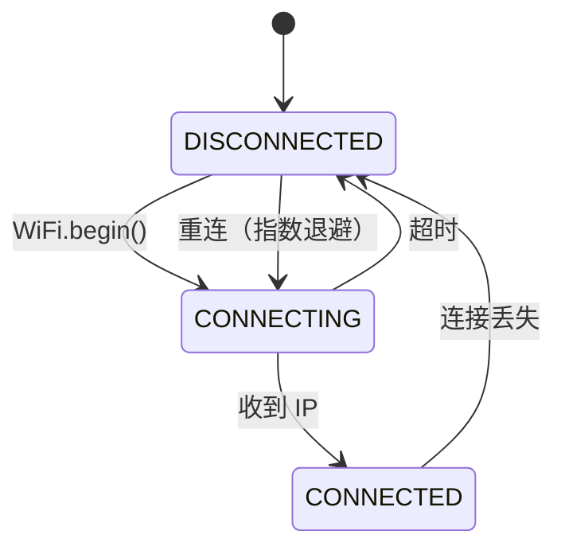
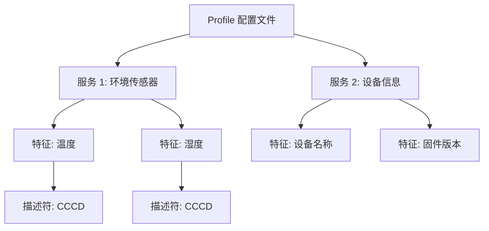
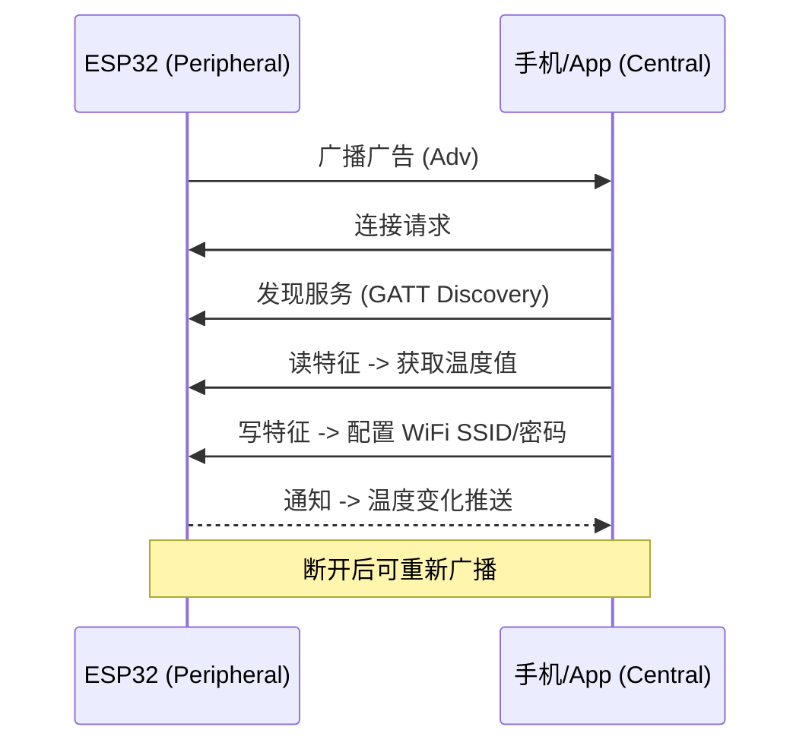
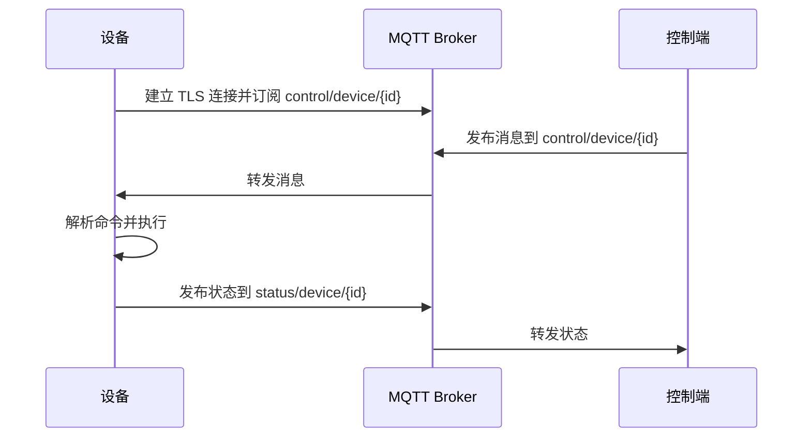
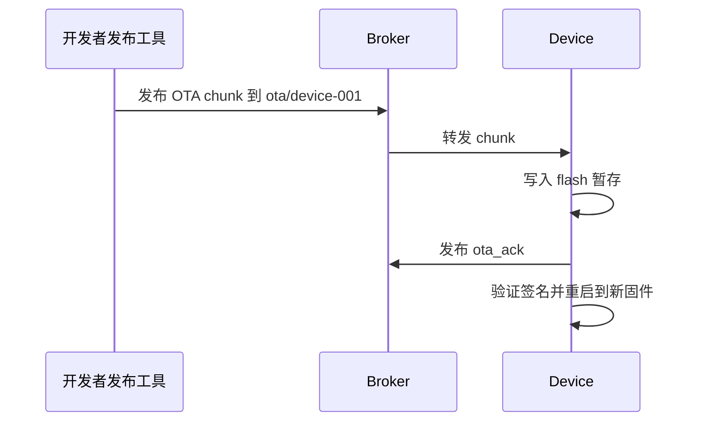

# 第10章 嵌入式系统与互联网：ESP8266/ESP32 的蓝牙与 WiFi 应用，NAT 穿越与 MQTT

本章核心内容：基于 ESP8266 与 ESP32 的无线连接（WiFi、蓝牙 BLE/BT）实现方法、嵌入式设备如何安全接入互联网、常见 NAT 穿越策略（用于远程控制）、以及 MQTT 在物联网中的工程实践与安全应用。面向研究生，强调理论与工程实践结合，提供架构图、时序图、实现要点、核心代码片段与安全/性能考量。

学习目标：
- 掌握 ESP8266/ESP32 的网络与蓝牙能力差异及选型依据；
- 能够设计并实现基于 MQTT 的远程控制方案，并理解为何该方法可规避 NAT 问题；
- 理解 NAT 穿越常见技术（反向连接、STUN/TURN、WebSocket/HTTP 翻转、VPN/SSH 隧道）在嵌入式场景中的优缺点；
- 能在嵌入式设备上实现安全的 MQTT 客户端（TLS、认证、LWT、QoS）、并完成基本故障与性能工程化考虑。

---

## 10.1 ESP8266 与 ESP32 特性对比与选型

表格：ESP8266 vs ESP32（简要对比）

| 特性 | ESP8266 | ESP32 |
|---|---:|---|
| 内核 | 单核 Tensilica | 双核/单核 Xtensa，含低功耗协处理器 |
| 蓝牙 | 无 | 支持 BLE & Classic (ESP32) |
| WiFi | 802.11 b/g/n | 802.11 b/g/n (更好的并发与吞吐) |
| 硬件加密 | 较弱 | 硬件加密加速（AES/SSL） |
| 外设 | 较少 | 丰富（ADC, DAC, I2S, SPI, UART 等） |
| 适用场景 | 低成本 WiFi 设备、简单传感器节点 | 需要蓝牙、多任务或更高性能的应用 |

选型建议：对蓝牙或更复杂并发需求选择 ESP32；对成本敏感且只需 WiFi 的简单传感器可选 ESP8266。

---

## 10.2 WiFi 应用实践（连接、DHCP、mDNS）

### 10.2.1 WiFi 连接管理

嵌入式设备的 WiFi 连接必须考虑网络不稳定性。稳健的连接管理包括：

**连接状态机**：



**关键策略**：

| 策略 | 描述 | 配置建议 |
|---|---|---|
| 指数退避重连 | 每次失败后翻倍等待时间 | 初始 1s，最大 60s |
| 最大重试次数 | 连续失败 N 次后重启 WiFi 模块 | N = 10~20 |
| mDNS 注册 | 局域网内设备发现 | `esp-device.local` |
| 静态 IP（可选） | 避免 DHCP 延迟 | 适合固定部署场景 |

### 10.2.2 示意代码（带指数退避的 WiFi 连接管理）

```cpp
#include <ESP8266WiFi.h>

const char* ssid = "ssid";
const char* pass = "password";

uint32_t reconnect_delay = 1000;  // 初始退避 1s
const uint32_t MAX_DELAY = 60000; // 最大退避 60s
uint8_t retry_count = 0;
const uint8_t MAX_RETRIES = 20;

void wifi_connect() {
    WiFi.mode(WIFI_STA);
    WiFi.begin(ssid, pass);
    unsigned long t0 = millis();
    while (WiFi.status() != WL_CONNECTED && millis() - t0 < 10000) {
        delay(200);
        Serial.print('.');
    }
    if (WiFi.status() == WL_CONNECTED) {
        Serial.println(WiFi.localIP());
        reconnect_delay = 1000;  // 重置退避
        retry_count = 0;
    } else {
        retry_count++;
        if (retry_count >= MAX_RETRIES) {
            ESP.restart();  // 硬重启
        }
    }
}

void loop() {
    if (WiFi.status() != WL_CONNECTED) {
        WiFi.disconnect();
        delay(reconnect_delay);
        wifi_connect();
        // 指数退避
        reconnect_delay = min(reconnect_delay * 2, MAX_DELAY);
    }
    // 业务逻辑
}
```

### 10.2.3 mDNS 设备发现

mDNS 允许局域网内设备通过 `.local` 域名被发现，无需知道 IP：

```cpp
#include <ESP8266mDNS.h>

void setup() {
    // WiFi 连接完成后...
    if (MDNS.begin("esp-sensor")) {
        Serial.println("mDNS: esp-sensor.local");
        MDNS.addService("http", "tcp", 80);  // 注册 HTTP 服务
    }
}
```

### 10.2.4 HTTP 服务器与 RESTful API

ESP8266/ESP32 可作为轻量 HTTP 服务器，提供 RESTful 接口用于配置和数据查询：

```cpp
#include <ESP8266WebServer.h>
ESP8266WebServer server(80);

void handleGetStatus() {
    String json = "{\"temperature\": 25.3, \"humidity\": 60}";
    server.send(200, "application/json", json);
}

void setup() {
    // WiFi 连接完成后...
    server.on("/api/status", HTTP_GET, handleGetStatus);
    server.begin();
}

void loop() {
    server.handleClient();
}
```

---

## 10.3 蓝牙应用简介（ESP32）

### 10.3.1 BLE 与 Classic Bluetooth 对比

| 特性 | BLE (低功耗蓝牙) | Classic Bluetooth (SPP) |
|---|---|---|
| 功耗 | 极低（μA 级待机） | 较高 |
| 传输速率 | 低（几十 KB/s） | 高（几 MB/s） |
| 连接时间 | 快（ms 级） | 慢（秒级） |
| 适用场景 | 传感器数据、设备配置、信标 | 音频传输、大量数据串口透传 |
| 通信模型 | GATT（属性/服务/特征） | SPP（虚拟串口） |

ESP32 同时支持 BLE 和 Classic，但通常不建议同时启用两者（内存与功耗开销大）。

### 10.3.2 BLE GATT 架构



- **服务（Service）**：功能的逻辑分组，用 UUID 标识；
- **特征（Characteristic）**：服务中的数据项，支持读/写/通知；
- **描述符（Descriptor）**：特征的元数据，如 CCCD（客户端特征配置描述符）用于启用通知。

### 10.3.3 BLE GATT 交互时序



### 10.3.4 BLE 配网实践

常见场景：ESP32 首次上电时没有 WiFi 配置，通过 BLE 接收手机 App 发送的 WiFi SSID 和密码：

```cpp
#include <BLEDevice.h>
#include <BLEServer.h>
#include <BLEUtils.h>
#include <BLE2902.h>

#define SERVICE_UUID        "4fafc201-1fb5-459e-8fcc-c5c9c331914b"
#define WIFI_SSID_CHAR_UUID "beb5483e-36e1-4688-b7f5-ea07361b26a8"
#define WIFI_PASS_CHAR_UUID "beb5483f-36e1-4688-b7f5-ea07361b26a8"

class WiFiConfigCallback : public BLECharacteristicCallbacks {
    void onWrite(BLECharacteristic *pChar) override {
        std::string value = pChar->getValue();
        if (pChar->getUUID().toString() == WIFI_SSID_CHAR_UUID) {
            // 保存 SSID 到 NVS
        } else if (pChar->getUUID().toString() == WIFI_PASS_CHAR_UUID) {
            // 保存密码到 NVS 并触发 WiFi 连接
        }
    }
};

void setup_ble() {
    BLEDevice::init("ESP32-Config");
    BLEServer *pServer = BLEDevice::createServer();
    BLEService *pService = pServer->createService(SERVICE_UUID);

    BLECharacteristic *pSSID = pService->createCharacteristic(
        WIFI_SSID_CHAR_UUID, BLECharacteristic::PROPERTY_WRITE);
    BLECharacteristic *pPass = pService->createCharacteristic(
        WIFI_PASS_CHAR_UUID, BLECharacteristic::PROPERTY_WRITE);

    pSSID->setCallbacks(new WiFiConfigCallback());
    pPass->setCallbacks(new WiFiConfigCallback());

    pService->start();
    pServer->getAdvertising()->start();
}
```

代码提示：实现时推荐使用 ESP-IDF 提供的 NimBLE/GATTS 示例，关注回连与断开处理、MTU 协商及安全配对策略（建议使用 Passkey 或 OOB 配对以防止中间人攻击）。

---

## 10.4 NAT 穿越与远程控制策略

问题背景：大多数家庭/企业网络使用 NAT，设备位于私有地址后无法被互联网上的控制端直接发起 TCP 连接。常用解决策略：

1) 使用云中继（推荐）——设备主动发起到云服务器的长连接（MQTT/TCP/WebSocket），控制端通过云服务器下发命令；
2) 反向隧道（Reverse SSH / Reverse TCP）——设备建立反向代理隧道到公网服务器；
3) P2P 打洞（STUN/ICE）——在可行的 NAT 类型下让两端直接建立 UDP/TCP 连接；
4) VPN（OpenVPN / WireGuard）——将设备与控制端加入同一虚拟网络，适用于对延迟有一定要求且能管理隧道的场景。

对嵌入式设备的建议：首选云中继（MQTT/WebSocket）因实现简单、可靠性高；对高带宽或低延迟需求，考虑 VPN 或 P2P（但 P2P 受限于 NAT 类型）。

架构示意图（云中继 + MQTT）

```mermaid
flowchart LR
  Device[ESP device (私网)] -->|TLS| Broker[云端 MQTT Broker (公网)]
  Controller[控制端 (App/Server)] -->|TLS| Broker
  Broker -->|转发| Device
```

时序（基于 MQTT 的远程控制）



---

## 10.5 MQTT 在嵌入式的应用实践

关键概念：主题（Topic）、QoS（0/1/2）、保留消息（Retain）、遗嘱（Last Will, LWT）、会话持久化（Clean Session）、保持心跳（Keep Alive）。

安全建议：
- 使用 TLS（最好带服务器证书验证）保护 MQTT 通信；
- 使用客户端证书或强认证机制，避免弱口令；
- 对控制主题进行授权与细粒度访问控制（ACL）；
- 合理设置 QoS 与重试策略以平衡延迟与可靠性。

示例（ESP8266 + PubSubClient）：

```cpp
#include <ESP8266WiFi.h>
#include <WiFiClientSecure.h>
#include <PubSubClient.h>

const char* ssid = "...";
const char* pass = "...";
const char* mqtt_host = "broker.example.com";
const int mqtt_port = 8883; // TLS

WiFiClientSecure secureClient;
PubSubClient client(secureClient);

void callback(char* topic, byte* payload, unsigned int length) {
  // 处理控制命令
}

void connectMQTT() {
  secureClient.setCACert(ca_cert_pem);
  while (!client.connected()) {
    if (client.connect("device-001")) {
      client.subscribe("control/device/device-001");
      client.publish("status/device/device-001", "online", true);
    } else {
      delay(2000);
    }
  }
}

void setup() {
  WiFi.begin(ssid, pass);
  while (WiFi.status() != WL_CONNECTED) delay(100);
  client.setServer(mqtt_host, mqtt_port);
  client.setCallback(callback);
  connectMQTT();
}

void loop() {
  if (!client.connected()) connectMQTT();
  client.loop();
  // 心跳 / 状态发布
  static unsigned long t0 = 0;
  if (millis() - t0 > 5000) {
    client.publish("status/device/device-001", "ok");
    t0 = millis();
  }
}
```

QoS 与可靠性：
- QoS0（最多一次）适合非关键 telemetry；
- QoS1（至少一次）适合命令类消息，可配合幂等处理避免重复执行；
- QoS2（仅一次）开销最大，嵌入式场景较少使用。

---

## 10.6 NAT 穿越工程实现建议（细化）

1) 使用云中继（MQTT 或 WebSocket）：设备主动发起 TLS 连接到云端 MQTT Broker，控制端通过 broker 下发指令。优势：穿透 NAT、易于扩展；劣势：引入中继延迟与运营成本。
2) 若需 P2P：使用 STUN/ICE 做打洞并在必要时回退到 TURN（转发服务器）。注意：STUN 成功率受 NAT 类型影响；TURN 对嵌入式设备增加带宽成本。
3) 反向隧道：设备用 SSH/Reverse TCP 建立隧道到运维服务器，控制端通过该服务器访问设备。适合可部署运维场景但需管理隧道安全性。

工程落地注意：连接稳定性（重连与保活）、带宽限制（避免大量日志上云）、隐私与访问控制、固件升级通道安全（OTA 使用签名与完整性校验）。

---

## 10.7 工程示例：ESP32 使用 MQTT 做远程控制与固件升级

架构要点：
- 设备与 Broker 使用 TLS，Broker 验证客户端证书或用户名/密码；
- 设备订阅 control/{id}，发布 status/{id} 与 ota/{id} 主题；
- OTA 通过 chunked 文件发布（或使用 HTTP(S) 下载并验证签名）。

示意流程（OTA via MQTT）



核心实现提示：
- 避免在 MQTT 消息内嵌入大 payload，使用分块并带序号与签名；
- 使用双分区 OTA 与完整性校验（签名 + 哈希）；
- 发布固件时确保 QoS 与重试策略，以保证每块可靠到达或通知失败重试。

---

## 10.8 安全与隐私考量

- 使用 TLS（至少 TLS1.2）并验证服务端证书；对极高安全需求使用双向 TLS（客户端证书）；
- 对控制主题启用 ACL 与审计日志，避免未经授权的命令；
- 频繁更新依赖库与固件以修补已知漏洞；
- 最小化设备暴露的调试接口（串口、JTAG）并在发布固件时禁用。

---

## 本章测验

<div id="exam-meta" data-exam-id="chapter10" data-exam-title="第十章 嵌入式系统与互联网测验" style="display:none"></div>

<!-- mkdocs-quiz intro -->

<quiz>
1) 在大多数家庭 NAT 场景下，下述哪种方法最可靠地实现远程控制（不要求 P2P 低延迟）？
- [ ] 直接 TCP 连接到设备私有 IP
- [x] 设备主动连接到云端 MQTT Broker 并订阅控制主题
- [ ] 通过 UDP 打洞（STUN）保证 100% 成功
- [ ] 仅依赖局域网内 mDNS 发现

正确。设备主动建立到公网 Broker 的连接可穿透 NAT 并能稳定转发控制消息，UDP 打洞受限于 NAT 类型不保证成功；直接连接私有 IP 无法跨 NAT。
</quiz>

<quiz>
2) 关于 MQTT 在嵌入式设备上的使用，下列哪些做法是推荐且有助于提升安全性与可靠性？
- [x] 使用 TLS 加密传输
- [ ] 在控制主题使用 QoS0
- [x] 使用 LWT 提示离线状态
- [ ] 将固件通过未经签名的 MQTT 消息直接执行更新

正确。TLS 与 LWT 是推荐做法；控制主题通常至少用 QoS1 保证命令到达，固件更新必须签名校验以保证安全性。
</quiz>

<quiz>
3) 关于 STUN 与 TURN 在 NAT 穿越流程中的作用，下列哪些说法正确？
- [x] STUN 用于探测公共地址并帮助两端打洞实现 P2P
- [x] TURN 在 P2P 无法建立时充当中继，转发实际流量
- [x] TURN 增加带宽占用与服务器成本
- [ ] STUN 可以在所有 NAT 类型下保证 P2P 连接成功

正确。STUN 用于探测公共地址并帮助两端打洞实现 P2P；TURN 在 P2P 无法建立时充当中继，转发实际流量。TURN 增加带宽占用与服务器成本。
</quiz>

<quiz>
4) 设计一套基于 ESP32 的远程控制方案，能在家庭 NAT 后安全控制设备、支持 OTA 更新并在网络断连时保证可恢复性，以下哪些是推荐的做法？
- [x] 设备作为 MQTT 客户端通过 TLS 连接至云端 Broker
- [x] OTA 使用分块下载并签名验证
- [x] 在设备断线时使用 LWT 通知并在重连后采用增量重试
- [x] TLS（服务端证书与服务器验证）、设备认证（证书或强令牌）、ACL 控制主题访问

正确。以上都是推荐的做法，可以实现安全、可靠的远程控制方案。
</quiz>

---

本章参考资料：ESP-IDF/ESP8266 SDK 文档、MQTT 协议规范 (OASIS)、STUN/TURN/ICE RFC 文档与物联网安全最佳实践。
