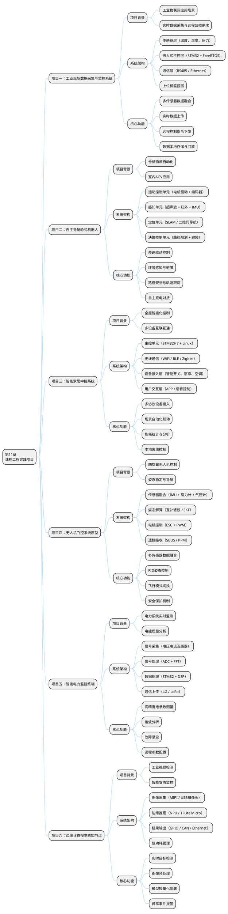
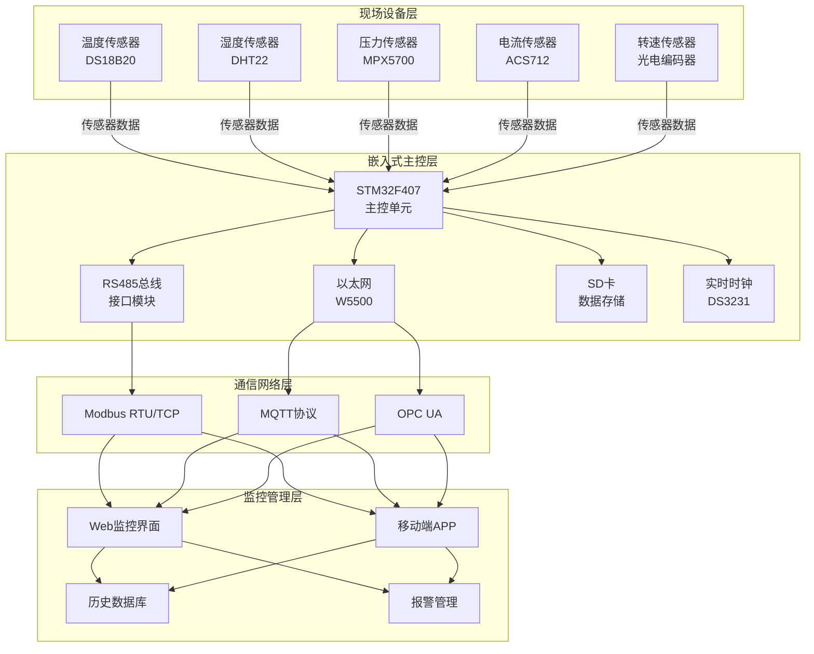
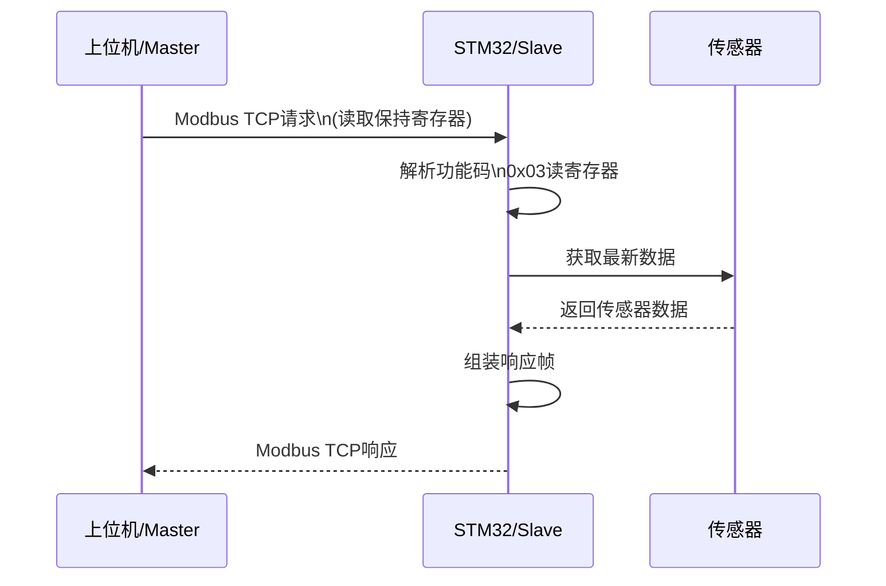
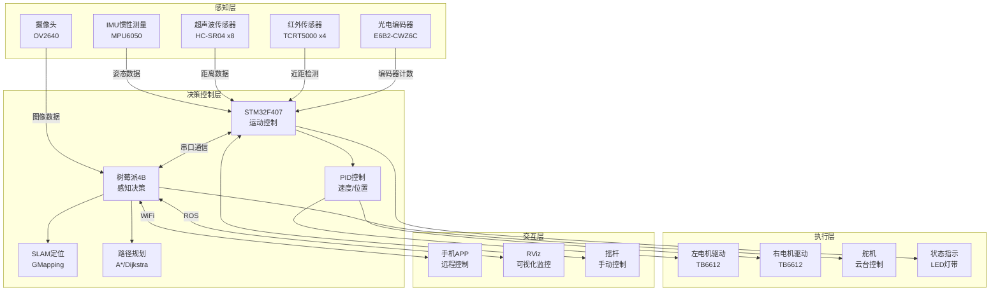
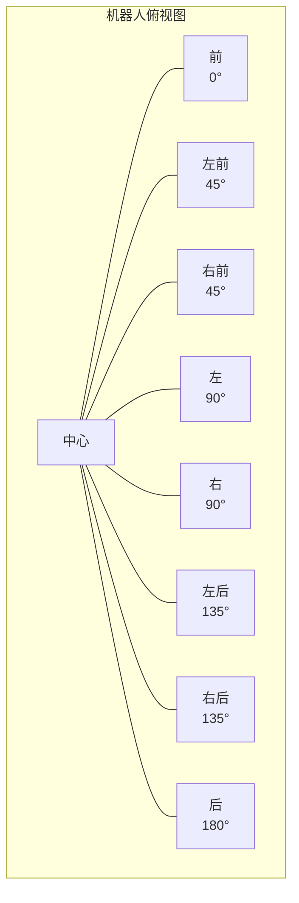
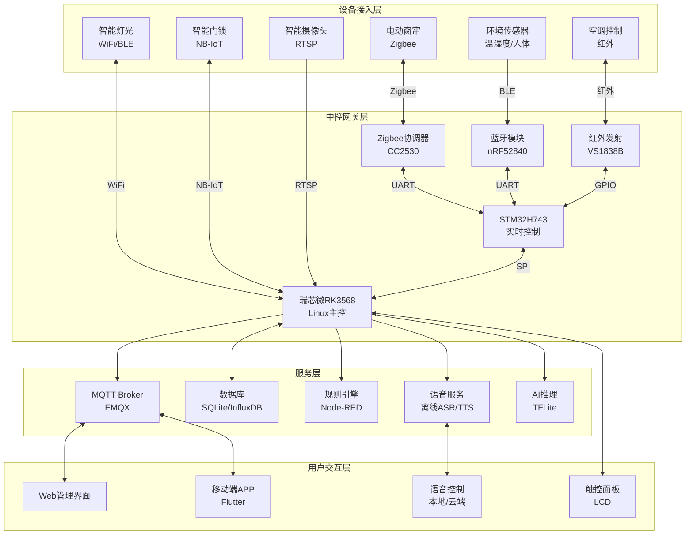
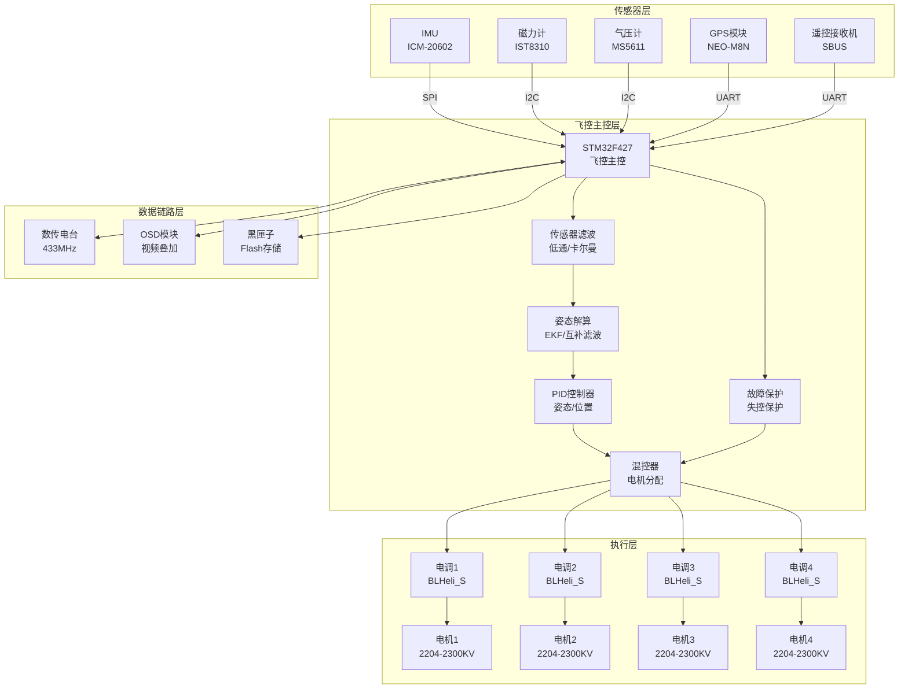
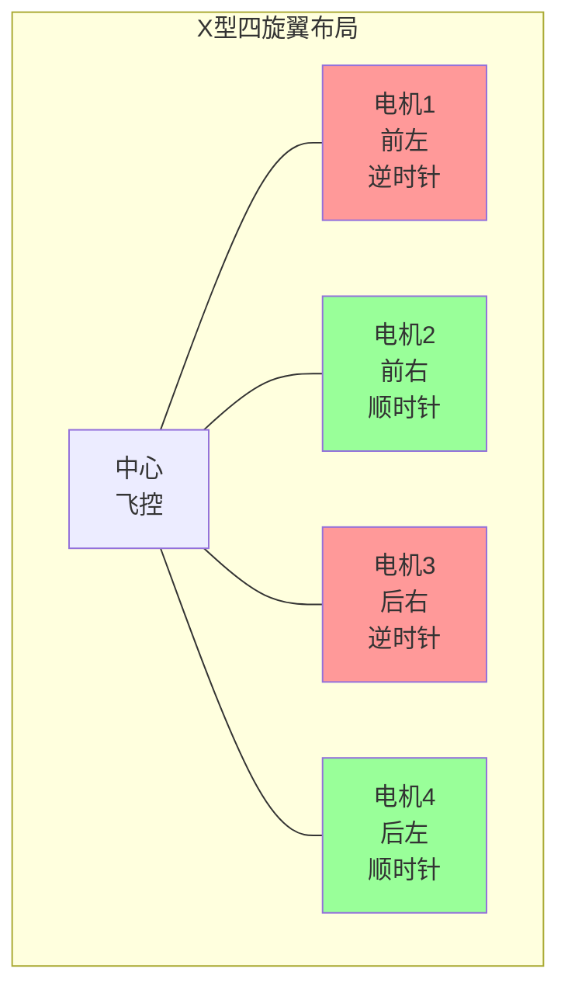
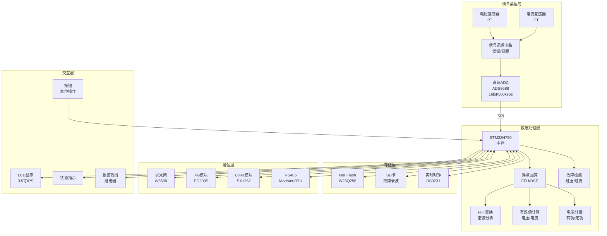
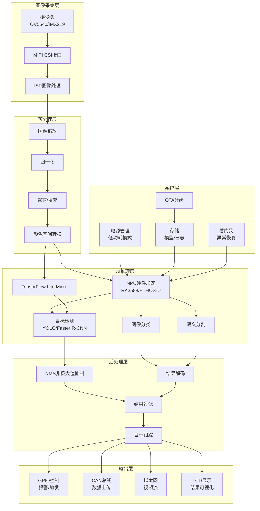

## 11 第11章 课程工程实践项目

成都信息工程大学 软件工程学院

### 11.1 本章知识导图



---

### 11.2 本章概述

本章提供6个具有实际工程应用背景的嵌入式系统实践项目，旨在帮助研究生将前序章节所学的理论知识应用于实际工程开发中。每个项目都涵盖从需求分析、系统设计、硬件选型、软件开发到系统集成的完整开发流程，注重培养学生的工程实践能力和系统思维。

#### 11.2.1 学习目标
- 掌握嵌入式系统工程开发的完整流程
- 提升系统架构设计和软硬件协同设计能力
- 培养复杂问题分析与解决能力
- 锻炼团队协作和工程文档编写能力

#### 11.2.2 项目特点
- **工程性强**：所有项目均来自真实工业应用场景
- **复杂度适中**：适合研究生在1-2学期内完成
- **技术覆盖面广**：融合本课程所有核心知识点
- **可扩展性好**：预留功能扩展空间，便于后续深入研究

---

### 11.3 项目一：工业现场数据采集与监控系统

#### 11.3.1 项目背景

在工业4.0和智能制造的大背景下，工业现场数据采集与监控系统（SCADA）是实现生产过程数字化、智能化的基础。本项目针对中小型制造企业的实际需求，设计并实现一套低成本、高可靠性的工业数据采集与监控系统，可应用于车间环境监测、设备状态监控、能耗管理等场景。

**工程价值**：
- 实现生产过程的可视化监控
- 提高设备运维效率，降低故障率
- 为生产决策提供数据支撑
- 降低企业信息化改造成本

#### 11.3.2 系统架构



#### 11.3.3 核心功能模块

##### 11.3.3.1 多传感器数据采集

**功能描述**：支持多种工业传感器的同时采集，实现温度、湿度、压力、电流、转速等物理量的实时测量。

**技术要点**：
- 使用FreeRTOS实现多任务调度
- 每个传感器分配独立采集任务
- 采用队列机制实现数据传输
- 实现传感器故障检测与自动恢复

**核心代码示例**：

```c
/* 传感器采集任务 */
void Sensor_Task(void *argument) {
    sensor_data_t data;
    uint32_t tick;
    
    for (;;) {
        tick = osKernelGetTickCount();
        
        /* 采集温度传感器 */
        data.temperature = DS18B20_ReadTemp();
        
        /* 采集湿度传感器 */
        data.humidity = DHT22_ReadHumidity();
        
        /* 采集压力传感器 */
        data.pressure = MPX5700_ReadPressure();
        
        /* 采集电流传感器 */
        data.current = ACS712_ReadCurrent();
        
        /* 采集转速传感器 */
        data.speed = Encoder_GetSpeed();
        
        /* 时间戳 */
        data.timestamp = RTC_GetTime();
        
        /* 将数据发送到数据处理队列 */
        osMessageQueuePut(sensor_queue, &data, 0, 0);
        
        /* 定时1秒采集一次 */
        osDelayUntil(tick + 1000);
    }
}

/* 数据处理任务 */
void DataProcess_Task(void *argument) {
    sensor_data_t data;
    osStatus_t status;
    
    for (;;) {
        /* 从队列获取传感器数据 */
        status = osMessageQueueGet(sensor_queue, &data, NULL, osWaitForever);
        
        if (status == osOK) {
            /* 数据有效性检查 */
            if (ValidateSensorData(&data)) {
                /* 数据滤波处理 */
                ApplyFilter(&data);
                
                /* 发送到存储任务 */
                osMessageQueuePut(storage_queue, &data, 0, 0);
                
                /* 发送到通信任务 */
                osMessageQueuePut(comm_queue, &data, 0, 0);
                
                /* 检查报警条件 */
                CheckAlarm(&data);
            }
        }
    }
}
```

##### 11.3.3.2 Modbus协议实现

**功能描述**：实现Modbus RTU和Modbus TCP协议，支持与主流PLC、HMI和SCADA系统对接。

**时序图**：



#### 11.3.4 项目实施要点

**硬件选型**：
- 主控：STM32F407ZGT6（168MHz，192KB RAM，1MB Flash）
- 传感器：DS18B20、DHT22、MPX5700、ACS712、光电编码器
- 通信模块：W5500（以太网）、MAX485（RS485）
- 存储：SD卡（FATFS文件系统）
- 时钟：DS3231（高精度RTC）

**软件开发计划**：
1. 第1-2周：硬件平台搭建与基础驱动开发
2. 第3-4周：FreeRTOS移植与多任务框架搭建
3. 第5-6周：传感器驱动与数据采集实现
4. 第7-8周：Modbus协议实现与通信调试
5. 第9-10周：数据存储与Web监控界面开发
6. 第11-12周：系统集成测试与性能优化

---

### 11.4 项目二：自主导航轮式机器人

#### 11.4.1 项目背景

随着仓储物流、智能制造的快速发展，自主导航轮式机器人（AGV/AMR）的应用日益广泛。本项目设计实现一套室内自主导航轮式机器人系统，具备环境感知、路径规划、自主避障、精确定位等核心功能，可应用于物料搬运、巡检等场景。

**工程价值**：
- 掌握移动机器人自主导航核心技术
- 理解多传感器融合与状态估计方法
- 提升机器人系统集成与调试能力
- 为后续研究SLAM、机器视觉等方向奠定基础

#### 11.4.2 系统架构



#### 11.4.3 核心功能模块

##### 11.4.3.1 差速驱动控制

**功能描述**：实现两轮差速驱动的速度闭环控制，支持机器人前进、后退、旋转等运动模式。

**控制框图**：


**核心代码示例**：

```c
/* 电机速度控制结构体 */
typedef struct {
    float target_speed;      /* 目标速度 (rad/s) */
    float current_speed;     /* 当前速度 (rad/s) */
    float Kp, Ki, Kd;        /* PID参数 */
    float integral;          /* 积分项 */
    float last_error;        /* 上一次误差 */
    int32_t last_encoder;    /* 上一次编码器值 */
    float output;            /* PID输出 */
} Motor_Control_t;

Motor_Control_t motor_left, motor_right;

/* 速度PID控制计算 */
float PID_Calculate(Motor_Control_t *motor, float dt) {
    float error = motor->target_speed - motor->current_speed;
    float derivative;
    
    /* 积分项（带抗饱和） */
    motor->integral += error * dt;
    if (motor->integral > INTEGRAL_MAX) motor->integral = INTEGRAL_MAX;
    if (motor->integral < -INTEGRAL_MAX) motor->integral = -INTEGRAL_MAX;
    
    /* 微分项 */
    derivative = (error - motor->last_error) / dt;
    
    /* PID输出 */
    motor->output = motor->Kp * error + 
                    motor->Ki * motor->integral + 
                    motor->Kd * derivative;
    
    /* 输出限幅 */
    if (motor->output > PWM_MAX) motor->output = PWM_MAX;
    if (motor->output < -PWM_MAX) motor->output = -PWM_MAX;
    
    motor->last_error = error;
    return motor->output;
}

/* 速度计算任务（100Hz） */
void SpeedCalculate_Task(void *argument) {
    int32_t left_cnt, right_cnt;
    float dt = 0.01f;
    
    for (;;) {
        /* 获取编码器计数 */
        left_cnt = Encoder_GetLeftCount();
        right_cnt = Encoder_GetRightCount();
        
        /* 计算速度 (rad/s) */
        motor_left.current_speed = 
            (float)(left_cnt - motor_left.last_encoder) * ENCODER_TO_RAD / dt;
        motor_right.current_speed = 
            (float)(right_cnt - motor_right.last_encoder) * ENCODER_TO_RAD / dt;
        
        /* 保存当前编码器值 */
        motor_left.last_encoder = left_cnt;
        motor_right.last_encoder = right_cnt;
        
        osDelay(10);
    }
}

/* 电机控制任务（1kHz） */
void MotorControl_Task(void *argument) {
    float pwm_left, pwm_right;
    
    for (;;) {
        /* PID计算 */
        pwm_left = PID_Calculate(&motor_left, 0.001f);
        pwm_right = PID_Calculate(&motor_right, 0.001f);
        
        /* 输出PWM */
        Motor_SetPWM(LEFT_MOTOR, (int16_t)pwm_left);
        Motor_SetPWM(RIGHT_MOTOR, (int16_t)pwm_right);
        
        osDelay(1);
    }
}
```

##### 11.4.3.2 避障策略实现

**功能描述**：基于多传感器融合实现动态避障，支持静态障碍物规避和动态障碍物绕行。

**超声波传感器布局**：



#### 11.4.4 项目实施要点

**硬件选型**：
- 运动控制：STM32F407ZGT6
- 上层决策：树莓派4B（4GB）
- 电机：直流减速电机（12V，200rpm）x2
- 电机驱动：TB6612FNG x2
- 传感器：MPU6050（IMU）、HC-SR04（超声波x8）、光电编码器x2
- 电源：12V 5AH锂电池组

**软件开发计划**：
1. 第1-2周：机器人机械结构搭建与硬件连接
2. 第3-4周：电机驱动与速度闭环控制
3. 第5-6周：传感器驱动与数据融合
4. 第7-8周：ROS环境搭建与基础通信
5. 第9-10周：SLAM定位与路径规划
6. 第11-12周：系统集成与自主导航测试

---

### 11.5 项目三：智能家居中控系统

#### 11.5.1 项目背景

智能家居是物联网技术的重要应用领域，通过将家庭设备互联互通，实现智能化控制和场景联动。本项目设计实现一套智能家居中控系统，支持多协议设备接入、场景自动化、语音控制、能耗管理等功能，为用户提供舒适、安全、节能的智能家居体验。

**工程价值**：
- 掌握物联网多协议融合技术
- 理解智能家居系统架构设计
- 提升嵌入式+Linux全栈开发能力
- 探索AIoT在智能家居中的应用

#### 11.5.2 系统架构



#### 11.5.3 核心功能模块

##### 11.5.3.1 多协议设备接入

**功能描述**：支持WiFi、BLE、Zigbee、红外等多种协议设备的统一接入和管理。

**核心代码示例（Zigbee协调器）**：

```c
/* Zigbee设备信息结构体 */
typedef struct {
    uint16_t short_addr;     /* 网络短地址 */
    uint64_t ieee_addr;      /* IEEE地址 */
    uint8_t endpoint;         /* 端点号 */
    uint8_t device_type;      /* 设备类型 */
    char device_name[32];     /* 设备名称 */
    uint8_t status;           /* 在线状态 */
    uint32_t last_seen;      /* 最后在线时间 */
} Zigbee_Device_t;

#define MAX_DEVICES 32
Zigbee_Device_t device_list[MAX_DEVICES];
uint8_t device_count = 0;

/* Zigbee数据包接收处理 */
void Zigbee_ProcessPacket(uint8_t *data, uint16_t len) {
    zigbee_packet_t *pkt = (zigbee_packet_t *)data;
    
    switch (pkt->frame_type) {
        case ZIGBEE_DEVICE_ANNCE:
            /* 新设备加入 */
            Zigbee_AddDevice(pkt);
            break;
            
        case ZIGBEE_REPORT_ATTR:
            /* 设备属性上报 */
            Zigbee_UpdateAttribute(pkt);
            break;
            
        case ZIGBEE_ZCL_COMMAND:
            /* ZCL命令响应 */
            Zigbee_HandleCommand(pkt);
            break;
    }
}

/* 发送控制命令到Zigbee设备 */
int Zigbee_SendControl(uint16_t short_addr, uint8_t endpoint, 
                        uint8_t cluster, uint8_t command, 
                        uint8_t *payload, uint8_t payload_len) {
    zigbee_packet_t pkt;
    
    pkt.frame_type = ZIGBEE_ZCL_COMMAND;
    pkt.short_addr = short_addr;
    pkt.endpoint = endpoint;
    pkt.cluster = cluster;
    pkt.command = command;
    memcpy(pkt.payload, payload, payload_len);
    pkt.payload_len = payload_len;
    
    return Zigbee_SendPacket(&pkt);
}

/* 控制灯光开关 */
int Zigbee_ControlLight(uint16_t short_addr, bool on_off) {
    uint8_t payload = on_off ? 0x01 : 0x00;
    
    return Zigbee_SendControl(short_addr, 1, 
                              ZCL_CLUSTER_ON_OFF, 
                              ZCL_CMD_ON_OFF, 
                              &payload, 1);
}

/* 控制窗帘位置 */
int Zigbee_ControlCurtain(uint16_t short_addr, uint8_t position) {
    return Zigbee_SendControl(short_addr, 1,
                              ZCL_CLUSTER_WINDOW_COVERING,
                              ZCL_CMD_GOTO_LIFT_PERCENTAGE,
                              &position, 1);
}
```

##### 11.5.3.2 场景自动化规则引擎

**功能描述**：基于规则引擎实现设备场景联动，支持时间触发、条件触发、手动触发等多种触发方式。

**场景规则示例**：

```mermaid
flowchart LR
    Trigger[触发器] --> Condition{条件判断}
    Condition -->|满足| Action[执行动作]
    Condition -->|不满足| End[结束]
    Action --> End
    
    subgraph "触发器类型"
        Time[时间触发\n7:00]
        Sensor[传感器触发\n人体检测]
        Manual[手动触发\nAPP/面板]
        Voice[语音触发\n"回家模式"]
    end
    
    subgraph "条件类型"
        Lux[照度条件\n< 100lux]
        Temp[温度条件\n> 26°C]
        TimeCond[时间条件\n工作日]
        Presence[人员条件\n在家]
    end
    
    subgraph "动作类型"
        LightOn[开灯\n客厅主灯]
        AcOn[开空调\n制冷24°C]
        CurtainOpen[开窗帘\n70%]
        MusicOn[播放音乐\n背景音乐]
    end
```

#### 11.5.4 项目实施要点

**硬件选型**：
- 实时控制：STM32H743VIT6（400MHz，1MB RAM，2MB Flash）
- Linux主控：瑞芯微RK3568（四核A55，2GB RAM）
- Zigbee协调器：CC2530 + PA
- BLE模块：nRF52840
- 显示：7寸LCD电容触控屏（MIPI）
- 存储：eMMC 32GB

**软件开发计划**：
1. 第1-2周：硬件平台搭建与系统启动
2. 第3-4周：Linux系统裁剪与驱动开发
3. 第5-6周：多协议设备接入驱动开发
4. 第7-8周：MQTT服务与规则引擎实现
5. 第9-10周：Web界面与移动端APP开发
6. 第11-12周：系统集成与场景测试

---

### 11.6 项目四：无人机飞控系统原型

#### 11.6.1 项目背景

无人机技术在近年来取得了快速发展，在航拍、测绘、巡检、物流等领域得到广泛应用。飞控系统是无人机的核心，负责姿态稳定、导航控制、飞行模式管理等关键功能。本项目设计实现一套四旋翼无人机飞控系统原型，帮助学生深入理解无人机飞控的核心原理和实现方法。

**工程价值**：
- 掌握多旋翼无人机飞控原理
- 理解多传感器融合与姿态解算
- 提升实时控制系统设计能力
- 为无人机相关研究奠定基础

#### 11.6.2 系统架构



#### 11.6.3 核心功能模块

##### 11.6.3.1 姿态解算（互补滤波）

**功能描述**：融合加速度计和陀螺仪数据，实现高精度的姿态角（俯仰、横滚、偏航）解算。

**核心代码示例**：

```c
/* 姿态解算结构体 */
typedef struct {
    float roll;          /* 横滚角 (rad) */
    float pitch;         /* 俯仰角 (rad) */
    float yaw;           /* 偏航角 (rad) */
    
    float gyro_bias_x;   /* 陀螺仪零偏 X */
    float gyro_bias_y;   /* 陀螺仪零偏 Y */
    float gyro_bias_z;   /* 陀螺仪零偏 Z */
    
    float Kp;            /* 比例增益 */
    float Ki;            /* 积分增益 */
} AHRS_t;

AHRS_t ahrs;

/* 互补滤波姿态更新 */
void AHRS_Update(float ax, float ay, float az, 
                  float gx, float gy, float gz, 
                  float mx, float my, float mz,
                  float dt) {
    float halfvx, halfvy, halfvz;
    float halfex, halfey, halfez;
    float qa, qb, qc;
    
    /* 减去陀螺仪零偏 */
    gx -= ahrs.gyro_bias_x;
    gy -= ahrs.gyro_bias_y;
    gz -= ahrs.gyro_bias_z;
    
    /* 归一化加速度计数据 */
    float norm = 1.0f / sqrtf(ax*ax + ay*ay + az*az);
    ax *= norm;
    ay *= norm;
    az *= norm;
    
    /* 归一化磁力计数据 */
    norm = 1.0f / sqrtf(mx*mx + my*my + mz*mz);
    mx *= norm;
    my *= norm;
    mz *= norm;
    
    /* 四元数微分方程（仅陀螺仪） */
    float q0 = ahrs.q0, q1 = ahrs.q1, q2 = ahrs.q2, q3 = ahrs.q3;
    float q0dot = 0.5f * (-q1*gx - q2*gy - q3*gz);
    float q1dot = 0.5f * ( q0*gx + q2*gz - q3*gy);
    float q2dot = 0.5f * ( q0*gy - q1*gz + q3*gx);
    float q3dot = 0.5f * ( q0*gz + q1*gy - q2*gx);
    
    /* 计算重力向量在机体坐标系的估计 */
    halfvx = q1*q3 - q0*q2;
    halfvy = q0*q1 + q2*q3;
    halfvz = q0*q0 - 0.5f + q3*q3;
    
    /* 计算误差（加速度计测量 - 估计） */
    halfex = (ay*halfvz - az*halfvy);
    halfey = (az*halfvx - ax*halfvz);
    halfez = (ax*halfvy - ay*halfvx);
    
    /* 积分修正陀螺仪零偏 */
    if (ahrs.Ki > 0.0f) {
        ahrs.gyro_bias_x += ahrs.Ki * halfex * dt;
        ahrs.gyro_bias_y += ahrs.Ki * halfey * dt;
        ahrs.gyro_bias_z += ahrs.Ki * halfez * dt;
        
        /* 应用比例修正 */
        gx += ahrs.Kp * halfex;
        gy += ahrs.Kp * halfey;
        gz += ahrs.Kp * halfez;
    }
    
    /* 更新四元数 */
    q0 += q0dot * dt;
    q1 += q1dot * dt;
    q2 += q2dot * dt;
    q3 += q3dot * dt;
    
    /* 归一化四元数 */
    norm = 1.0f / sqrtf(q0*q0 + q1*q1 + q2*q2 + q3*q3);
    ahrs.q0 = q0 * norm;
    ahrs.q1 = q1 * norm;
    ahrs.q2 = q2 * norm;
    ahrs.q3 = q3 * norm;
    
    /* 转换为欧拉角 */
    ahrs.roll  = atan2f(2.0f * (q0*q1 + q2*q3), 1.0f - 2.0f * (q1*q1 + q2*q2));
    ahrs.pitch = asinf(2.0f * (q0*q2 - q3*q1));
    ahrs.yaw   = atan2f(2.0f * (q0*q3 + q1*q2), 1.0f - 2.0f * (q2*q2 + q3*q3));
}
```

##### 11.6.3.2 姿态PID控制与混控

**功能描述**：实现姿态环PID控制，并将控制输出分配到四个电机。

**四旋翼布局（X型）**：



**混控公式（X型）**：

```
Motor1 = Throttle - Roll - Pitch + Yaw
Motor2 = Throttle + Roll - Pitch - Yaw
Motor3 = Throttle + Roll + Pitch + Yaw
Motor4 = Throttle - Roll + Pitch - Yaw
```

#### 11.6.4 项目实施要点

**硬件选型**：
- 飞控主控：STM32F427VIT6（168MHz，256KB RAM，1MB Flash）
- IMU：ICM-20602（加速度计+陀螺仪）
- 磁力计：IST8310
- 气压计：MS5611
- GPS：NEO-M8N
- 电调：BLHeli_S 4in1（20A）
- 电机：2204-2300KV无刷电机x4
- 机架：250mm四旋翼机架

**软件开发计划**：
1. 第1-2周：飞控硬件平台搭建与传感器驱动
2. 第3-4周：传感器滤波与姿态解算实现
3. 第5-6周：姿态PID控制与电机混控
4. 第7-8周：遥控接收与飞行模式实现
5. 第9-10周：故障保护与安全机制
6. 第11-12周：地面站联调与试飞测试

---

### 11.7 项目五：智能电力监控终端

#### 11.7.1 项目背景

电力系统的安全稳定运行对国民经济至关重要，智能电力监控终端是实现电力系统自动化、智能化的关键设备。本项目设计实现一套智能电力监控终端，具备高精度电参数测量、谐波分析、故障录波、远程通信等功能，可广泛应用于配电网监测、工业用电管理、新能源并网等场景。

**工程价值**：
- 掌握电力电子测量技术
- 理解信号处理与谐波分析方法
- 提升高精度采集系统设计能力
- 为电力系统相关研究奠定基础

#### 11.7.2 系统架构



#### 11.7.3 核心功能模块

##### 11.7.3.1 高精度电参数测量

**功能描述**：实现电压、电流、功率、电能等电参数的高精度测量。

**核心代码示例**：

```c
/* 电参数测量结构体 */
typedef struct {
    /* 电压参数 */
    float voltage_rms;       /* 电压有效值 (V) */
    float voltage_thd;       /* 电压总谐波畸变率 (%) */
    
    /* 电流参数 */
    float current_rms;       /* 电流有效值 (A) */
    float current_thd;       /* 电流总谐波畸变率 (%) */
    
    /* 功率参数 */
    float active_power;      /* 有功功率 (W) */
    float reactive_power;    /* 无功功率 (Var) */
    float apparent_power;    /* 视在功率 (VA) */
    float power_factor;      /* 功率因数 */
    
    /* 电能参数 */
    float active_energy;     /* 有功电能 (kWh) */
    float reactive_energy;   /* 无功电能 (kVarh) */
    
    /* 频率 */
    float frequency;         /* 电网频率 (Hz) */
} PowerParam_t;

PowerParam_t power_param;

#define SAMPLE_RATE 12800     /* 采样率 12.8kHz */
#define SAMPLES_PER_CYCLE 256  /* 每周期采样点数 (50Hz) */

/* 电参数计算 */
void PowerParam_Calculate(int16_t *adc_voltage, int16_t *adc_current, uint16_t samples) {
    float sum_v2 = 0.0f, sum_i2 = 0.0f;
    float sum_vi = 0.0f, sum_v = 0.0f, sum_i = 0.0f;
    float v, i;
    
    /* 计算均值 */
    for (uint16_t n = 0; n < samples; n++) {
        v = ADC_to_Voltage(adc_voltage[n]);
        i = ADC_to_Current(adc_current[n]);
        sum_v += v;
        sum_i += i;
    }
    float mean_v = sum_v / samples;
    float mean_i = sum_i / samples;
    
    /* 计算有效值和功率 */
    for (uint16_t n = 0; n < samples; n++) {
        v = ADC_to_Voltage(adc_voltage[n]) - mean_v;
        i = ADC_to_Current(adc_current[n]) - mean_i;
        
        sum_v2 += v * v;
        sum_i2 += i * i;
        sum_vi += v * i;
    }
    
    /* 电压有效值 */
    power_param.voltage_rms = sqrtf(sum_v2 / samples);
    
    /* 电流有效值 */
    power_param.current_rms = sqrtf(sum_i2 / samples);
    
    /* 有功功率 */
    power_param.active_power = sum_vi / samples;
    
    /* 视在功率 */
    power_param.apparent_power = power_param.voltage_rms * power_param.current_rms;
    
    /* 功率因数 */
    if (power_param.apparent_power > 0.1f) {
        power_param.power_factor = power_param.active_power / power_param.apparent_power;
    } else {
        power_param.power_factor = 1.0f;
    }
    
    /* 无功功率 */
    power_param.reactive_power = 
        sqrtf(power_param.apparent_power * power_param.apparent_power - 
              power_param.active_power * power_param.active_power);
}

/* 过零检测与频率计算 */
float Frequency_Calculate(int16_t *adc_voltage, uint16_t samples) {
    static int16_t last_sample = 0;
    static uint32_t last_cross_time = 0;
    static float frequency = 50.0f;
    
    for (uint16_t n = 1; n < samples; n++) {
        /* 检测上升沿过零 */
        if (last_sample < 0 && adc_voltage[n] >= 0) {
            uint32_t current_time = osKernelGetTickCount();
            uint32_t period = current_time - last_cross_time;
            
            if (period > 15 && period < 25) { /* 40-66.7Hz范围 */
                frequency = 1000.0f / period;
                last_cross_time = current_time;
            }
        }
        last_sample = adc_voltage[n];
    }
    
    return frequency;
}
```

##### 11.7.3.2 FFT谐波分析

**功能描述**：基于FFT变换实现电压、电流的谐波分析，计算各次谐波含量和总谐波畸变率（THD）。

**FFT处理流程**：


#### 11.7.4 项目实施要点

**硬件选型**：
- 主控：STM32H750VBT6（480MHz，1MB RAM，128KB Flash）
- ADC：ADS8688（16位，8通道，500ksps）
- 电压互感器：ZMPT107
- 电流互感器：ZMCT103C
- 通信：W5500（以太网）、EC200S（4G）、SX1262（LoRa）
- 显示：3.5寸IPS LCD（RGB接口）
- 存储：W25Q256（Nor Flash）、SD卡

**软件开发计划**：
1. 第1-2周：硬件平台搭建与信号调理电路调试
2. 第3-4周：ADC驱动与数据采集实现
3. 第5-6周：电参数测量算法实现
4. 第7-8周：FFT谐波分析与故障录波
5. 第9-10周：通信协议与远程监控
6. 第11-12周：系统集成与精度校准

---

### 11.8 项目六：边缘计算视觉感知节点

#### 11.8.1 项目背景

随着边缘计算和人工智能技术的发展，将AI推理部署在嵌入式边缘设备上成为趋势。边缘计算视觉感知节点将图像采集、预处理、AI推理、结果输出等功能集成在一个嵌入式设备上，具备低延迟、高隐私、低带宽等优势，可应用于工业视觉检测、智能安防、自动驾驶感知等领域。

**工程价值**：
- 掌握边缘AI部署技术
- 理解模型轻量化与优化方法
- 提升计算机视觉嵌入式实现能力
- 探索AIoT在工业领域的应用

#### 11.8.2 系统架构



#### 11.8.3 核心功能模块

##### 11.8.3.1 图像预处理

**功能描述**：实现图像采集、缩放、归一化等预处理操作，为AI推理准备输入数据。

**核心代码示例**：

```c
/* 图像预处理结构体 */
typedef struct {
    uint8_t *input_buf;      /* 输入图像缓冲区 */
    uint8_t *output_buf;     /* 输出图像缓冲区 */
    uint16_t input_width;    /* 输入宽度 */
    uint16_t input_height;   /* 输入高度 */
    uint16_t output_width;   /* 输出宽度 */
    uint16_t output_height;  /* 输出高度 */
    uint8_t input_format;    /* 输入格式 */
    uint8_t output_format;   /* 输出格式 */
} ImagePreprocess_t;

ImagePreprocess_t preprocess;

/* 图像双线性插值缩放 */
void Image_ResizeBilinear(uint8_t *src, uint16_t src_w, uint16_t src_h,
                          uint8_t *dst, uint16_t dst_w, uint16_t dst_h) {
    float x_ratio = (float)(src_w - 1) / dst_w;
    float y_ratio = (float)(src_h - 1) / dst_h;
    
    for (uint16_t y = 0; y < dst_h; y++) {
        for (uint16_t x = 0; x < dst_w; x++) {
            float src_x = x * x_ratio;
            float src_y = y * y_ratio;
            
            int x0 = (int)src_x;
            int y0 = (int)src_y;
            int x1 = x0 + 1;
            int y1 = y0 + 1;
            
            if (x1 >= src_w) x1 = src_w - 1;
            if (y1 >= src_h) y1 = src_h - 1;
            
            float dx = src_x - x0;
            float dy = src_y - y0;
            
            /* 双线性插值 */
            for (int c = 0; c < 3; c++) {
                float v00 = src[(y0 * src_w + x0) * 3 + c];
                float v10 = src[(y0 * src_w + x1) * 3 + c];
                float v01 = src[(y1 * src_w + x0) * 3 + c];
                float v11 = src[(y1 * src_w + x1) * 3 + c];
                
                float v0 = v00 * (1 - dx) + v10 * dx;
                float v1 = v01 * (1 - dx) + v11 * dx;
                float v = v0 * (1 - dy) + v1 * dy;
                
                dst[(y * dst_w + x) * 3 + c] = (uint8_t)v;
            }
        }
    }
}

/* 图像归一化 */
void Image_Normalize(uint8_t *src, float *dst, 
                     uint16_t width, uint16_t height,
                     float mean[3], float std[3]) {
    for (uint32_t i = 0; i < width * height; i++) {
        for (int c = 0; c < 3; c++) {
            float val = src[i * 3 + c] / 255.0f;
            dst[i * 3 + c] = (val - mean[c]) / std[c];
        }
    }
}

/* 完整预处理流程 */
int Image_Preprocess(uint8_t *raw_image, float *model_input) {
    uint8_t *resized_buf = (uint8_t *)malloc(preprocess.output_width * 
                                               preprocess.output_height * 3);
    
    /* 1. 图像缩放 */
    Image_ResizeBilinear(raw_image, 
                        preprocess.input_width, preprocess.input_height,
                        resized_buf,
                        preprocess.output_width, preprocess.output_height);
    
    /* 2. 归一化 */
    float mean[3] = {0.485f, 0.456f, 0.406f};
    float std[3] = {0.229f, 0.224f, 0.225f};
    Image_Normalize(resized_buf, model_input,
                   preprocess.output_width, preprocess.output_height,
                   mean, std);
    
    free(resized_buf);
    return 0;
}
```

##### 11.8.3.2 目标检测后处理

**功能描述**：实现NMS（非极大值抑制）等后处理算法，过滤重复检测框，输出最终检测结果。

**目标检测流程**：


#### 11.8.4 项目实施要点

**硬件选型**：
- 主控：瑞芯微RK3588（八核A76+A55，6TOPS NPU）
- 摄像头：IMX219（800万像素，MIPI CSI）
- 存储：eMMC 64GB + LPDDR4X 8GB
- 显示：5寸MIPI LCD电容屏
- 通信：千兆以太网、WiFi6、蓝牙5.2
- 接口：GPIO、CAN、RS485、USB3.0

**软件开发计划**：
1. 第1-2周：硬件平台搭建与系统环境配置
2. 第3-4周：摄像头驱动与图像采集实现
3. 第5-6周：图像预处理算法优化
4. 第7-8周：AI模型转换与NPU部署
5. 第9-10周：后处理算法与结果输出
6. 第11-12周：系统集成与性能优化

---

### 11.9 本章总结

本章提供了6个具有实际工程应用背景的嵌入式系统实践项目，涵盖了工业物联网、移动机器人、智能家居、无人机飞控、电力监控、边缘计算视觉等多个热门应用领域。

**项目特点回顾**：
1. **工业现场数据采集与监控系统**：聚焦Modbus协议、多传感器融合、实时数据处理
2. **自主导航轮式机器人**：涵盖运动控制、SLAM定位、路径规划、自主避障
3. **智能家居中控系统**：涉及多协议融合、规则引擎、嵌入式Linux开发
4. **无人机飞控系统原型**：聚焦姿态解算、PID控制、多传感器融合
5. **智能电力监控终端**：涵盖高精度测量、FFT谐波分析、故障录波
6. **边缘计算视觉感知节点**：涉及图像预处理、NPU部署、目标检测

**能力培养目标**：
- 系统设计能力：能够独立完成从需求分析到系统集成的完整流程
- 软硬件协同能力：掌握硬件选型、驱动开发、软件设计的协同优化
- 工程实践能力：具备解决实际工程问题的能力和调试经验
- 创新思维能力：能够在项目基础上进行功能扩展和技术创新

---

### 11.10 本章测验

<div id="exam-meta" data-exam-id="chapter11" data-exam-title="第十一章 课程工程实践项目测验" style="display:none"></div>

<!-- mkdocs-quiz intro -->

<quiz>
1) 在工业现场数据采集与监控系统中，Modbus TCP协议的默认端口号是：
- [ ] 502
- [x] 502
- [ ] 8080
- [ ] 1883

正确。Modbus TCP协议的默认端口号是502。
</quiz>

<quiz>
2) 四旋翼无人机X型布局中，电机1（前左）的混控公式是：
- [ ] Motor1 = Throttle + Roll + Pitch + Yaw
- [x] Motor1 = Throttle - Roll - Pitch + Yaw
- [ ] Motor1 = Throttle + Roll - Pitch - Yaw
- [ ] Motor1 = Throttle - Roll + Pitch - Yaw

正确。X型四旋翼布局中，电机1（前左）的混控公式是Motor1 = Throttle - Roll - Pitch + Yaw。
</quiz>

<quiz>
3) 在电力监控系统中，电压有效值的计算公式是：
- [ ] Vrms = 平均值
- [x] Vrms = sqrt(Σ(v²) / N)
- [ ] Vrms = 最大值 / √2
- [ ] Vrms = Σ(|v|) / N

正确。电压有效值是瞬时值平方的平均值的平方根，即Vrms = sqrt(Σ(v²) / N)。
</quiz>

<quiz>
4) 智能家居系统中，Zigbee协议的主要优势是：
- [x] 低功耗、自组网、低成本
- [ ] 高速率、远距离
- [ ] 直接连接互联网
- [ ] 支持高清视频传输

正确。Zigbee协议的主要优势是低功耗、自组网、低成本，适合智能家居设备接入。
</quiz>

<quiz>
5) 在边缘计算视觉感知节点中，图像预处理的归一化操作目的是：
- [ ] 提高图像分辨率
- [x] 统一数据分布，加速模型收敛
- [ ] 增加图像对比度
- [ ] 减少图像噪声

正确。图像归一化可以统一数据分布，加速模型收敛，提高推理精度。
</quiz>

<quiz>
6) 自主导航轮式机器人中，PID控制的三个参数分别对应：
- [x] 比例项、积分项、微分项
- [ ] 速度项、位置项、加速度项
- [ ] 前轮、后轮、转向
- [ ] X轴、Y轴、Z轴

正确。PID控制器由比例项（P）、积分项（I）、微分项（D）三部分组成。
</quiz>

<quiz>
7) 在无人机姿态解算中，互补滤波融合了哪些传感器数据？
- [x] 加速度计和陀螺仪
- [ ] GPS和磁力计
- [ ] 气压计和超声波
- [ ] 光流和视觉

正确。互补滤波主要融合加速度计（低频）和陀螺仪（高频）数据，实现高精度姿态解算。
</quiz>

<quiz>
8) 电力监控系统中，FFT变换主要用于：
- [ ] 电压有效值计算
- [x] 谐波分析
- [ ] 电能计量
- [ ] 故障检测

正确。FFT（快速傅里叶变换）主要用于谐波分析，计算各次谐波含量和THD。
</quiz>

<quiz>
9) 智能家居规则引擎中，场景联动的触发方式不包括：
- [ ] 时间触发
- [ ] 传感器触发
- [ ] 手动触发
- [x] 随机触发

正确。场景联动触发方式包括时间触发、传感器触发、手动触发、语音触发等，不包括随机触发。
</quiz>

<quiz>
10) 边缘计算相比云端计算的主要优势是：
- [x] 低延迟、高隐私、低带宽
- [ ] 计算能力更强
- [ ] 存储容量更大
- [ ] 更容易部署

正确。边缘计算的主要优势是低延迟、高隐私、低带宽，适合实时性要求高的应用场景。
</quiz>

<!-- mkdocs-quiz results -->

---

本章参考资料：各项目相关技术手册、开源项目代码、嵌入式系统开发最佳实践文献。
