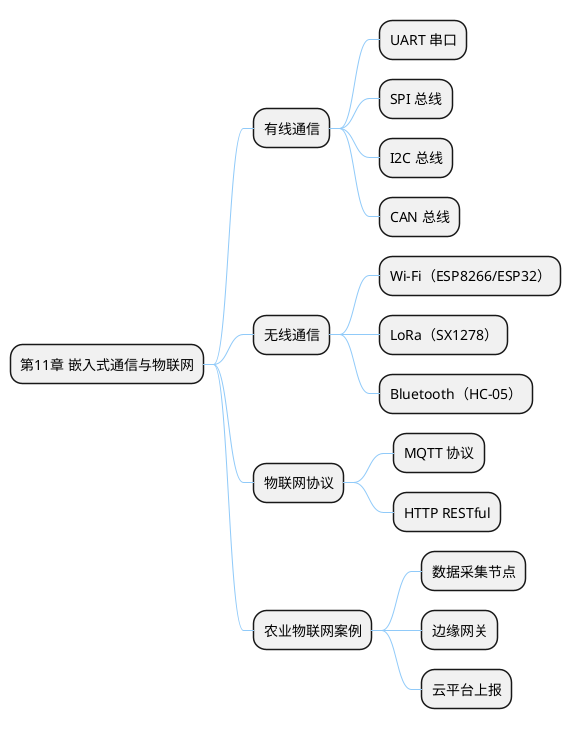
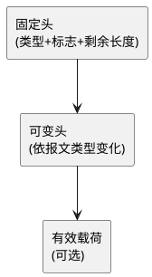
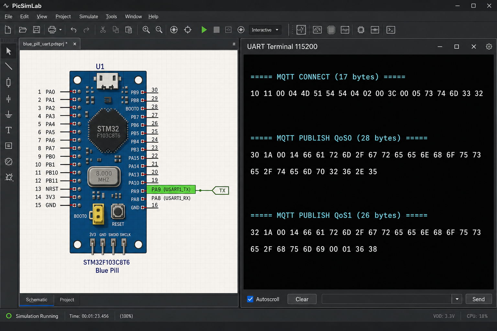

## 11 第 11 章 嵌入式通信与物联网

> 嵌入式系统很少独立工作，往往需要与上位机、云平台或其他节点通信。本章深入介绍 UART、SPI、I2C、CAN 四种常用总线协议，并扩展到 Wi-Fi、LoRa 等无线通信与 MQTT 物联网协议，最后结合农业物联网场景给出综合案例。

### 11.1 本章知识导图


```plantuml
@startmindmap
skinparam mindmapNodeBackgroundColor<<root>>    #1565C0
skinparam mindmapNodeFontColor<<root>>          white
skinparam mindmapNodeBackgroundColor<<l1>>      #1976D2
skinparam mindmapNodeFontColor<<l1>>            white
skinparam ArrowColor                            #90CAF9
skinparam mindmapNodeBorderColor                #90CAF9

* 第11章 嵌入式通信与物联网
** 有线通信
*** UART 串口
*** SPI 总线
*** I2C 总线
*** CAN 总线
** 无线通信
*** Wi-Fi（ESP8266/ESP32）
*** LoRa（SX1278）
*** Bluetooth（HC-05）
** 物联网协议
*** MQTT 协议
*** HTTP RESTful
** 农业物联网案例
*** 数据采集节点
*** 边缘网关
*** 云平台上报
@endmindmap
```

**图 11-1** 本章知识导图：从有线总线到物联网协议的完整通信体系。
<!-- fig:ch11-1 本章知识导图：从有线总线到物联网协议的完整通信体系。 -->

### 11.2 有线通信总线对比

**表 11-1** 四种常用有线通信总线对比
<!-- tab:ch11-1 四种常用有线通信总线对比 -->

| 特性 | UART | SPI | I2C | CAN |
|------|------|-----|-----|-----|
| 信号线数 | 2（TX/RX） | 4（SCK/MOSI/MISO/CS） | 2（SCL/SDA） | 2（CANH/CANL） |
| 通信方式 | 异步全双工 | 同步全双工 | 同步半双工 | 异步半双工 |
| 主从关系 | 点对点 | 一主多从 | 多主多从 | 多主多从 |
| 典型速率 | 115200 bps | 数十 Mbps | 100/400 kbps | 1 Mbps |
| 传输距离 | 短（<15m） | 很短（<1m） | 短（<1m） | 长（可达 1km） |
| 典型应用 | 调试串口、GPS | Flash、LCD、ADC | 传感器、EEPROM | 汽车/工业网络 |

---

### 11.3 UART 串口通信

UART（Universal Asynchronous Receiver/Transmitter）是最常用的调试和通信接口。第 3 章已介绍基本配置，本节补充 DMA 收发和协议帧设计。

#### 11.3.1 DMA 接收不定长数据

利用 UART 空闲中断 + DMA 实现不定长数据接收，是工程中最常用的方案：

```c
/* 全局缓冲区 */
#define RX_BUF_SIZE  256
uint8_t rx_buf[RX_BUF_SIZE];
volatile uint16_t rx_len = 0;
volatile uint8_t rx_flag = 0;

/* 启动 DMA 接收 */
void UART_StartReceive(void)
{
    __HAL_UART_ENABLE_IT(&huart1, UART_IT_IDLE);
    HAL_UART_Receive_DMA(&huart1, rx_buf, RX_BUF_SIZE);
}

/* 空闲中断回调（在 USARTx_IRQHandler 中调用） */
void UART_IDLE_Handler(void)
{
    if (__HAL_UART_GET_FLAG(&huart1, UART_FLAG_IDLE)) {
        __HAL_UART_CLEAR_IDLEFLAG(&huart1);
        HAL_UART_DMAStop(&huart1);
        rx_len = RX_BUF_SIZE - __HAL_DMA_GET_COUNTER(huart1.hdmarx);
        rx_flag = 1;
        HAL_UART_Receive_DMA(&huart1, rx_buf, RX_BUF_SIZE);
    }
}
```

#### 11.3.2 自定义协议帧

工程通信需要定义帧结构保证数据完整性：

**表 11-2** 自定义通信协议帧格式
<!-- tab:ch11-2 自定义通信协议帧格式 -->

| 帧头 | 长度 | 命令 | 数据 | 校验 |
|:----:|:---:|:---:|:----:|:---:|
| 0xAA 0x55 | 1字节（数据域长度） | 1字节 | N字节 | 1字节（异或校验） |

```c
typedef struct __attribute__((packed)) {
    uint8_t header[2];  /* 0xAA, 0x55 */
    uint8_t length;     /* 数据域长度 */
    uint8_t cmd;        /* 命令码 */
    uint8_t data[64];   /* 数据域 */
    uint8_t checksum;   /* XOR 校验 */
} FrameTypeDef;

uint8_t Frame_CalcChecksum(const uint8_t *buf, uint16_t len)
{
    uint8_t xor_val = 0;
    for (uint16_t i = 0; i < len; i++) {
        xor_val ^= buf[i];
    }
    return xor_val;
}
```

---

### 11.4 CAN 总线深入

CAN（Controller Area Network）最初为汽车网络设计，因其高可靠性和长距离传输能力，在工业控制和农业装备中广泛应用。STM32F103 内置 bxCAN 控制器。

#### 11.4.1 CAN 帧结构

**表 11-3** CAN 标准数据帧各字段
<!-- tab:ch11-3 CAN 标准数据帧各字段 -->

| 字段 | 位数 | 说明 |
|------|:----:|------|
| SOF | 1 | 帧起始（显性位） |
| 标识符（ID） | 11 | 仲裁用，数值越小优先级越高 |
| RTR | 1 | 0=数据帧，1=远程帧 |
| 控制域 | 6 | 含DLC（数据长度 0~8） |
| 数据域 | 0~64 | 0~8字节有效数据 |
| CRC | 16 | 循环冗余校验 |
| ACK | 2 | 接收方确认 |
| EOF | 7 | 帧结束 |

#### 11.4.2 STM32 CAN 收发

```c
/* CAN 发送数据 */
CAN_TxHeaderTypeDef tx_header;
uint8_t tx_data[8];
uint32_t tx_mailbox;

void CAN_SendData(uint32_t id, uint8_t *data, uint8_t len)
{
    tx_header.StdId = id;
    tx_header.IDE   = CAN_ID_STD;
    tx_header.RTR   = CAN_RTR_DATA;
    tx_header.DLC   = len;

    HAL_CAN_AddTxMessage(&hcan, &tx_header, data, &tx_mailbox);
}

/* CAN 接收回调 */
void HAL_CAN_RxFifo0MsgPendingCallback(CAN_HandleTypeDef *hcan_inst)
{
    CAN_RxHeaderTypeDef rx_header;
    uint8_t rx_data[8];

    HAL_CAN_GetRxMessage(hcan_inst, CAN_RX_FIFO0, &rx_header, rx_data);

    /* 根据 ID 分发处理 */
    switch (rx_header.StdId) {
        case 0x101:  /* 温湿度节点 */
            Process_TempHumi(rx_data, rx_header.DLC);
            break;
        case 0x102:  /* 土壤湿度节点 */
            Process_Soil(rx_data, rx_header.DLC);
            break;
    }
}

/* 过滤器配置——只接收 0x100~0x1FF 的帧 */
void CAN_FilterConfig(void)
{
    CAN_FilterTypeDef filter;
    filter.FilterBank           = 0;
    filter.FilterMode           = CAN_FILTERMODE_IDMASK;
    filter.FilterScale          = CAN_FILTERSCALE_32BIT;
    filter.FilterIdHigh         = 0x100 << 5;
    filter.FilterIdLow          = 0;
    filter.FilterMaskIdHigh     = 0x700 << 5;
    filter.FilterMaskIdLow      = 0;
    filter.FilterFIFOAssignment = CAN_RX_FIFO0;
    filter.FilterActivation     = ENABLE;
    HAL_CAN_ConfigFilter(&hcan, &filter);
}
```

---

### 11.5 Wi-Fi 通信（ESP8266）

ESP8266 是低成本 Wi-Fi 模块，通过 AT 指令与 STM32 串口通信，可将嵌入式设备接入互联网。

#### 11.5.1 AT 指令基础

**表 11-4** 常用 ESP8266 AT 指令
<!-- tab:ch11-4 常用 ESP8266 AT 指令 -->

| 指令 | 功能 | 示例响应 |
|------|------|---------|
| `AT` | 测试连接 | OK |
| `AT+CWMODE=1` | 设为 Station 模式 | OK |
| `AT+CWJAP="SSID","PASS"` | 连接 Wi-Fi | WIFI CONNECTED |
| `AT+CIPSTART="TCP","IP",PORT` | 建立 TCP 连接 | CONNECT |
| `AT+CIPSEND=N` | 发送 N 字节数据 | > |

#### 11.5.2 STM32 驱动 ESP8266

```c
/* 发送 AT 指令并等待响应 */
uint8_t ESP_SendCmd(const char *cmd, const char *expected,
                    uint32_t timeout_ms)
{
    rx_flag = 0;
    HAL_UART_Transmit(&huart2, (uint8_t *)cmd, strlen(cmd), 100);
    HAL_UART_Transmit(&huart2, (uint8_t *)"\r\n", 2, 10);

    uint32_t start = HAL_GetTick();
    while (HAL_GetTick() - start < timeout_ms) {
        if (rx_flag) {
            rx_flag = 0;
            if (strstr((char *)rx_buf, expected)) return 1;
        }
    }
    return 0;
}

/* 初始化 ESP8266 并连接 Wi-Fi */
uint8_t ESP_Init(const char *ssid, const char *pass)
{
    char cmd[128];
    if (!ESP_SendCmd("AT", "OK", 2000)) return 0;
    if (!ESP_SendCmd("AT+CWMODE=1", "OK", 2000)) return 0;
    snprintf(cmd, sizeof(cmd), "AT+CWJAP=\"%s\",\"%s\"", ssid, pass);
    if (!ESP_SendCmd(cmd, "WIFI GOT IP", 10000)) return 0;
    return 1;
}
```

---

### 11.6 LoRa 远距离通信

LoRa（Long Range）是一种低功耗广域网（LPWAN）技术，适用于农业环境监测等远距离、低速率场景。

**表 11-5** LoRa 与 Wi-Fi 对比
<!-- tab:ch11-5 LoRa 与 Wi-Fi 对比 -->

| 特性 | LoRa | Wi-Fi |
|------|------|-------|
| 通信距离 | 1~15 km（开阔地） | 50~100 m |
| 数据速率 | 0.3~50 kbps | 数十 Mbps |
| 功耗 | 极低（电池供电数月~年） | 高（需持续供电） |
| 频段 | 免授权（433/470/868/915 MHz） | 2.4/5 GHz |
| 拓扑 | 星型 | 星型/Mesh |
| 适用场景 | 农田监测、水质检测 | 室内设备联网 |

SX1278 模块通过 SPI 接口与 STM32 通信，基本流程：配置频率/扩频因子/带宽 → 发送/接收数据包。

---

### 11.7 MQTT 物联网协议

MQTT（Message Queuing Telemetry Transport）是面向物联网的轻量级发布/订阅消息协议，常运行于 TCP（默认端口 1883）。农业物联网网关在采集温湿度后，可将数据封装为 MQTT PUBLISH 报文，经 Wi-Fi 模块发往云平台 Broker。

学习目标：

- 说明 Broker、Topic、QoS 在发布/订阅模型中的作用；
- 按 MQTT 3.1.1 格式手动构造 CONNECT 与 PUBLISH 报文；
- 在 C 代码中实现剩余长度变长编码，并区分 QoS0 与 QoS1 固定头；
- 使用 PicSimLab 观察 USART 输出的报文字节流，完成组包验证。

#### 11.7.1 核心概念

```bob
  +----------+    PUBLISH     +----------+    PUBLISH     +----------+
  | 传感器   |   topic:       | MQTT     |   topic:       | 手机APP  |
  | 节点     |  "farm/temp"   | Broker   |  "farm/temp"   | 订阅者   |
  | (发布者)  |  ------------> | 服务器   |  ------------> | (订阅者)  |
  +----------+                +----------+                +----------+
                                   |
                              +----------+
                              | 云平台   |
                              | 订阅者   |
                              +----------+
```

**图 11-2** MQTT 发布/订阅模型：发布者与订阅者通过 Broker 解耦，彼此无需知道对方地址。
<!-- fig:ch11-2 MQTT 发布/订阅模型：发布者与订阅者通过 Broker 解耦，彼此无需知道对方地址。 -->

**表 11-6** MQTT 核心术语
<!-- tab:ch11-6 MQTT 核心术语 -->

| 术语 | 含义 | 农业物联网示例 |
|------|------|----------------|
| Broker | 消息中转服务器 | 云端 Mosquitto、EMQX |
| Topic | 层级主题字符串 | `farm/zone1/temp` |
| Publisher | 向 Topic 发布消息 | 温室网关 STM32 + ESP8266 |
| Subscriber | 订阅 Topic 接收消息 | 手机 APP、云平台规则引擎 |

#### 11.7.2 QoS 等级说明

**表 11-7** MQTT QoS 等级
<!-- tab:ch11-7 MQTT QoS 等级 -->

| QoS | 语义 | 机制概要 | 适用场景 |
|:---:|------|----------|----------|
| 0 | 最多一次（At most once） | 无 PUBACK，发完即忘 | 高频采样、允许偶尔丢包的温度曲线 |
| 1 | 至少一次（At least once） | 发布者收 PUBACK，可能重复 | 灌溉开关、告警上报 |
| 2 | 恰好一次（Exactly once） | 四次握手，开销最大 | 计费、关键指令（嵌入式较少用） |

QoS 体现在 **PUBLISH 固定头** 的 bit1～bit2：类型高 4 位为 `0011`（PUBLISH）。QoS0 时首字节常为 `0x30`，QoS1 为 `0x32`。QoS1/2 时在主题名之后还需 **报文标识符（Packet Identifier）** 2 字节。

#### 11.7.3 报文结构原理

MQTT 控制报文由固定头、可变头、有效载荷三部分组成：


```plantuml
@startuml
skinparam backgroundColor white
rectangle "固定头\n(类型+标志+剩余长度)" as FH
rectangle "可变头\n(依报文类型变化)" as VH
rectangle "有效载荷\n(可选)" as PL
FH -down-> VH
VH -down-> PL
@enduml
```

**表 11-8** CONNECT 与 PUBLISH 可变头概要（MQTT 3.1.1）
<!-- tab:ch11-8 CONNECT 与 PUBLISH 可变头概要（MQTT 3.1.1） -->

| 报文 | 可变头主要内容 | 载荷 |
|------|----------------|------|
| CONNECT | 协议名、协议级别、连接标志、保活时间 | Client ID，及可选用户名/密码 |
| PUBLISH | 主题名（2 字节长度 + UTF-8 字符串） | 应用数据；QoS>0 时先有 Packet Id |

**剩余长度** 使用 1～4 字节变长编码：每字节低 7 位为数值，最高位为延续标志。建议封装 `MQTT_EncodeRemainingLength()` 统一处理。

#### 11.7.4 CONNECT 报文构造

下列代码在无第三方 MQTT 库时，构造最简 **Clean Session** 连接（协议名 `MQTT`、版本 4）：

```c
uint8_t MQTT_EncodeRemainingLength(uint8_t *buf, uint32_t len)
{
    uint8_t pos = 0;
    do {
        uint8_t digit = (uint8_t)(len % 128U);
        len /= 128U;
        if (len > 0U) {
            digit |= 0x80U;
        }
        buf[pos++] = digit;
    } while (len > 0U);
    return pos;
}

uint16_t MQTT_BuildConnect(uint8_t *buf, const char *client_id, uint16_t keep_alive_sec)
{
    uint16_t cid_len = (uint16_t)strlen(client_id);
    uint32_t remain = 6U + 1U + 1U + 2U + 2U + cid_len;
    uint16_t idx = 0;

    buf[idx++] = 0x10U; /* CONNECT */
    idx += MQTT_EncodeRemainingLength(&buf[idx], remain);

    buf[idx++] = 0x00U;
    buf[idx++] = 0x04U;
    memcpy(&buf[idx], "MQTT", 4U);
    idx += 4U;
    buf[idx++] = 0x04U;       /* MQTT 3.1.1 */
    buf[idx++] = 0x02U;       /* Clean Session */
    buf[idx++] = (uint8_t)(keep_alive_sec >> 8);
    buf[idx++] = (uint8_t)(keep_alive_sec);
    buf[idx++] = (uint8_t)(cid_len >> 8);
    buf[idx++] = (uint8_t)(cid_len);
    memcpy(&buf[idx], client_id, cid_len);
    idx += cid_len;

    return idx;
}
```

当 `client_id = "stm32"`、`keep_alive = 60` 时，完整报文为：

```text
10 11 00 04 4D 51 54 54 04 02 00 3C 00 05 73 74 6D 33 32
```

完整实现见 `code_examples/ch11_mqtt_packet_stm32f103/Core/Src/mqtt_packet.c`。

#### 11.7.5 PUBLISH 报文构造

在 QoS0 基础上扩展可变 QoS 与 Packet Identifier：

```c
uint16_t MQTT_BuildPublish(uint8_t *buf, const char *topic,
                           const char *payload, uint8_t qos, uint16_t pkt_id)
{
    uint16_t topic_len = (uint16_t)strlen(topic);
    uint16_t payload_len = (uint16_t)strlen(payload);
    uint32_t remain = 2U + topic_len + payload_len;
    uint16_t idx = 0;

    if (qos > 2U) {
        qos = 0U;
    }
    if (qos > 0U) {
        remain += 2U;
    }

    buf[idx++] = (uint8_t)(0x30U | ((qos & 0x03U) << 1));
    idx += MQTT_EncodeRemainingLength(&buf[idx], remain);

    buf[idx++] = (uint8_t)(topic_len >> 8);
    buf[idx++] = (uint8_t)(topic_len);
    memcpy(&buf[idx], topic, topic_len);
    idx += topic_len;

    if (qos > 0U) {
        buf[idx++] = (uint8_t)(pkt_id >> 8);
        buf[idx++] = (uint8_t)(pkt_id);
    }

    memcpy(&buf[idx], payload, payload_len);
    idx += payload_len;

    return idx;
}
```

示例：主题 `farm/greenhouse/temp`、载荷 `26.5`、QoS0 时首字节为 `0x30`；QoS1 且 Packet Id = 1 时首字节为 `0x32`，主题名后插入 `00 01`。

#### 11.7.6 工程实践与 PicSimLab 仿真

**表 11-9** 示例工程目录（`code_examples/ch11_mqtt_packet_stm32f103/`）
<!-- tab:ch11-9 示例工程目录（code_examples/ch11_mqtt_packet_stm32f103/） -->

| 路径 | 说明 |
|------|------|
| `Core/Src/mqtt_packet.c` | CONNECT / PUBLISH 组包 |
| `Application/mqtt_packet_demo.c` | USART1 十六进制打印 |
| `Doc/cubemx_config.md` | CubeMX 引脚与集成步骤 |
| `Doc/picsimlab_steps.md` | PicSimLab 启动与现象分析 |

仿真步骤概要：

1. CubeMX 配置 STM32F103C8，USART1 = 115200（TX=PA9），生成工程并加入示例源文件；
2. 在 `main.c` 的 `USER CODE BEGIN 2` 中调用 `MQTT_PacketDemo_Run(&huart1)`；
3. 编译得到 `.hex`，在 PicSimLab 加载 Blue Pill 与 UART Terminal（115200）；
4. 复位后应依次看到 CONNECT、PUBLISH QoS0、PUBLISH QoS1 三段十六进制输出。



**图 11-3** PicSimLab 仿真：USART1 打印 CONNECT 与 PUBLISH（QoS0/QoS1）报文字节流。
<!-- fig:ch11-3-picsimlab PicSimLab 仿真：USART1 打印 CONNECT 与 PUBLISH（QoS0/QoS1）报文字节流。 -->

#### 11.7.7 本节小结

- MQTT 通过 Broker 与 Topic 实现发布/订阅解耦，适合农业物联网一对多上报；
- CONNECT 建立会话，PUBLISH 承载传感数据，均可手动组包后经 TCP 发送；
- QoS0 无确认；QoS1 需 PUBACK，固定头与 Packet Id 不同；
- 资源受限 MCU 可先经 USART 验证报文，再对接 ESP8266 连接 Broker。

---

### 11.8 综合案例：农业物联网数据采集

将前面学习的技术整合，构建一个农业温室环境监测系统：

```bob
  ┌──────────────┐     CAN      ┌──────────────┐    UART/AT    ┌──────────┐
  │ 传感器节点A   │─────────────>│ 网关节点      │──────────────>│ ESP8266  │
  │ STM32+DHT11  │              │ STM32F103    │              │ Wi-Fi    │
  │ +土壤湿度     │              │ CAN接收       │              └────┬─────┘
  └──────────────┘              │ 数据汇聚      │                   │
                                │ OLED显示      │              MQTT PUBLISH
  ┌──────────────┐     CAN      │               │                   │
  │ 传感器节点B   │─────────────>│               │                   v
  │ STM32+超声波  │              └──────────────┘              ┌──────────┐
  │ +光照传感器   │                                            │ 云平台   │
  └──────────────┘                                            │ MQTT     │
                                                              │ Broker   │
                                                              └──────────┘
```

**图 11-4** 农业物联网系统架构：多个 CAN 节点采集数据，网关汇聚后通过 Wi-Fi/MQTT 上报云平台。
<!-- fig:ch11-4 农业物联网系统架构：多个 CAN 节点采集数据，网关汇聚后通过 Wi-Fi/MQTT 上报云平台。 -->

**系统特点：**

- CAN 总线连接多个传感器节点，距离可达数百米，适合温室大棚
- 网关节点汇聚数据，本地 OLED 显示，同时通过 ESP8266 上云
- MQTT 主题设计：`farm/{zone}/temp`、`farm/{zone}/humi`、`farm/{zone}/soil`
- 支持远程下发控制指令（如开启灌溉、调节通风）

---

### 11.9 本章小结

- **有线通信**：UART 用于调试和短距点对点；SPI 用于高速外设；I2C 用于低速传感器；CAN 用于长距离多节点网络
- **无线通信**：ESP8266 Wi-Fi 适合近距离联网；LoRa 适合远距离低功耗场景
- **MQTT 协议**：发布/订阅模型适合物联网的一对多通信；CONNECT/PUBLISH 可手动组包后经 TCP 上云
- **系统集成**：CAN 总线 + Wi-Fi 网关 + MQTT 云平台是农业物联网的典型架构

---

### 11.10 习题

1. 比较 UART、SPI、I2C、CAN 四种总线的适用场景，各举一个实际应用。
2. 设计一个通信协议帧格式，要求支持帧头检测、长度可变数据域和 CRC 校验。
3. CAN 总线仲裁机制如何保证高优先级消息先发送？
4. 比较 LoRa 和 Wi-Fi 在农业物联网中的优劣势。
5. 设计一个 3 节点的温室监测系统：节点 1 采集温湿度，节点 2 采集光照和土壤湿度，网关节点汇聚数据通过 MQTT 上报。画出系统架构图并设计 CAN ID 分配和 MQTT 主题规划。