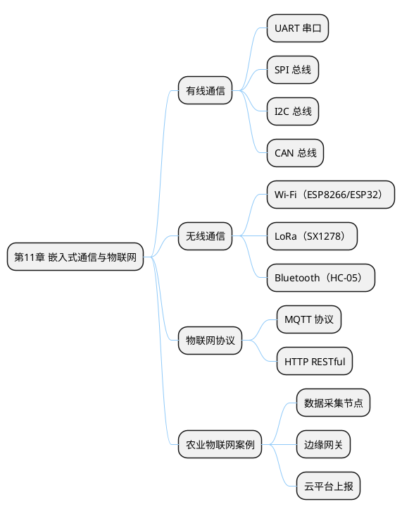
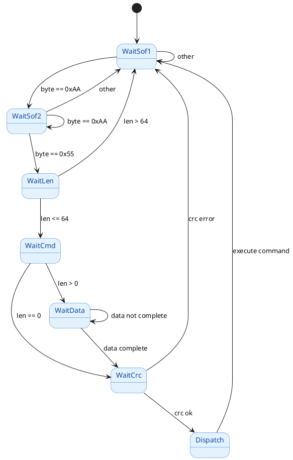
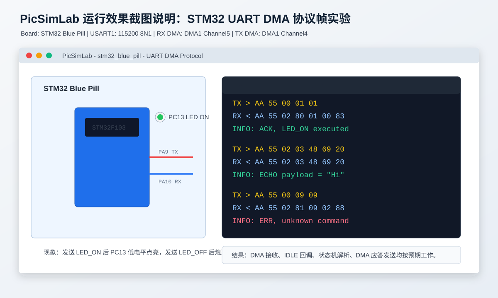

## 11 第 11 章 嵌入式通信与物联网

> 嵌入式系统很少独立工作，往往需要与上位机、云平台或其他节点通信。本章深入介绍 UART、SPI、I2C、CAN 四种常用总线协议，并扩展到 Wi-Fi、LoRa 等无线通信与 MQTT 物联网协议，最后结合农业物联网场景给出综合案例。

### 11.1 本章知识导图


```plantuml
@startmindmap
skinparam mindmapNodeBackgroundColor<<root>>    #1565C0
skinparam mindmapNodeFontColor<<root>>          white
skinparam mindmapNodeBackgroundColor<<l1>>      #1976D2
skinparam mindmapNodeFontColor<<l1>>            white
skinparam ArrowColor                            #90CAF9
skinparam mindmapNodeBorderColor                #90CAF9

* 第11章 嵌入式通信与物联网
** 有线通信
*** UART 串口
*** SPI 总线
*** I2C 总线
*** CAN 总线
** 无线通信
*** Wi-Fi（ESP8266/ESP32）
*** LoRa（SX1278）
*** Bluetooth（HC-05）
** 物联网协议
*** MQTT 协议
*** HTTP RESTful
** 农业物联网案例
*** 数据采集节点
*** 边缘网关
*** 云平台上报
@endmindmap
```

**图 11-1** 本章知识导图：从有线总线到物联网协议的完整通信体系。
<!-- fig:ch11-1 本章知识导图：从有线总线到物联网协议的完整通信体系。 -->

### 11.2 有线通信总线对比

**表 11-1** 四种常用有线通信总线对比
<!-- tab:ch11-1 四种常用有线通信总线对比 -->

| 特性 | UART | SPI | I2C | CAN |
|------|------|-----|-----|-----|
| 信号线数 | 2（TX/RX） | 4（SCK/MOSI/MISO/CS） | 2（SCL/SDA） | 2（CANH/CANL） |
| 通信方式 | 异步全双工 | 同步全双工 | 同步半双工 | 异步半双工 |
| 主从关系 | 点对点 | 一主多从 | 多主多从 | 多主多从 |
| 典型速率 | 115200 bps | 数十 Mbps | 100/400 kbps | 1 Mbps |
| 传输距离 | 短（<15m） | 很短（<1m） | 短（<1m） | 长（可达 1km） |
| 典型应用 | 调试串口、GPS | Flash、LCD、ADC | 传感器、EEPROM | 汽车/工业网络 |

---

### 11.3 UART DMA 收发与协议帧编程

UART（Universal Asynchronous Receiver/Transmitter）是 STM32 中最常用的调试与设备通信接口。简单轮询接收适合少量字节，但当上位机或通信模块连续发送数据时，轮询方式会占用 CPU，普通中断方式又容易因为字节级中断过多而增加实时性压力。本节以 `STM32F103C8T6 + STM32CubeMX + STM32CubeIDE + PicSimLab` 为实验平台，讲解 UART DMA 不定长接收、DMA 发送和自定义协议帧解析。

#### 11.3.1 学习目标

完成本节学习后，应达到以下目标：

1. 能说明 UART、DMA、空闲中断在不定长接收中的分工。
2. 能使用 CubeMX 配置 USART1、DMA1 Channel4/Channel5、NVIC 和 GPIO。
3. 能设计包含帧头、长度、命令、数据和校验字段的二进制协议帧。
4. 能编写帧解析状态机，并对错误帧、粘包和半包进行基本处理。
5. 能在 PicSimLab 中通过串口终端验证 `LED_ON`、`LED_OFF` 和 `ECHO` 命令。

#### 11.3.2 知识点

**表 11-2** UART DMA 协议实验知识点
<!-- tab:ch11-2 UART DMA 协议实验知识点 -->

| 知识点 | 作用 | 工程关注点 |
|------|------|------|
| UART 异步通信 | 完成 MCU 与上位机的字节流收发 | 波特率、数据位、停止位、校验位必须一致 |
| DMA 接收 | 将 UART 接收到的数据搬运到内存缓冲区 | 缓冲区长度、重新启动 DMA 的时机 |
| 空闲中断 | 判断一帧不定长数据已经暂时结束 | 清除 IDLE 标志，避免重复进入回调 |
| 协议帧 | 将字节流组织为有边界、有含义的数据包 | 帧头同步、长度检查、校验检查 |
| 状态机 | 在连续字节流中逐字节解析协议帧 | 能处理半包、错包和粘包 |

本实验使用 USART1，常用引脚和 DMA 通道如表 11-3 所示。

**表 11-3** STM32F103C8T6 USART1 与 DMA 配置
<!-- tab:ch11-3 STM32F103C8T6 USART1 与 DMA 配置 -->

| 项目 | 配置值 | 说明 |
|------|------|------|
| 芯片 | STM32F103C8T6 | PicSimLab Blue Pill 常用仿真目标 |
| 串口 | USART1 | 用于连接虚拟 UART Terminal |
| TX 引脚 | PA9 | MCU 发送，上位机接收 |
| RX 引脚 | PA10 | MCU 接收，上位机发送 |
| 波特率 | 115200 bps | 8 数据位、无校验、1 停止位 |
| RX DMA | DMA1 Channel5 | 外设到内存 |
| TX DMA | DMA1 Channel4 | 内存到外设 |
| 指示灯 | PC13 | Blue Pill 板载 LED，低电平点亮 |

#### 11.3.3 原理

UART DMA 不定长接收的核心思想是：USART 外设负责串并转换，DMA 负责把收到的字节搬运到内存，空闲中断负责通知“本次连续接收暂时结束”。CPU 不再为每个字节进入中断，而是在一段数据到达后统一解析。

```bob
  ┌─────────────┐       RX 字节流        ┌──────────────┐
  │  上位机/终端 │──────────────────────▶│ USART1 外设   │
  └─────────────┘                        └──────┬───────┘
                                                 │ DMA 请求
                                                 ▼
                                          ┌──────────────┐
                                          │ DMA1 Channel5 │
                                          └──────┬───────┘
                                                 │ 写入
                                                 ▼
                                          ┌──────────────┐
                                          │ rx_dma_buf[] │
                                          └──────┬───────┘
                                                 │ IDLE 回调
                                                 ▼
                                          ┌──────────────┐
                                          │ 协议状态机    │
                                          └──────┬───────┘
                                                 │ ACK/ERR/ECHO
                                                 ▼
                                          ┌──────────────┐
                                          │ DMA1 Channel4 │
                                          └──────┬───────┘
                                                 │ TX
                                                 ▼
                                          ┌─────────────┐
                                          │  上位机/终端 │
                                          └─────────────┘
```

**图 11-2** UART DMA 不定长接收与 DMA 应答发送流程。
<!-- fig:ch11-2 UART DMA 不定长接收与 DMA 应答发送流程。 -->

协议帧采用固定帧头、长度字段和异或校验。校验范围为 `LEN`、`CMD` 和 `DATA` 字段，不包含帧头。

**表 11-4** 自定义 UART 协议帧格式
<!-- tab:ch11-4 自定义 UART 协议帧格式 -->

| 字段 | 长度 | 示例 | 说明 |
|------|:---:|------|------|
| SOF1 | 1 字节 | `0xAA` | 帧头第 1 字节 |
| SOF2 | 1 字节 | `0x55` | 帧头第 2 字节 |
| LEN | 1 字节 | `0x02` | 数据域长度，范围 0~64 |
| CMD | 1 字节 | `0x03` | 命令码 |
| DATA | N 字节 | `0x48 0x69` | 有效数据 |
| CRC | 1 字节 | `0x20` | `LEN ^ CMD ^ DATA[0] ... DATA[N-1]` |

实验命令集如表 11-5 所示。

**表 11-5** UART 协议命令与响应
<!-- tab:ch11-5 UART 协议命令与响应 -->

| 命令 | 命令码 | 请求帧示例 | 正常现象 |
|------|:---:|------|------|
| LED_ON | `0x01` | `AA 55 00 01 01` | PC13 LED 点亮，返回 ACK |
| LED_OFF | `0x02` | `AA 55 00 02 02` | PC13 LED 熄灭，返回 ACK |
| ECHO | `0x03` | `AA 55 02 03 48 69 20` | 返回同样的数据 `Hi` |
| ACK | `0x80` | 由设备返回 | 表示命令执行成功 |
| ERR | `0x81` | 由设备返回 | 表示长度、校验或命令错误 |

帧解析状态机按字节推进。遇到错误帧头时重新寻找 `0xAA`；长度超过最大值时丢弃本帧；校验正确后再交给业务层执行命令。


```plantuml
@startuml
skinparam backgroundColor white
skinparam state {
  BackgroundColor #E3F2FD
  BorderColor #1976D2
  FontColor #0D47A1
}

[*] --> WaitSof1
WaitSof1 --> WaitSof2 : byte == 0xAA
WaitSof1 --> WaitSof1 : other
WaitSof2 --> WaitLen : byte == 0x55
WaitSof2 --> WaitSof2 : byte == 0xAA
WaitSof2 --> WaitSof1 : other
WaitLen --> WaitCmd : len <= 64
WaitLen --> WaitSof1 : len > 64
WaitCmd --> WaitCrc : len == 0
WaitCmd --> WaitData : len > 0
WaitData --> WaitData : data not complete
WaitData --> WaitCrc : data complete
WaitCrc --> WaitSof1 : crc error
WaitCrc --> Dispatch : crc ok
Dispatch --> WaitSof1 : execute command
@enduml
```

**图 11-3** 协议帧逐字节解析状态机。
<!-- fig:ch11-3 协议帧逐字节解析状态机。 -->

#### 11.3.4 示例

示例工程位于 `code_examples/stm32_uart_dma_protocol/`，按 CubeMX/CubeIDE 常见目录组织。该目录不提交 `Debug/`、`Release/`、`.elf`、`.bin`、`.hex` 等编译产物，满足课程仓库对 ROM 镜像和中间文件的清理要求。

```bob
  +---------------------------------------------------------------+
  | code_examples/stm32_uart_dma_protocol                         |
  +----------------------+----------------------------------------+
  | STM32_UART_DMA_      | CubeMX 工程配置文件                     |
  | Protocol.ioc         |                                        |
  +----------------------+----------------------------------------+
  | README.md            | 编译、仿真和测试说明                   |
  +----------------------+----------------------------------------+
  | Core/Inc             | app_protocol.h、uart_dma_protocol.h、   |
  |                      | main.h、usart.h、dma.h、gpio.h          |
  +----------------------+----------------------------------------+
  | Core/Src             | app_protocol.c、uart_dma_protocol.c、   |
  |                      | main.c、usart.c、dma.c、gpio.c          |
  +----------------------+----------------------------------------+
```

**图 11-4** UART DMA 协议实验工程结构。
<!-- fig:ch11-4 UART DMA 协议实验工程结构。 -->

CubeMX 配置完成后，在 `main.c` 中初始化 HAL、时钟、GPIO、DMA、USART1，再启动协议层。

```c
int main(void)
{
    HAL_Init();
    SystemClock_Config();
    MX_GPIO_Init();
    MX_DMA_Init();
    MX_USART1_UART_Init();

    Protocol_Init();
    UART_DMA_Protocol_Start();

    while (1) {
        Protocol_Poll();
    }
}
```

DMA 接收到一段不定长数据后，HAL 会进入 `HAL_UARTEx_RxEventCallback()`，应用层在回调中把本次收到的字节交给协议状态机，然后立即重新启动 DMA 接收。

```c
void HAL_UARTEx_RxEventCallback(UART_HandleTypeDef *huart, uint16_t size)
{
    if (huart->Instance == USART1) {
        Protocol_ParseBytes(uart_dma_rx_buffer, size);
        UART_DMA_Protocol_Start();
    }
}
```

#### 11.3.5 仿真

本实验使用 PicSimLab 的 STM32 Blue Pill 板卡和 UART Terminal 组件验证收发逻辑。仿真时不需要提交 `.bin` 文件；`.bin` 由 CubeIDE 本地编译生成，仅用于加载到 PicSimLab。

**表 11-6** PicSimLab 仿真配置与测试用例
<!-- tab:ch11-6 PicSimLab 仿真配置与测试用例 -->

| 项目 | 配置或输入 | 预期结果 |
|------|------|------|
| 板卡 | `stm32_blue_pill` | QEMU 后端启动 STM32F103C8T6 |
| 固件 | `Debug/STM32_UART_DMA_Protocol.bin` | 程序运行后串口可交互 |
| 串口 | USART1，115200 8N1 | UART Terminal 可收发十六进制帧 |
| LED_ON | `AA 55 00 01 01` | PC13 LED 点亮，返回 `AA 55 02 80 01 00 83` |
| LED_OFF | `AA 55 00 02 02` | PC13 LED 熄灭，返回 `AA 55 02 80 02 00 80` |
| ECHO | `AA 55 02 03 48 69 20` | 返回 `AA 55 02 03 48 69 20` |
| 错误帧 | `AA 55 00 09 09` | 返回 ERR，说明未知命令被识别 |

接线与配置步骤如下：

1. 在 STM32CubeIDE 中打开 `STM32_UART_DMA_Protocol.ioc`，确认目标芯片为 `STM32F103C8Tx`。
2. 生成并编译工程，得到本地文件 `Debug/STM32_UART_DMA_Protocol.bin`。
3. 打开 PicSimLab，选择 `Board → STM32 → Blue Pill`。
4. 执行 `File → Load Hex/Bin`，加载 CubeIDE 生成的 `.bin`。
5. 打开 `Tools → Serial Terminal` 或添加 UART Terminal 部件，设置为 `115200, 8N1, Hex` 模式。
6. 发送表 11-6 中的测试帧，观察串口返回数据和 PC13 LED 状态。

命令行启动可写为：

```bash
picsimlab --board=stm32_blue_pill --firmware=Debug/STM32_UART_DMA_Protocol.bin
```



**图 11-5** PicSimLab UART DMA 协议仿真运行效果：串口终端发送协议帧后，设备返回 ACK、ERR 或 ECHO 数据，并同步改变 PC13 LED 状态。
<!-- fig:ch11-5 PicSimLab UART DMA 协议仿真运行效果：串口终端发送协议帧后，设备返回 ACK、ERR 或 ECHO 数据，并同步改变 PC13 LED 状态。 -->

结果分析：`LED_ON` 和 `LED_OFF` 的请求帧长度为 0，因此校验值等于命令码本身；`ECHO` 的校验值为 `0x02 ^ 0x03 ^ 0x48 ^ 0x69 = 0x20`。若发送未知命令或校验错误，状态机会进入业务错误分支并返回 ERR 帧，说明帧同步、长度判断和校验判断均已生效。

#### 11.3.6 总结

UART DMA 不定长接收适合上位机协议、无线模块 AT 响应、工业网关数据透传等场景。其工程要点是：DMA 负责高效搬运字节，空闲中断负责划分接收批次，状态机负责从连续字节流中恢复协议帧。与轮询和字节中断相比，该方案能明显降低 CPU 中断频率，并提高通信代码的可维护性。实际项目中还应继续补充环形缓冲区、超时机制、CRC8/CRC16 校验和协议版本号，以增强长时间运行的可靠性。

---

### 11.4 CAN 总线深入

CAN（Controller Area Network）最初为汽车网络设计，因其高可靠性和长距离传输能力，在工业控制和农业装备中广泛应用。STM32F103 内置 bxCAN 控制器。

#### 11.4.1 CAN 帧结构

**表 11-7** CAN 标准数据帧各字段
<!-- tab:ch11-7 CAN 标准数据帧各字段 -->

| 字段 | 位数 | 说明 |
|------|:----:|------|
| SOF | 1 | 帧起始（显性位） |
| 标识符（ID） | 11 | 仲裁用，数值越小优先级越高 |
| RTR | 1 | 0=数据帧，1=远程帧 |
| 控制域 | 6 | 含DLC（数据长度 0~8） |
| 数据域 | 0~64 | 0~8字节有效数据 |
| CRC | 16 | 循环冗余校验 |
| ACK | 2 | 接收方确认 |
| EOF | 7 | 帧结束 |

#### 11.4.2 STM32 CAN 收发

```c
/* CAN 发送数据 */
CAN_TxHeaderTypeDef tx_header;
uint8_t tx_data[8];
uint32_t tx_mailbox;

void CAN_SendData(uint32_t id, uint8_t *data, uint8_t len)
{
    tx_header.StdId = id;
    tx_header.IDE   = CAN_ID_STD;
    tx_header.RTR   = CAN_RTR_DATA;
    tx_header.DLC   = len;

    HAL_CAN_AddTxMessage(&hcan, &tx_header, data, &tx_mailbox);
}

/* CAN 接收回调 */
void HAL_CAN_RxFifo0MsgPendingCallback(CAN_HandleTypeDef *hcan_inst)
{
    CAN_RxHeaderTypeDef rx_header;
    uint8_t rx_data[8];

    HAL_CAN_GetRxMessage(hcan_inst, CAN_RX_FIFO0, &rx_header, rx_data);

    /* 根据 ID 分发处理 */
    switch (rx_header.StdId) {
        case 0x101:  /* 温湿度节点 */
            Process_TempHumi(rx_data, rx_header.DLC);
            break;
        case 0x102:  /* 土壤湿度节点 */
            Process_Soil(rx_data, rx_header.DLC);
            break;
    }
}

/* 过滤器配置——只接收 0x100~0x1FF 的帧 */
void CAN_FilterConfig(void)
{
    CAN_FilterTypeDef filter;
    filter.FilterBank           = 0;
    filter.FilterMode           = CAN_FILTERMODE_IDMASK;
    filter.FilterScale          = CAN_FILTERSCALE_32BIT;
    filter.FilterIdHigh         = 0x100 << 5;
    filter.FilterIdLow          = 0;
    filter.FilterMaskIdHigh     = 0x700 << 5;
    filter.FilterMaskIdLow      = 0;
    filter.FilterFIFOAssignment = CAN_RX_FIFO0;
    filter.FilterActivation     = ENABLE;
    HAL_CAN_ConfigFilter(&hcan, &filter);
}
```

---

### 11.5 Wi-Fi 通信（ESP8266）

ESP8266 是低成本 Wi-Fi 模块，通过 AT 指令与 STM32 串口通信，可将嵌入式设备接入互联网。

#### 11.5.1 AT 指令基础

**表 11-8** 常用 ESP8266 AT 指令
<!-- tab:ch11-8 常用 ESP8266 AT 指令 -->

| 指令 | 功能 | 示例响应 |
|------|------|---------|
| `AT` | 测试连接 | OK |
| `AT+CWMODE=1` | 设为 Station 模式 | OK |
| `AT+CWJAP="SSID","PASS"` | 连接 Wi-Fi | WIFI CONNECTED |
| `AT+CIPSTART="TCP","IP",PORT` | 建立 TCP 连接 | CONNECT |
| `AT+CIPSEND=N` | 发送 N 字节数据 | > |

#### 11.5.2 STM32 驱动 ESP8266

```c
/* 发送 AT 指令并等待响应 */
uint8_t ESP_SendCmd(const char *cmd, const char *expected,
                    uint32_t timeout_ms)
{
    rx_flag = 0;
    HAL_UART_Transmit(&huart2, (uint8_t *)cmd, strlen(cmd), 100);
    HAL_UART_Transmit(&huart2, (uint8_t *)"\r\n", 2, 10);

    uint32_t start = HAL_GetTick();
    while (HAL_GetTick() - start < timeout_ms) {
        if (rx_flag) {
            rx_flag = 0;
            if (strstr((char *)rx_buf, expected)) return 1;
        }
    }
    return 0;
}

/* 初始化 ESP8266 并连接 Wi-Fi */
uint8_t ESP_Init(const char *ssid, const char *pass)
{
    char cmd[128];
    if (!ESP_SendCmd("AT", "OK", 2000)) return 0;
    if (!ESP_SendCmd("AT+CWMODE=1", "OK", 2000)) return 0;
    snprintf(cmd, sizeof(cmd), "AT+CWJAP=\"%s\",\"%s\"", ssid, pass);
    if (!ESP_SendCmd(cmd, "WIFI GOT IP", 10000)) return 0;
    return 1;
}
```

---

### 11.6 LoRa 远距离通信

LoRa（Long Range）是一种低功耗广域网（LPWAN）技术，适用于农业环境监测等远距离、低速率场景。

**表 11-9** LoRa 与 Wi-Fi 对比
<!-- tab:ch11-9 LoRa 与 Wi-Fi 对比 -->

| 特性 | LoRa | Wi-Fi |
|------|------|-------|
| 通信距离 | 1~15 km（开阔地） | 50~100 m |
| 数据速率 | 0.3~50 kbps | 数十 Mbps |
| 功耗 | 极低（电池供电数月~年） | 高（需持续供电） |
| 频段 | 免授权（433/470/868/915 MHz） | 2.4/5 GHz |
| 拓扑 | 星型 | 星型/Mesh |
| 适用场景 | 农田监测、水质检测 | 室内设备联网 |

SX1278 模块通过 SPI 接口与 STM32 通信，基本流程：配置频率/扩频因子/带宽 → 发送/接收数据包。

---

### 11.7 MQTT 物联网协议

MQTT（Message Queuing Telemetry Transport）是物联网中最流行的轻量级消息协议，基于发布/订阅模型。

#### 11.7.1 核心概念

```bob
  +----------+    PUBLISH     +----------+    PUBLISH     +----------+
  | 传感器   |   topic:       | MQTT     |   topic:       | 手机APP  |
  | 节点     |  "farm/temp"   | Broker   |  "farm/temp"   | 订阅者   |
  | (发布者)  |  ------------> | 服务器   |  ------------> | (订阅者)  |
  +----------+                +----------+                +----------+
                                   |
                              +----------+
                              | 云平台   |
                              | 订阅者   |
                              +----------+
```

**图 11-6** MQTT 发布/订阅模型：发布者和订阅者通过 Broker 解耦通信。
<!-- fig:ch11-6 MQTT 发布/订阅模型：发布者和订阅者通过 Broker 解耦通信。 -->

**表 11-10** MQTT QoS 等级
<!-- tab:ch11-10 MQTT QoS 等级 -->

| QoS | 语义 | 说明 |
|:---:|------|------|
| 0 | 最多一次（At most once） | 不确认，可能丢失 |
| 1 | 至少一次（At least once） | 确认机制，可能重复 |
| 2 | 恰好一次（Exactly once） | 四次握手，开销最大 |

#### 11.7.2 嵌入式 MQTT 报文构造

MQTT CONNECT 报文由固定头 + 可变头 + 有效载荷组成。嵌入式端通常使用轻量级 MQTT 库（如 MQTTPacket），或手动构造报文通过 TCP 发送：

```c
/* 简化的 MQTT PUBLISH 报文构造 */
uint16_t MQTT_BuildPublish(uint8_t *buf, const char *topic,
                           const char *payload)
{
    uint16_t topic_len = strlen(topic);
    uint16_t payload_len = strlen(payload);
    uint16_t remain_len = 2 + topic_len + payload_len;
    uint16_t idx = 0;

    buf[idx++] = 0x30;                     /* PUBLISH, QoS0 */
    buf[idx++] = (uint8_t)remain_len;      /* 剩余长度（<128） */
    buf[idx++] = (uint8_t)(topic_len >> 8);
    buf[idx++] = (uint8_t)(topic_len);
    memcpy(&buf[idx], topic, topic_len);
    idx += topic_len;
    memcpy(&buf[idx], payload, payload_len);
    idx += payload_len;

    return idx;
}
```

---

### 11.8 综合案例：农业物联网数据采集

将前面学习的技术整合，构建一个农业温室环境监测系统：

```bob
  ┌──────────────┐     CAN      ┌──────────────┐    UART/AT    ┌──────────┐
  │ 传感器节点A   │─────────────>│ 网关节点      │──────────────>│ ESP8266  │
  │ STM32+DHT11  │              │ STM32F103    │              │ Wi-Fi    │
  │ +土壤湿度     │              │ CAN接收       │              └────┬─────┘
  └──────────────┘              │ 数据汇聚      │                   │
                                │ OLED显示      │              MQTT PUBLISH
  ┌──────────────┐     CAN      │               │                   │
  │ 传感器节点B   │─────────────>│               │                   v
  │ STM32+超声波  │              └──────────────┘              ┌──────────┐
  │ +光照传感器   │                                            │ 云平台   │
  └──────────────┘                                            │ MQTT     │
                                                              │ Broker   │
                                                              └──────────┘
```

**图 11-7** 农业物联网系统架构：多个 CAN 节点采集数据，网关汇聚后通过 Wi-Fi/MQTT 上报云平台。
<!-- fig:ch11-7 农业物联网系统架构：多个 CAN 节点采集数据，网关汇聚后通过 Wi-Fi/MQTT 上报云平台。 -->

**系统特点：**

- CAN 总线连接多个传感器节点，距离可达数百米，适合温室大棚
- 网关节点汇聚数据，本地 OLED 显示，同时通过 ESP8266 上云
- MQTT 主题设计：`farm/{zone}/temp`、`farm/{zone}/humi`、`farm/{zone}/soil`
- 支持远程下发控制指令（如开启灌溉、调节通风）

---

### 11.9 本章小结

- **有线通信**：UART 用于调试和短距点对点；SPI 用于高速外设；I2C 用于低速传感器；CAN 用于长距离多节点网络
- **无线通信**：ESP8266 Wi-Fi 适合近距离联网；LoRa 适合远距离低功耗场景
- **MQTT 协议**：发布/订阅模型适合物联网的一对多通信
- **系统集成**：CAN 总线 + Wi-Fi 网关 + MQTT 云平台是农业物联网的典型架构

---

### 11.10 习题

1. 比较 UART、SPI、I2C、CAN 四种总线的适用场景，各举一个实际应用。
2. 设计一个通信协议帧格式，要求支持帧头检测、长度可变数据域和 CRC 校验。
3. CAN 总线仲裁机制如何保证高优先级消息先发送？
4. 比较 LoRa 和 Wi-Fi 在农业物联网中的优劣势。
5. 设计一个 3 节点的温室监测系统：节点 1 采集温湿度，节点 2 采集光照和土壤湿度，网关节点汇聚数据通过 MQTT 上报。画出系统架构图并设计 CAN ID 分配和 MQTT 主题规划。
