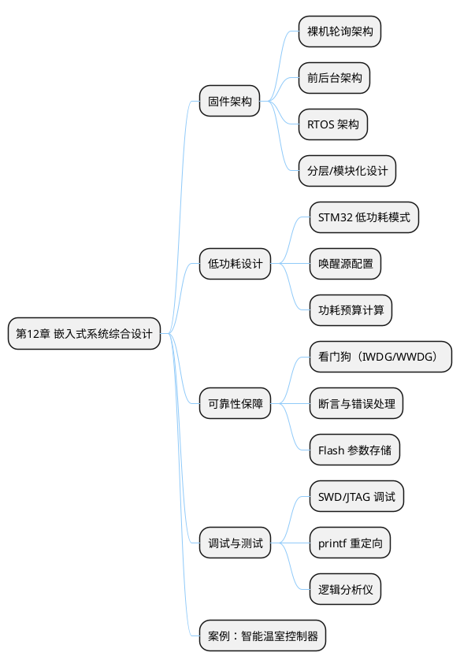
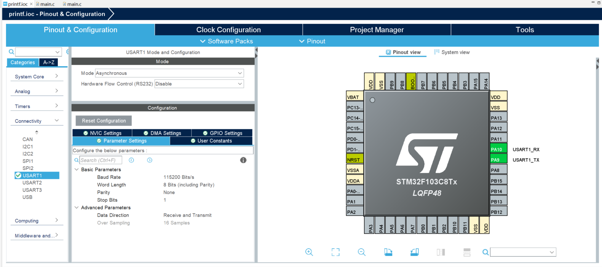
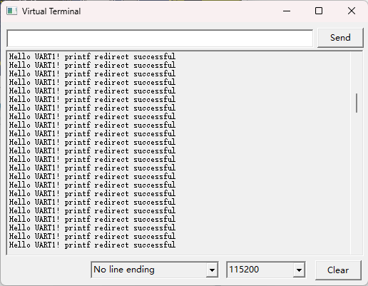
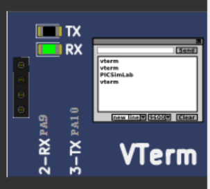
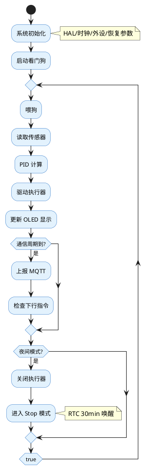

## 12 第 12 章 嵌入式系统综合设计

> 前面各章分别介绍了外设驱动、传感器、执行器、通信和控制。本章将从系统层面讨论嵌入式产品的设计方法论，包括低功耗设计、固件架构、可靠性保障和调试技术，帮助学生从"写一个外设驱动"提升到"设计一个完整的嵌入式产品"。

### 12.1 本章知识导图



**图 12-1** 本章知识导图：嵌入式系统综合设计的关键要素。
<!-- fig:ch12-1 本章知识导图：嵌入式系统综合设计的关键要素。 -->

### 12.2 固件架构设计

#### 12.2.1 三种典型架构

**表 12-1** 三种固件架构对比
<!-- tab:ch12-1 三种固件架构对比 -->

| 架构 | 结构 | 优点 | 缺点 | 适用场景 |
|------|------|------|------|---------|
| 裸机轮询 | `while(1)` 顺序执行 | 简单直观 | 无法响应实时事件 | LED 闪烁等极简应用 |
| 前后台 | 中断（前台）+ `while(1)`（后台） | 实时性好 | 中断中不宜执行耗时操作 | 大多数中小型项目 |
| RTOS | 多任务调度 | 模块化、可扩展 | 占用 RAM、学习成本高 | 复杂多任务系统 |

#### 12.2.2 前后台架构实践

前后台架构是嵌入式开发最常用的模式——中断中置标志位/存数据，主循环中处理逻辑：

```c
/* 全局标志 */
volatile uint8_t flag_uart_rx = 0;
volatile uint8_t flag_tim_10ms = 0;
volatile uint8_t flag_adc_done = 0;

/* 中断：置标志 + 快速存数据 */
void HAL_TIM_PeriodElapsedCallback(TIM_HandleTypeDef *htim)
{
    if (htim->Instance == TIM6)
        flag_tim_10ms = 1;
}

/* 主循环：依次处理各事件 */
int main(void)
{
    HAL_Init();
    SystemClock_Config();
    Periph_Init();

    while (1) {
        if (flag_tim_10ms) {
            flag_tim_10ms = 0;
            PID_Control_Task();    /* 10ms 周期控制 */
        }
        if (flag_uart_rx) {
            flag_uart_rx = 0;
            Command_Parse_Task();  /* 解析串口指令 */
        }
        if (flag_adc_done) {
            flag_adc_done = 0;
            Sensor_Process_Task(); /* 传感器数据处理 */
        }
        Display_Update_Task();     /* 低优先级刷新显示 */
    }
}
```

#### 12.2.3 分层模块化设计

```bob
  ┌─────────────────────────────────────────────┐
  │               应用层 (Application)           │
  │  main.c, task_xxx.c                         │
  ├─────────────────────────────────────────────┤
  │               服务层 (Service)               │
  │  pid.c, protocol.c, mqtt.c                  │
  ├─────────────────────────────────────────────┤
  │               驱动层 (Driver)                │
  │  motor.c, dht11.c, oled.c, esp8266.c       │
  ├─────────────────────────────────────────────┤
  │               硬件抽象层 (HAL)               │
  │  stm32f1xx_hal_xxx.c                        │
  ├─────────────────────────────────────────────┤
  │               硬件 (Hardware)                │
  │  STM32F103C8T6 + 外围电路                    │
  └─────────────────────────────────────────────┘
```

**图 12-2** 分层固件架构：上层调用下层接口，禁止跨层或反向调用。
<!-- fig:ch12-2 分层固件架构：上层调用下层接口，禁止跨层或反向调用。 -->

---

### 12.3 低功耗设计

电池供电的农业传感器节点需要极低功耗以延长工作时间。STM32F103 提供三种低功耗模式：

**表 12-2** STM32F103 低功耗模式对比
<!-- tab:ch12-2 STM32F103 低功耗模式对比 -->

| 模式 | 内核 | 外设 | RAM | 唤醒源 | 典型电流 |
|------|:----:|:----:|:---:|--------|:-------:|
| Sleep | 停止 | 运行 | 保持 | 任意中断 | ~1.5 mA |
| Stop | 停止 | 停止 | 保持 | EXTI/RTC | ~20 μA |
| Standby | 停止 | 停止 | 丢失 | WKUP/RTC/NRST | ~2 μA |

#### 12.3.1 Stop 模式实现

```c
/* 进入 Stop 模式，RTC 闹钟唤醒 */
void EnterStopMode(uint32_t wakeup_sec)
{
    /* 配置 RTC 闹钟 */
    HAL_RTC_SetAlarm_IT(&hrtc, &alarm, RTC_FORMAT_BIN);

    /* 进入 Stop 模式 */
    HAL_SuspendTick();
    HAL_PWR_EnterSTOPMode(PWR_LOWPOWERREGULATOR_ON, PWR_STOPENTRY_WFI);

    /* 唤醒后恢复时钟 */
    SystemClock_Config();
    HAL_ResumeTick();
}

/* 典型工作模式：采集 → 发送 → 休眠 */
while (1) {
    Sensor_ReadAll();          /* 采集传感器数据 */
    MQTT_PublishData();        /* 上报数据 */
    EnterStopMode(300);        /* 休眠 5 分钟 */
}
```

#### 12.3.2 功耗预算计算

以 3.7V/2000mAh 锂电池供电为例：

**表 12-3** 
<!-- tab:ch12-3  -->

| 阶段 | 时间 | 电流 | 能量消耗 |
|------|:----:|:----:|:-------:|
| 采集+发送 | 5s | 50 mA | 0.069 mAh |
| 休眠 | 295s | 20 μA | 0.0016 mAh |
| **一个周期（5min）** | **300s** | — | **0.071 mAh** |

$$寿命 = \frac{2000 \text{ mAh}}{0.071 \times 12} = 2347 \text{ 小时} \approx 98 \text{ 天}$$

---

### 12.4 可靠性保障

#### 12.4.1 独立看门狗（IWDG）

IWDG 使用独立的 LSI 时钟，即使主时钟失效也能复位 MCU：

```c
/* CubeMX 配置 IWDG：预分频 64，重载 625 → 超时约 1s */
void WDG_Init(void)
{
    hiwdg.Instance       = IWDG;
    hiwdg.Init.Prescaler = IWDG_PRESCALER_64;
    hiwdg.Init.Reload    = 625;
    HAL_IWDG_Init(&hiwdg);
}

/* 主循环中喂狗 */
while (1) {
    HAL_IWDG_Refresh(&hiwdg);  /* 必须在 1s 内执行 */
    /* ... 正常任务 ... */
}
```

#### 12.4.2 Flash 参数存储

将配置参数（PID 系数、传感器校准值、通信地址）存入 Flash 末页，断电不丢失：

```c
#define PARAM_ADDR  0x0800FC00  /* Flash 最后一页起始地址 */

void Param_Save(const uint8_t *data, uint16_t len)
{
    HAL_FLASH_Unlock();
    FLASH_EraseInitTypeDef erase;
    erase.TypeErase   = FLASH_TYPEERASE_PAGES;
    erase.PageAddress = PARAM_ADDR;
    erase.NbPages     = 1;
    uint32_t error;
    HAL_FLASHEx_Erase(&erase, &error);

    for (uint16_t i = 0; i < len; i += 2) {
        uint16_t half_word = data[i] | (data[i + 1] << 8);
        HAL_FLASH_Program(FLASH_TYPEPROGRAM_HALFWORD,
                          PARAM_ADDR + i, half_word);
    }
    HAL_FLASH_Lock();
}

void Param_Load(uint8_t *data, uint16_t len)
{
    memcpy(data, (const void *)PARAM_ADDR, len);
}
```

---

### 12.5 调试技术 — printf 串口重定向

本节对应课程实践说明如何将标准库 `printf` 重定向到 USART1，并在 PicSimLab 或串口助手中验证。

**课程工程信息：**

| 项目 | 说明 |
|------|------|
| 本地工程路径 | `STM32CubeIDE/workspace_1.13.2/printf/` |
| CubeMX 工程文件 | `printf.ioc` |
| 核心源码 | `Core/Src/main.c` |
| 提交到课程仓库 | 复制为 `code_examples/ch12_printf_uart/`（勿含 `Debug/*.bin` 等编译产物） |
| MCU | STM32F103C8T6 |
| 系统时钟 | **HSI 8 MHz**（本工程未启用 PLL 倍频至 72 MHz） |

**学习目标：**

- 理解 `printf` → `_write` / `fputc` → `HAL_UART_Transmit` 的输出路径
- 掌握 CubeMX 配置 USART1（PA9/PA10、115200）及 `setvbuf` 无缓冲设置
- 能在 PicSimLab 或 USB-TTL 串口助手中看到 `Hello UART1!` 周期性输出
- 能结合 SWD 断点调试与串口打印完成 Issue #125 验收与课程报告

#### 12.5.1 原理：从 printf 到 UART 字节流

在 PC 上，`printf` 写入标准输出；在 STM32 裸机程序中需将输出映射到外设。本工程在 `Core/Src/main.c` 的 `USER CODE BEGIN 0` 中实现 **`fputc`** 与 **`_write`**：`printf` 经标准库调用 `_write` 批量写字节，`_write` 再逐字节调用 `fputc`，最终由 `HAL_UART_Transmit` 从 **USART1** 发出。`main` 开头使用 **`setvbuf(stdout, NULL, _IONBF, 0)`** 关闭 stdout 缓冲，避免日志滞留在缓冲区；循环内 **`fflush(stdout)`** 保证每秒打印立即送出。

```bob
  ┌─────────────┐     _write      ┌─────────────┐    逐字节      ┌─────────────┐
  │  printf     │ ─────────────> │  _write     │ ────────────> │   fputc     │
  │ fflush      │                │ (main.c)    │               │ (main.c)    │
  └─────────────┘                └─────────────┘               └──────┬──────┘
                                                                      │
                                      HAL_UART_Transmit(&huart1)      v
                                                            ┌─────────────────┐
                                                            │ USART1 PA9/PA10 │
                                                            └────────┬────────┘
                                                                     v
                                                            ┌─────────────────┐
                                                            │ UART Terminal   │
                                                            │ (实物/PicSimLab) │
                                                            └─────────────────┘
```

**图 12-4** `printf` 经 `fputc` 重定向至 USART1 的数据路径。
<!-- fig:ch12-4 printf 经 fputc 重定向至 USART1 的数据路径。 -->

**表 12-4** printf 重定向相关配置项
<!-- tab:ch12-4 printf 重定向相关配置项 -->

| 配置项 | 本工程实际值 | 说明 |
|--------|--------------|------|
| 工程名 | `printf` | CubeIDE 工作区目录名 |
| 串口 | USART1 | `MX_USART1_UART_Init()` 在 `main.c` 中生成 |
| 引脚 | PA9 = TX，PA10 = RX | 与 `printf.ioc` 一致 |
| 波特率 | 115200 | 8 数据位、无校验、1 停止位 |
| 系统时钟 | HSI，SYSCLK = 8 MHz | `SystemClock_Config()` 使用内部 HSI |
| 标准 I/O | `setvbuf` 无缓冲 + `fflush` | 见 `main` 中 `USER CODE BEGIN 1` / `WHILE` |
| 换行 | `\r\n` | 示例字符串已带 `\r\n` |

#### 12.5.2 fputc 与 _write 重定向实现

下列代码摘自课程工程 **`Core/Src/main.c`**（`USER CODE BEGIN 0`），为 Issue #125 验收核心：

```c
#include "stdio.h"

int fputc(int ch, FILE *f)
{
    HAL_UART_Transmit(&huart1, (uint8_t *)&ch, 1, HAL_MAX_DELAY);
    return ch;
}

int _write(int file, char *ptr, int len)
{
    int i;
    for (i = 0; i < len; i++) {
        fputc(*ptr++, NULL);
    }
    return len;
}
```

**要点：**

- `fputc` 将单字符经 `huart1` 发出；超时使用 `HAL_MAX_DELAY`，避免发送未完成就返回。
- `_write` 适配 newlib 标准库：`printf` 可能一次写入多字节，循环调用 `fputc` 即可。
- 若仅勾选 MicroLIB 且只实现 `fputc` 也能工作；本工程**同时实现两者**，兼容性更好，便于通过 Copilot/教师评审中的「示例程序完整性」项。

#### 12.5.3 CubeMX 与 CubeIDE 配置

本工程 **`printf.ioc`** 已完成如下配置（与 `main.c` 中 `MX_USART1_UART_Init` 参数一致）：

1. MCU：**STM32F103C8Tx**（Blue Pill 对应芯片）。
2. **USART1**：Mode = Asynchronous；**PA9 = USART1_TX**，**PA10 = USART1_RX**。
3. **RCC**：使用 **HSI** 作为 SYSCLK（本工程 APB1/APB2 = 8 MHz，满足 USART1 115200 波特率）。
4. **Project Manager**：Toolchain / IDE 选 **STM32CubeIDE**，生成到 `printf` 工程。
5. 在 CubeIDE 打开 `Core/Src/main.c`，将 12.5.2 代码放入 `USER CODE BEGIN 0`，将 12.5.4 代码放入 `USER CODE BEGIN 1` 与 `WHILE`。
6. **Project → Build Project**，固件输出路径为  
   `printf/Debug/printf.bin`（仅本地烧录或 PicSimLab 加载）。



**图 12-5** CubeMX 工程 `printf.ioc` 中的 USART1 配置：异步模式、波特率 115200，TX/RX 分别映射至 **PA9** 与 **PA10**。生成代码后，`MX_USART1_UART_Init()` 中的参数与此界面一致，是后续 `fputc` 能正确发数的前提。
<!-- fig:ch12-5 CubeMX 工程 printf.ioc 中的 USART1 配置：异步模式、波特率 115200，TX/RX 分别映射至 PA9 与 PA10。 -->

#### 12.5.4 使用示例（main 循环）

`main` 函数中对应的实现如下（摘自 **`Core/Src/main.c`**）：

```c
int main(void)
{
    /* USER CODE BEGIN 1 */
    setvbuf(stdout, NULL, _IONBF, 0);
    /* USER CODE END 1 */

    HAL_Init();
    SystemClock_Config();
    MX_GPIO_Init();
    MX_USART1_UART_Init();

    while (1) {
        printf("Hello UART1! printf redirect successful\r\n");
        fflush(stdout);
        HAL_Delay(1000);
    }
}
```

**表 12-5** 本工程运行现象与预期对照
<!-- tab:ch12-5 本工程运行现象与验收对照 -->

| 项目 | 本工程对应实现 | 预期现象 |
|----------------------|----------------|----------|
| fputc 重定向正确 | `fputc` + `_write` | 串口有输出 |
| 使用示例 | 每秒 `printf` + `fflush` | 周期性显示 `Hello UART1!...` |
| SWD 调试配合 | 可在 `fputc`/`main` 设断点 | 断点命中且 `huart1` 已初始化 |

**拓展（可选）：** 在 `while` 中增加 `printf("%d\r\n", count++)` 或 `%.2f` 浮点格式，用于演示更多转换符；提交课程报告前建议保留当前可稳定运行的版本。

#### 12.5.5 PicSimLab 仿真演示

**表 12-6** PicSimLab 仿真环境配置
<!-- tab:ch12-6 PicSimLab 仿真环境配置 -->

| 项目 | 配置 |
|------|------|
| 板卡 | stm32_blue_pill |
| 固件 | `printf/Debug/printf.bin`（CubeIDE 编译产物，仅本地使用） |
| 外设 | UART Terminal，**115200** |
| 接线 | Terminal TX/RX 与 USART1 虚拟引脚（PA9/PA10）映射一致 |

**步骤：**

1. 在 CubeIDE 打开工程 `printf`，执行 **Build Project**。
2. 打开 PicSimLab，板卡选 **stm32_blue_pill**。
3. **File → Load Hex/Bin**，选择  
   `...\workspace_1.13.2\printf\Debug\printf.bin`。
4. 添加 **UART Terminal**，波特率 **115200**，引脚对接 USART1。
5. 点击运行，终端应**每秒一行**：  
   `Hello UART1! printf redirect successful`。

```bash
picsimlab --board=stm32_blue_pill --firmware=printf/Debug/printf.bin
```



**图 12-6** PicSimLab 仿真运行效果：板卡为 **stm32_blue_pill**，已加载 `printf.bin`。右侧 **UART Terminal** 以 115200 波特率接收 MCU 经 USART1 发出的字符流，可见程序每秒打印一行 `Hello UART1! printf redirect successful`，说明 `printf` → `_write` → `fputc` → `HAL_UART_Transmit` 链路工作正常。
<!-- fig:ch12-6 PicSimLab 仿真运行效果：加载 printf.bin 后 UART Terminal 周期性显示 Hello UART1 重定向成功信息。 -->



**图 12-7** PicSimLab 中 **UART Terminal** 与 Blue Pill **USART1** 的虚拟接线：MCU 的 **TX（PA9）** 接终端 **RX**，**RX（PA10）** 接终端 **TX**，GND 共地。接线错误时常见现象为无输出或乱码；配置完成后需在组件属性中确认波特率为 **115200**，与 `MX_USART1_UART_Init()` 一致。
<!-- fig:ch12-7 PicSimLab 中 UART Terminal 与 USART1 PA9 PA10 虚拟接线示意。 -->

**结果分析：**

- 出现 **乱码**：检查终端波特率是否为 115200，TX/RX 是否接反。
- **完全无输出**：确认 `MX_USART1_UART_Init()` 在 `printf` 之前执行；`fputc`/`_write` 是否已编译进工程；PicSimLab 是否已点击运行。
- **只输出一次**：检查是否忘记 `fflush(stdout)` 或未关闭缓冲（本工程已用 `setvbuf` + `fflush`）。

#### 12.5.6 SWD 在线调试配合

串口适合**连续日志**；SWD（ST-Link + CubeIDE）适合**断点、单步、查看变量**。二者互补。

**表 12-7** 串口 printf 与 SWD 调试对比
<!-- tab:ch12-7 串口 printf 与 SWD 调试对比 -->

| 对比项 | printf 串口 | SWD 在线调试 |
|--------|-------------|--------------|
| 是否停核 | 否 | 断点处暂停 |
| 适用场景 | 状态轨迹、周期采样 | 查崩溃点、跟踪初始化 |
| 对时序影响 | 打印耗时可能影响实时环 | 暂停破坏严格时序 |

**推荐流程（针对 `printf` 工程）：**

1. CubeIDE **Debug As → STM32 Cortex-M C/C++ Application**，连接 ST-Link（或板载 SWD）。
2. 在 `MX_USART1_UART_Init()` 之后、`printf` 行设断点，确认能命中且 `huart1.Instance == USART1`。
3. 在 `fputc` 内设断点，单步观察 `ch` 与 `HAL_UART_Transmit` 返回值。
4. 全速运行后，串口/PicSimLab 应与断点调试前的预期一致。

#### 12.5.7 其他调试手段

**表 12-8** 嵌入式系统调试手段
<!-- tab:ch12-8 嵌入式系统调试手段 -->

| 手段 | 工具 | 适用场景 |
|------|------|---------|
| 串口打印 | USART + 串口助手 / PicSimLab | 运行时变量监控（本节重点） |
| SWD 在线调试 | ST-Link + CubeIDE | 断点、单步、变量查看 |
| 逻辑分析仪 | Saleae / PulseView | UART 波形与波特率 |
| LED 指示 | 板载 LED | 确认执行到哪一段代码 |
| PicSimLab 仿真 | PicSimLab（第 6 章） | 无硬件时验证 printf |

#### 12.5.8 本节小结与课程报告对应关系

- 本课程论文以工程 **`printf`**、源文件 **`Core/Src/main.c`** 为依据，完成 Issue #125 三项验收：`fputc`/`_write`、`printf` 使用示例、SWD 配合说明。
- **CubeMX**（`printf.ioc`）配置 USART1；**CubeIDE** 编译得到 `Debug/printf.bin`；**PicSimLab** 或串口助手验证 `Hello UART1!` 周期性输出。
- 提交仓库时需将工程复制到 **`code_examples/ch12_printf_uart/`**，并附本章截图与 PR，以满足「示例程序 + 仿真 + 文档」评分项。

### 12.6 综合案例：智能温室控制器

整合本书前 11 章的知识，设计一个完整的智能温室控制器系统：

**表 12-9** 系统功能需求
<!-- tab:ch12-9 系统功能需求 -->

| 模块 | 功能 | 涉及章节 |
|------|------|---------|
| 传感器采集 | DHT11 温湿度 + 光照 ADC + 土壤湿度 ADC | 第 7 章 |
| 本地显示 | OLED 显示当前参数和系统状态 | 第 8 章 |
| 执行控制 | 直流电机驱动风扇、步进电机控制遮阳帘 | 第 9 章 |
| 自动调温 | PID 控制风扇速度，维持目标温度 | 第 10 章 |
| 远程通信 | CAN 总线多节点 + Wi-Fi/MQTT 上云 | 第 11 章 |
| 低功耗 | 夜间进入 Stop 模式，RTC 定时唤醒 | 第 12 章 |
| 可靠性 | 看门狗、参数 Flash 存储、异常自恢复 | 第 12 章 |

**软件流程：**



**图 12-3** 智能温室控制器主程序流程。
<!-- fig:ch12-3 智能温室控制器主程序流程。 -->

---

### 12.7 本章小结

- **固件架构**：前后台架构适合大多数嵌入式项目，代码应分层组织（应用→服务→驱动→HAL）
- **低功耗设计**：Stop 模式 + RTC 唤醒可将功耗降至 μA 级，电池供电可达数月
- **可靠性**：看门狗防死机、Flash 存储防断电丢参数
- **调试**：printf 重定向 + SWD 调试 + PicSimlab 仿真是最实用的三板斧
- **系统集成**：综合设计需要从需求分析→架构设计→模块实现→联调测试系统化推进

---

### 12.8 习题

1. 比较裸机轮询、前后台和 RTOS 三种架构的优缺点，你的毕业设计项目适合哪种架构？
2. 计算：若传感器节点每 10 分钟采集并发送一次数据，采集发送阶段 3 秒、50mA，休眠 20μA。使用 18650 电池（3400mAh）能工作多久？
3. 独立看门狗（IWDG）和窗口看门狗（WWDG）的区别是什么？各适用于什么场景？
4. 为什么 STM32 的 Flash 编程必须先擦除后写入？最小擦除单位是什么？
5. 画出你设计的一个嵌入式产品（如智能鱼缸、自动浇花器等）的系统框图，标明传感器、执行器、通信方式和电源方案。