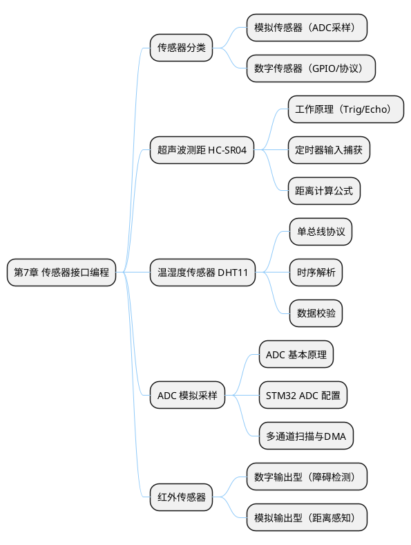
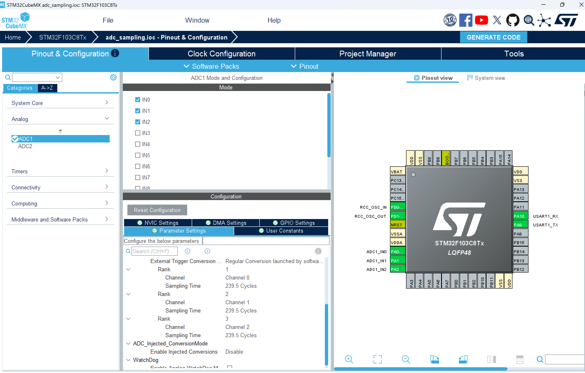
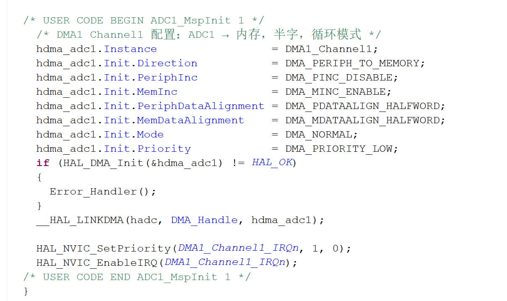
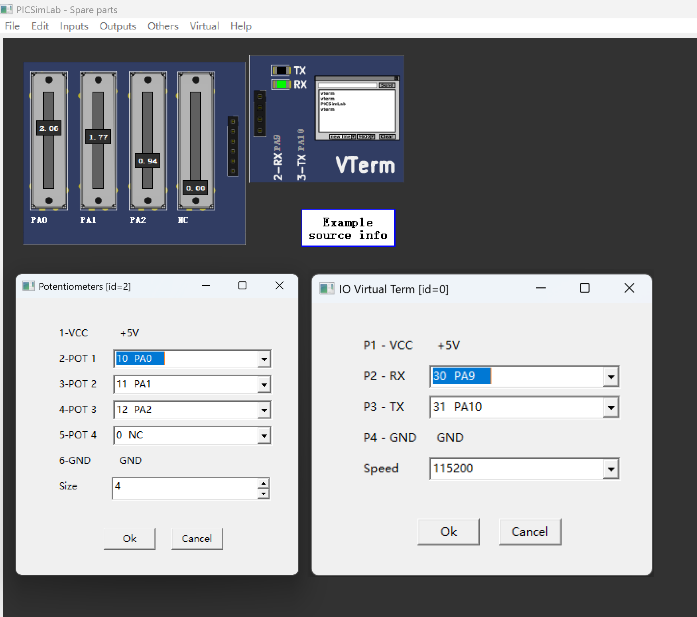
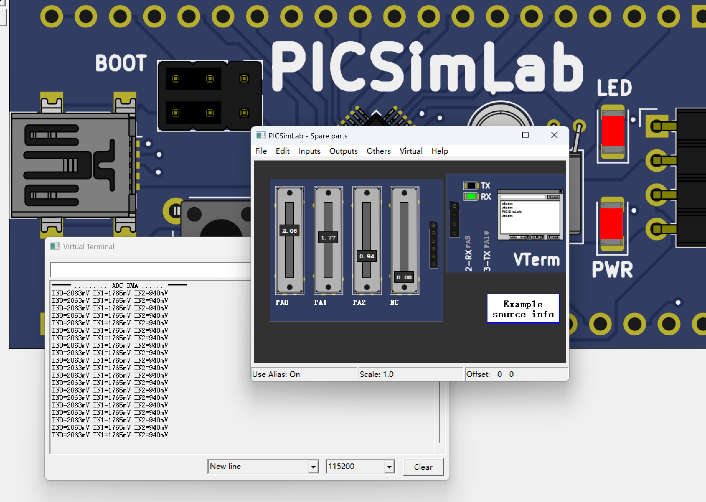
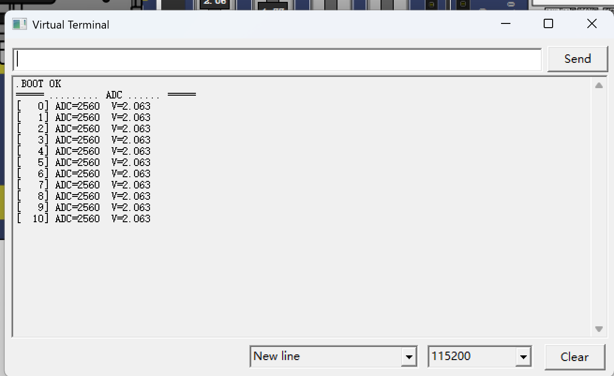

## 7 第 7 章 传感器接口编程

> 传感器是嵌入式系统感知外部世界的"眼睛和耳朵"。本章介绍超声波测距、温湿度检测、ADC 模拟采样和红外传感器等常用传感器在 STM32 上的接口编程方法，所有实验均可在 PicSimlab 中完成仿真验证。

### 7.1 本章知识导图



**图 7-1** 本章知识导图：传感器分类与四种常用传感器的接口编程。
<!-- fig:ch7-1 本章知识导图：传感器分类与四种常用传感器的接口编程。 -->

### 7.2 传感器分类与接口概述

传感器按输出信号类型可分为两大类：

**表 7-1** 传感器分类
<!-- tab:ch7-1 传感器分类 -->

| 类型 | 输出信号 | STM32 接口 | 典型传感器 |
|------|---------|-----------|-----------|
| 模拟传感器 | 连续电压（0~3.3V） | ADC | 热敏电阻、光敏电阻、气体传感器 |
| 数字传感器（电平型）| 高/低电平 | GPIO 输入 | 红外避障、限位开关、霍尔传感器 |
| 数字传感器（协议型）| 特定通信协议 | GPIO/I2C/SPI | DHT11（单总线）、BMP280（I2C） |
| 数字传感器（脉冲型）| 脉冲宽度/频率 | 定时器输入捕获 | HC-SR04（超声波）、编码器 |

```bob
  ┌─────────────────┐
  │    外部物理量    │
  │  温度/距离/光照  │
  └────────┬────────┘
           │ 传感器转换
           ▼
  ┌────────────────────────────────────────┐
  │          传感器输出信号                  │
  ├──────────┬──────────┬──────────────────┤
  │ 模拟电压 │ 数字电平 │ 数字脉冲/协议    │
  │ 0~3.3V   │ HIGH/LOW │ PWM/单总线/I2C   │
  ├──────────┼──────────┼──────────────────┤
  │  ADC     │  GPIO    │ TIM/GPIO/I2C     │
  │  采样    │  读取    │ 捕获/解析        │
  └──────────┴──────────┴──────────────────┘
           │ STM32 处理
           ▼
  ┌─────────────────┐
  │  数据 → 应用层  │
  │  显示/控制/上报  │
  └─────────────────┘
```

**图 7-2** 传感器信号从物理量到 STM32 数据处理的转换链路。
<!-- fig:ch7-2 传感器信号从物理量到 STM32 数据处理的转换链路。 -->

---

### 7.3 超声波测距传感器（HC-SR04）

HC-SR04 是最常用的超声波测距模块，可测量 2cm~400cm 范围内的距离，广泛用于障碍检测和液位监测。

#### 7.3.1 工作原理

```bob
     STM32                    HC-SR04
  ┌──────────┐            ┌──────────────┐
  │  Trig(PA0)├───────────►│  Trig        │
  │          │            │              │───── 超声波发射 ─────►
  │  Echo(PA1)│◄───────────┤  Echo        │
  │          │            │              │◄──── 超声波回波 ─────
  │  VCC     ├───────────►│  VCC (5V)    │
  │  GND     ├───────────►│  GND         │
  └──────────┘            └──────────────┘
```

**图 7-3** HC-SR04 与 STM32 的连接示意图。
<!-- fig:ch7-3 HC-SR04 与 STM32 的连接示意图。 -->

**测距流程：**

1. STM32 向 Trig 引脚发送 ≥10μs 的高电平脉冲
2. HC-SR04 自动发射 8 个 40kHz 超声波脉冲
3. 发射后 Echo 引脚拉高，等待回波
4. 收到回波后 Echo 拉低，高电平持续时间即为超声波往返时间

**距离计算公式：**

$$d = \frac{v \times t}{2} = \frac{340 \times t_{echo}}{2} \text{ (m)}$$

其中 $t_{echo}$ 为 Echo 高电平持续时间（秒），声速取 340 m/s。

#### 7.3.2 STM32 实现（定时器输入捕获）

使用定时器输入捕获测量 Echo 脉冲宽度：

**CubeMX 配置：**

- PA0 → GPIO_Output（Trig）
- PA1 → TIM2_CH2（Echo，输入捕获模式）
- TIM2 PSC = 71，ARR = 65535（计数周期 1μs，最大 65.535ms）

```c
/* 超声波测距驱动 */
#include "main.h"

static volatile uint32_t echo_start = 0;
static volatile uint32_t echo_end   = 0;
static volatile uint8_t  capture_done = 0;

/* 发送 Trig 脉冲 */
void HC_SR04_Trigger(void)
{
    HAL_GPIO_WritePin(GPIOA, GPIO_PIN_0, GPIO_PIN_SET);
    uint32_t tick = SysTick->VAL;
    while ((tick - SysTick->VAL) < 720) {}   /* 约 10us @72MHz */
    HAL_GPIO_WritePin(GPIOA, GPIO_PIN_0, GPIO_PIN_RESET);
}

/* 定时器输入捕获回调 */
void HAL_TIM_IC_CaptureCallback(TIM_HandleTypeDef *htim)
{
    if (htim->Channel == HAL_TIM_ACTIVE_CHANNEL_2) {
        if (!capture_done) {
            if (echo_start == 0) {
                echo_start = HAL_TIM_ReadCapturedValue(htim, TIM_CHANNEL_2);
                /* 切换为下降沿捕获 */
                __HAL_TIM_SET_CAPTUREPOLARITY(htim, TIM_CHANNEL_2,
                                               TIM_INPUTCHANNELPOLARITY_FALLING);
            } else {
                echo_end = HAL_TIM_ReadCapturedValue(htim, TIM_CHANNEL_2);
                capture_done = 1;
                /* 恢复上升沿捕获 */
                __HAL_TIM_SET_CAPTUREPOLARITY(htim, TIM_CHANNEL_2,
                                               TIM_INPUTCHANNELPOLARITY_RISING);
            }
        }
    }
}

/* 获取距离（单位：cm） */
float HC_SR04_GetDistance(void)
{
    echo_start = 0;
    echo_end   = 0;
    capture_done = 0;

    HAL_TIM_IC_Start_IT(&htim2, TIM_CHANNEL_2);
    HC_SR04_Trigger();

    uint32_t timeout = HAL_GetTick();
    while (!capture_done && (HAL_GetTick() - timeout < 50)) {}

    HAL_TIM_IC_Stop_IT(&htim2, TIM_CHANNEL_2);

    if (!capture_done) return -1.0f;  /* 超时 */

    uint32_t pulse_us = (echo_end >= echo_start)
                        ? (echo_end - echo_start)
                        : (65536 - echo_start + echo_end);
    return (float)pulse_us * 0.034f / 2.0f;  /* cm */
}
```

> 在 PicSimlab 中可使用 Ultrasonic 虚拟组件模拟 HC-SR04，通过滑块调节模拟距离值。

---

### 7.4 温湿度传感器（DHT11）

DHT11 是一款低成本的温湿度传感器，通过单总线协议与 MCU 通信，适用于农业温室环境监测等场景。

#### 7.4.1 单总线协议时序

DHT11 仅需一根数据线（DATA），通信流程如下：

1. **MCU 发送起始信号**：拉低 DATA ≥18ms，然后拉高 20~40μs
2. **DHT11 响应**：拉低 80μs → 拉高 80μs
3. **数据传输**：40 位数据（湿度整数+小数 + 温度整数+小数 + 校验和），每位以脉冲宽度编码：
   - "0"：低电平 50μs + 高电平 26~28μs
   - "1"：低电平 50μs + 高电平 70μs
4. **校验**：校验和 = 湿度整数 + 湿度小数 + 温度整数 + 温度小数

#### 7.4.2 STM32 实现

```c
/* DHT11 驱动 */
#include "main.h"

#define DHT11_PORT GPIOB
#define DHT11_PIN  GPIO_PIN_0

typedef struct {
    uint8_t humidity;       /* 湿度整数部分 */
    uint8_t temperature;    /* 温度整数部分 */
    uint8_t valid;          /* 数据是否有效 */
} DHT11_Data;

/* 微秒延时（基于 DWT） */
static void delay_us(uint32_t us)
{
    uint32_t start = DWT->CYCCNT;
    uint32_t ticks = us * (SystemCoreClock / 1000000);
    while ((DWT->CYCCNT - start) < ticks) {}
}

/* 设置引脚方向 */
static void DHT11_SetOutput(void)
{
    GPIO_InitTypeDef g = {0};
    g.Pin   = DHT11_PIN;
    g.Mode  = GPIO_MODE_OUTPUT_PP;
    g.Speed = GPIO_SPEED_FREQ_HIGH;
    HAL_GPIO_Init(DHT11_PORT, &g);
}

static void DHT11_SetInput(void)
{
    GPIO_InitTypeDef g = {0};
    g.Pin  = DHT11_PIN;
    g.Mode = GPIO_MODE_INPUT;
    g.Pull = GPIO_PULLUP;
    HAL_GPIO_Init(DHT11_PORT, &g);
}

/* 读取一个字节 */
static uint8_t DHT11_ReadByte(void)
{
    uint8_t byte = 0;
    for (int i = 0; i < 8; i++) {
        while (HAL_GPIO_ReadPin(DHT11_PORT, DHT11_PIN) == GPIO_PIN_RESET) {}
        delay_us(40);  /* 超过 28us 则为 '1' */
        if (HAL_GPIO_ReadPin(DHT11_PORT, DHT11_PIN) == GPIO_PIN_SET) {
            byte |= (1 << (7 - i));
        }
        while (HAL_GPIO_ReadPin(DHT11_PORT, DHT11_PIN) == GPIO_PIN_SET) {}
    }
    return byte;
}

/* 读取完整数据 */
DHT11_Data DHT11_Read(void)
{
    DHT11_Data data = {0};
    uint8_t buf[5];

    /* 发送起始信号 */
    DHT11_SetOutput();
    HAL_GPIO_WritePin(DHT11_PORT, DHT11_PIN, GPIO_PIN_RESET);
    HAL_Delay(20);  /* 拉低 20ms */
    HAL_GPIO_WritePin(DHT11_PORT, DHT11_PIN, GPIO_PIN_SET);
    delay_us(30);

    /* 等待 DHT11 响应 */
    DHT11_SetInput();
    if (HAL_GPIO_ReadPin(DHT11_PORT, DHT11_PIN) == GPIO_PIN_SET) return data;

    while (HAL_GPIO_ReadPin(DHT11_PORT, DHT11_PIN) == GPIO_PIN_RESET) {}
    while (HAL_GPIO_ReadPin(DHT11_PORT, DHT11_PIN) == GPIO_PIN_SET) {}

    /* 读取 5 字节数据 */
    for (int i = 0; i < 5; i++) {
        buf[i] = DHT11_ReadByte();
    }

    /* 校验 */
    if (buf[4] == (uint8_t)(buf[0] + buf[1] + buf[2] + buf[3])) {
        data.humidity    = buf[0];
        data.temperature = buf[2];
        data.valid       = 1;
    }
    return data;
}
```

---

### 7.5 ADC 模拟采样

STM32F103 内置 12 位逐次逼近型 ADC，参考电压接 3.3 V 时，可将 0~3.3 V 模拟输入量化为 0~4095 的数字值。在农业信息化等应用中，土壤湿度、光照强度、温度等传感器常输出模拟电压，需通过 ADC 采集后交由 MCU 处理。

本节先说明 ADC 工作原理与关键配置，再分别实现**单通道软件轮询**和**三通道 DMA 扫描**两种方式，并在 PicSimLab 0.9.2 中完成仿真验证。

#### 7.5.1 学习目标

完成本节学习后，应能：

1. 说明逐次逼近型 ADC 的基本工作过程；
2. 根据 ADC 读数计算输入电压；
3. 使用 CubeMX 配置单通道轮询与多通道 DMA 扫描；
4. 编写基于 HAL 库的 ADC 采样程序；
5. 在 PicSimLab 中完成三路模拟量采集实验。

---

#### 7.5.2 知识点

**表 7-3** 第 7.5 节知识点
<!-- tab:ch7-3 第 7.5 节知识点 -->

| 知识点 | 主要内容 | 小节 |
|--------|----------|------|
| ADC 原理 | SAR 结构、采样保持、量化误差 | 7.5.3 |
| 电压换算 | $V = ADC\_Value / 4095 \times 3.3$ V | 7.5.3 |
| CubeMX 配置 | 三路模拟引脚、ADC1、USART1；DMA1_Channel1 在 MSP 中配置 | 7.5.4 |
| 软件轮询 | `HAL_ADC_Start` / `PollForConversion` / `GetValue`（`ADC_USE_DMA=0`） | 7.5.5 |
| DMA 采集 | `HAL_ADC_Start_DMA`、`ADC_DMA_SampleBlock`、`ConvCpltCallback` | 7.5.5 |
| PicSimLab 仿真 | 电位器模拟模拟量、VirtualTerm 查看输出 | 7.5.6 |

---

#### 7.5.3 ADC 基本原理

##### 7.5.3.1 逐次逼近型 ADC

STM32F103 采用逐次逼近（SAR）型 ADC：先通过采样保持电路锁定输入电压，再由内部 DAC 从高位到低位逐位比较，确定 12 位数字结果。一次转换时间约为采样周期加 12.5 个 ADC 时钟周期。

```bob
   模拟输入 Vin
        │
   ┌────▼────┐
   │ 采样保持 │ → 锁定 Vin
   └────┬────┘
        │
   ┌────▼────┐
   │   SAR   │ → 逐位比较，输出 12 位
   └────┬────┘
        ▼
     ADC_DR
```

**图 7-4** 逐次逼近型 ADC 工作流程。
<!-- fig:ch7-4 逐次逼近型 ADC 工作流程。 -->

##### 7.5.3.2 电压转换

参考电压 $V_{ref} = 3.3$ V，12 位分辨率对应 0~4095，换算公式为：

$$V_{input} = \frac{ADC\_Value}{4095} \times 3.3 \text{ (V)}$$

最小分辨电压（1 LSB）约为 0.806 mV，理论量化误差不超过 ±0.5 LSB。

##### 7.5.3.3 采样时间

采样时间越长，对高阻抗信号源的适应越好。本实验统一使用 **239.5 Cycles**，在精度与速度之间较为均衡。

**表 7-4** 常用采样时间（ADC 时钟 8 MHz）
<!-- tab:ch7-4 常用采样时间 -->

| 采样周期 | 总转换时间 | 典型应用 |
|:--------:|:----------:|---------|
| 1.5 Cycles | 1.75 µs | 低阻抗、快速信号 |
| 13.5 Cycles | 3.25 µs | 一般传感器 |
| 239.5 Cycles | 31.4 µs | 热敏电阻、电位器分压等 |

##### 7.5.3.4 相关寄存器

使用 HAL 库时，以下寄存器位与 CubeMX 配置项对应，便于理解底层行为：

**表 7-5** ADC 主要寄存器与 HAL 配置
<!-- tab:ch7-5 ADC 主要寄存器与 HAL 配置 -->

| 寄存器/位 | 作用 | HAL 配置 |
|-----------|------|----------|
| `ADC_CR2.DMA` | 使能 DMA 传输 | `HAL_ADC_Start_DMA` |
| `ADC_SQR` Rank | 当前转换通道 | `HAL_ADC_ConfigChannel` 按路切换 IN0/IN1/IN2 |
| `ADC_DR` | 转换结果寄存器 | DMA 搬运至 `adc_buf[]` |
| `DMA1_CCR1` | 通道 1 传输控制 | `stm32f1xx_hal_msp.c` 中 `HAL_DMA_Init` |

本工程 DMA 模式下，主循环每 200 ms 调用 `ADC_DMA_SampleBlock()`：对 **IN0、IN1、IN2** 依次切换通道配置，各执行一次 `HAL_ADC_Start_DMA(..., len=1)`，由 **DMA1_Channel1** 将当次转换结果写入 `adc_buf[i]`；传输完成后通过 DMA TC 标志或 `HAL_ADC_ConvCpltCallback` 通知应用层（PicSimLab 仿真下可能需轮询 TC/EOC，见 7.5.5.2）。

---

#### 7.5.4 CubeMX 配置

同一工程 `chapter7_adc_sampling` 通过宏 **`ADC_USE_DMA`** 在“单通道轮询”与“三通道 DMA”之间切换：轮询模式只需配置 **ADC1 + USART1**；DMA 模式还需在 `stm32f1xx_hal_msp.c` 中增加 **DMA1_Channel1** 与 **NVIC**（见 7.5.4.2）。

##### 7.5.4.1 单通道轮询

单通道轮询是最直观的 ADC 用法：CPU 发出软件启动信号，在 `PollForConversion` 中等待 **EOC（End Of Conversion）** 置位，再从数据寄存器 **DR** 读出 12 位结果。该方式不占用 DMA，适合验证模拟前端、调试 printf 重定向，以及只采集 **一路** 传感器（如单个土壤湿度探头接 PA0）的场景。

**表 7-6** ADC1 单通道轮询 CubeMX 配置
<!-- tab:ch7-6 ADC1 单通道轮询配置 -->

| 配置项 | 值 | 说明 |
|--------|-----|------|
| 引脚 | PA0 → ADC1_IN0（Analog） | 模拟输入，禁止上下拉 |
| Scan Conversion Mode | **Disabled** | 仅 1 个 Rank |
| Continuous Conversion Mode | **Disabled** | 每次由软件触发一次 |
| External Trigger | Software Start | `HAL_ADC_Start` 启动 |
| Number of Conversions | 1 | 单 Rank |
| Sampling Time | 239.5 Cycles | 与 DMA 模式一致，便于对比 |
| DMA | **不启用** | 轮询读 DR，无需 DMA1 |
| USART1 | PA9 TX / PA10 RX，115200 | 打印采样结果 |

**表 7-6a** 轮询模式 HAL 调用顺序
<!-- tab:ch7-6a 轮询模式 HAL 调用顺序 -->

| 步骤 | API | 作用 |
|:----:|-----|------|
| 1 | `HAL_ADC_Start(&hadc1)` | 软件触发一次转换 |
| 2 | `HAL_ADC_PollForConversion(&hadc1, Timeout)` | 阻塞等待 EOC，可设超时（如 100 ms） |
| 3 | `HAL_ADC_GetValue(&hadc1)` | 读取 `ADC_DR` 中的 12 位结果 |
| 4 | `HAL_ADC_Stop(&hadc1)` | 停止 ADC，便于下次重新触发 |

```bob
   电位器/传感器 ──► PA0 (ADC1_IN0)
                         │
                    HAL_ADC_Start
                         │
                    PollForConversion (CPU 等待 EOC)
                         │
                    HAL_ADC_GetValue ──► raw (0~4095)
                         │
                    V = raw × 3.3 / 4095
                         │
                    printf ──► USART1 (PA9) ──► 串口终端
```

**图 7-5** 单通道 ADC 软件轮询数据流。
<!-- fig:ch7-5 单通道 ADC 软件轮询数据流。 -->

> **与 DMA 模式的关系**：本工程 `MX_ADC1_Init()` 在两种模式下共用同一套 ADC 初始化（单 Rank、非扫描）。切换为轮询时，将 `main.c` 中 `#define ADC_USE_DMA` 改为 **`0`** 后重新编译即可，无需改 CubeMX 引脚；此时 PA1/PA2 可不接信号，仅观察 PA0 即可。

##### 7.5.4.2 三通道 DMA 采集（本工程默认）

PA0、PA1、PA2 分别接三路模拟信号。CubeMX 中将三引脚设为 **ADC1_IN0/IN1/IN2（Analog）**，并启用 **USART1（PA9/PA10）** 用于打印。DMA 在 `stm32f1xx_hal_msp.c` 中配置（ADC1 请求映射到 **DMA1_Channel1**）。

**表 7-7** 三通道 DMA 相关配置（与 `chapter7_adc_sampling` 工程一致）
<!-- tab:ch7-7 三通道 DMA 相关配置 -->

| 配置项 | 值 |
|--------|-----|
| 引脚 | PA0/PA1/PA2 → ADC1_IN0/IN1/IN2；PA9 → USART1_TX |
| ADC 运行模式 | 单次转换；运行时按路切换 `HAL_ADC_ConfigChannel` |
| `HAL_ADC_Start_DMA` 长度 | 每路 1 个半字（`len=1`） |
| DMA | DMA1_Channel1，Periph→Memory，**Normal**，HalfWord |
| NVIC | `DMA1_Channel1_IRQn` 使能 |
| 主循环周期 | `ADC_DMA_SampleBlock()` + `HAL_Delay(200)` |

> **说明**：为兼容 PicSimLab 的 qemu-stm32，固件采用 **DMA Normal + 分三路依次 Start_DMA**，而非 Circular 连续扫描；实物板若需不间断后台采集，可改为 Scan + Continuous + DMA Circular。

```bob
   主循环 (每 200ms)
        │
        ├─► 配置 IN0 ──► HAL_ADC_Start_DMA ──► DMA1_Ch1 ──► adc_buf[0]
        ├─► 配置 IN1 ──► HAL_ADC_Start_DMA ──► DMA1_Ch1 ──► adc_buf[1]
        └─► 配置 IN2 ──► HAL_ADC_Start_DMA ──► DMA1_Ch1 ──► adc_buf[2]
        │
        ▼
   printf IN0/IN1/IN2 (mV) ──► PA9 USART1 ──► VirtualTerm
```

**图 7-6** 三通道 DMA 扫描数据流。
<!-- fig:ch7-6 三通道 DMA 扫描数据流。 -->



**图 7-7** CubeMX 引脚与 ADC1 配置（PA0~PA2 模拟输入，PA9 USART1_TX）。
<!-- fig:ch7-7 CubeMX 引脚与 ADC1 配置。 -->



**图 7-8** DMA1_Channel1 初始化代码（`stm32f1xx_hal_msp.c` 或 CubeMX DMA Settings）。
<!-- fig:ch7-8 DMA1_Channel1 配置。 -->

---

#### 7.5.5 示例程序

本节示例基于 **STM32F103C8T6 + CubeMX + CubeIDE + HAL 库** 实现，完整工程位于 `code_examples/chapter7_adc_sampling/`。

**工程结构：**

完整工程位于 `code_examples/chapter7_adc_sampling/`：

```
code_examples/chapter7_adc_sampling/
├── Core/
│   ├── Inc/
│   │   ├── main.h
│   │   ├── adc_driver.h              # ADC 驱动接口
│   │   ├── stm32f1xx_it.h
│   │   └── stm32f1xx_hal_conf.h
│   ├── Src/
│   │   ├── main.c                    # 入口，ADC_USE_DMA 切换轮询/DMA
│   │   ├── adc_driver.c              # ADC_Read / ADC_DMA_SampleBlock
│   │   ├── stm32f1xx_hal_msp.c       # GPIO、DMA1_Channel1、NVIC
│   │   ├── stm32f1xx_it.c            # DMA1_Channel1_IRQHandler
│   │   ├── system_stm32f1xx.c
│   │   ├── syscalls.c                # printf → USART1
│   │   └── sysmem.c
│   └── Startup/
│       └── startup_stm32f103c8tx.s
├── Drivers/                          # STM32 HAL + CMSIS（CubeMX 生成）
├── adc_sampling.ioc                  # CubeMX 工程
└── STM32F103C8TX_FLASH.ld
```

##### 7.5.5.1 单通道轮询

将 `main.c` 顶部宏改为 **`#define ADC_USE_DMA 0`** 后编译烧录（或 Load Bin 到 PicSimLab），即进入轮询模式。驱动接口在 `adc_driver.h` 中声明为 `ADC_Read()` / `ADC_ReadVoltage()`。

**（1）采样函数**

与工程 `adc_driver.c` 一致，对超时做了判断，避免仿真或硬件异常时死等：

```c
uint16_t ADC_Read(void)
{
    HAL_ADC_Start(&hadc1);
    if (HAL_ADC_PollForConversion(&hadc1, 100) != HAL_OK) {
        HAL_ADC_Stop(&hadc1);
        return 0;
    }
    uint16_t value = (uint16_t)HAL_ADC_GetValue(&hadc1);
    HAL_ADC_Stop(&hadc1);
    return value;
}

float ADC_ReadVoltage(void)
{
    return (float)ADC_Read() * 3.3f / 4095.0f;
}
```

**（2）printf 重定向**

`main.c` 中实现 `__io_putchar`，将 `printf` 输出到 **USART1**，便于在串口终端或 PicSimLab VirtualTerm 中查看：

```c
int __io_putchar(int ch)
{
    HAL_UART_Transmit(&huart1, (uint8_t *)&ch, 1, 100);
    return ch;
}
```

CubeIDE 须在链接选项中启用浮点 printf（本工程已配置 `-u _printf_float`），否则 `%.3f` 可能打印异常。

**（3）主循环**

轮询模式下每 **500 ms** 采样一次 PA0，同时打印原始值与电压，便于对照公式验算：

```c
#define ADC_USE_DMA  0

printf("===== 单通道 ADC 轮询 =====\r\n");
while (1) {
    uint16_t raw = ADC_Read();
    float v = ADC_ReadVoltage();
    static uint32_t n;
    printf("[%4lu] ADC=%4u  V=%.3f\r\n", n++, raw, v);
    HAL_Delay(500);
}
```

**预期串口输出示例：**

```
===== 单通道 ADC 轮询 =====
[   0] ADC=2048  V=1.650
[   1] ADC=2100  V=1.692
```

当电位器位于中间位置时，`ADC≈2048`，`V≈1.650 V`，与 7.5.3.2 节公式一致。

PicSimLab 单通道轮询仿真步骤与截图见 **7.5.6.5**。

**（4）常见问题**

| 现象 | 可能原因 | 处理 |
|------|----------|------|
| 串口无输出 | 未接 PA9 或波特率不是 115200 | 检查 VirtualTerm 接线与波特率 |
| 电压始终为 0 | PA0 未接电位器中间脚 | 确认 Analog 连接与 VCC/GND |
| `ADC` 不变 | 仍使用 DMA 固件（`ADC_USE_DMA=1`） | 改宏为 0 并重新编译 |
| `V` 显示乱码 | 未链接浮点 printf | 确认 CubeIDE 已勾选 Use float with printf |

##### 7.5.5.2 多通道 DMA 采集（默认）

驱动文件 `adc_driver.c` 对三路模拟输入各启动一次 DMA 传输，结果保存在 `adc_buf[]`。`main.c` 中 `#define ADC_USE_DMA 1` 为默认模式。

```c
/* 单路：切换通道 → Start_DMA(len=1) → 等待 DMA/ADC 完成 */
static uint8_t ADC_DMA_ReadOne(uint8_t idx)
{
    /* HAL_ADC_ConfigChannel：Rank1 = IN0/IN1/IN2 */
    adc_ready = 0;
    HAL_ADC_Start_DMA(&hadc1, (uint32_t *)&adc_buf[idx], 1);
    return ADC_DMA_WaitDone(idx);  /* 轮询 TC 或 EOC，兼容 PicSimLab */
}

uint8_t ADC_DMA_SampleBlock(void)
{
    for (uint8_t i = 0; i < ADC_CHANNELS; i++) {
        if (!ADC_DMA_ReadOne(i)) return 0;
    }
    return 1;
}

void HAL_ADC_ConvCpltCallback(ADC_HandleTypeDef *hadc)
{
    if (hadc->Instance == ADC1) adc_ready = 1;
}
```

`stm32f1xx_hal_msp.c` 中 DMA 初始化要点：

```c
hdma_adc1.Instance = DMA1_Channel1;
hdma_adc1.Init.Direction = DMA_PERIPH_TO_MEMORY;
hdma_adc1.Init.PeriphDataAlignment = DMA_PDATAALIGN_HALFWORD;
hdma_adc1.Init.MemDataAlignment    = DMA_MDATAALIGN_HALFWORD;
hdma_adc1.Init.Mode = DMA_NORMAL;
__HAL_LINKDMA(hadc, DMA_Handle, hdma_adc1);
HAL_NVIC_EnableIRQ(DMA1_Channel1_IRQn);
```

主循环（`main.c`）：

```c
#define ADC_USE_DMA  1

printf("===== 三通道 ADC DMA 扫描 =====\r\n");
while (1) {
    if (ADC_DMA_SampleBlock()) {
        printf("IN0=%lumV IN1=%lumV IN2=%lumV\r\n",
               ADC_GetChannelMilliVolt(0),
               ADC_GetChannelMilliVolt(1),
               ADC_GetChannelMilliVolt(2));
    }
    HAL_Delay(200);
}
```

> **说明**：固件通过 `HAL_ADC_Start_DMA` 完成采集；PicSimLab 下由 `ADC_DMA_WaitDone()` 轮询 DMA/ADC 完成标志。轮询模式见 7.5.5.1、7.5.6.5。

**表 7-8** 轮询与 DMA 方式对比
<!-- tab:ch7-8 轮询与 DMA 方式对比 -->

| 对比项 | 软件轮询（`ADC_USE_DMA=0`） | DMA 采集（`ADC_USE_DMA=1`，默认） |
|--------|:--------------------------:|:--------------------------------:|
| 启动 API | `HAL_ADC_Start` | `HAL_ADC_Start_DMA` |
| 结果获取 | `HAL_ADC_GetValue` 读 DR | DMA 写入 `adc_buf[]` |
| CPU 等待 | `PollForConversion` 阻塞 | 主循环可延时，传输由 DMA 完成 |
| 外设依赖 | 仅 ADC1 | ADC1 + DMA1_Ch1 + NVIC |
| 本工程采样周期 | 500 ms / 次（单路） | 200 ms / 轮（三路） |
| PicSimLab | 1 个电位器接 PA0 即可 | 3 个电位器接 PA0~PA2 |
| 适用场景 | 入门、单传感器、查公式 | 多路采集、课程默认实验 |

---

#### 7.5.6 PicSimLab 仿真

本节仿真环境为 **PicSimLab 0.9.2**（Windows 32 位），目标板为 **Blue Pill（STM32F103C8T6，qemu-stm32 后端）**。固件使用 CubeIDE 编译生成的 `Debug/adc_sampling.bin`。

##### 7.5.6.1 仿真环境与固件

| 项目 | 设置 |
|------|------|
| 软件版本 | PicSimLab 0.9.2（如 Version: 0.9.2 241005 Windows32_WX） |
| 目标板 | **Board → Blue Pill** |
| 固件文件 | `code_examples/chapter7_adc_sampling/Debug/adc_sampling.bin` |
| 串口 | USART1，PA9(TX)，115200 8N1 |

CubeIDE **Build** 后在 `Debug/` 目录生成 **`adc_sampling.bin`**，PicSimLab 使用 **File → Load Bin** 加载（勿用 Load Hex，勿将 `.hex` 当作 `.bin`）。

##### 7.5.6.2 接线

通过 **Modules → Spare Parts** 打开备件窗口，拖入外设并完成连线：

**表 7-9** PicSimLab 仿真接线
<!-- tab:ch7-9 PicSimLab 仿真接线 -->

| 备件 | 连接引脚 | 说明 |
|------|----------|------|
| Potentiometer ×3 | 输出 → PA0 / PA1 / PA2 | 模拟三路 0~3.3 V 输入 |
| VCC (3.3 V) | 接各电位器上端 | 参考电压上限 |
| GND | 接各电位器下端 | 参考地 |
| VirtualTerm | RXD ← PA9 | 接收 USART1 打印，波特率 115200 |

```bob
   [POT1]──► PA0    [POT2]──► PA1    [POT3]──► PA2
      │                │                │
     VCC/GND          VCC/GND          VCC/GND
   PA9(TX) ─────────────────────────► VirtualTerm
              Blue Pill (STM32F103C8)
```

**图 7-9** PicSimLab 三通道 ADC 仿真接线示意。
<!-- fig:ch7-9 PicSimLab 三通道 ADC 仿真接线示意。 -->

##### 7.5.6.3 操作步骤（DMA 三通道，默认固件）

1. **Board → Blue Pill**；
2. **File → Load Bin** → 选择 `Debug/adc_sampling.bin`；
3. **Modules → Spare Parts**：添加 3 个 **Potentiometer**、1 个 **VirtualTerm**；
4. 电位器输出接 **PA0 / PA1 / PA2**，VCC/GND 接 3.3V 与地；VirtualTerm **RXD ← PA9**，波特率 **115200**；
5. 点击工具栏 **Debug** 启动仿真；
6. 调节电位器，在 VirtualTerm 查看输出。

**DMA 模式预期输出：**

```
===== 三通道 ADC DMA 扫描 =====
IN0=1650mV IN1=825mV IN2=3102mV
IN0=1650mV IN1=825mV IN2=3102mV
```



**图 7-10** PicSimLab 仿真接线（Blue Pill + 三路电位器 + VirtualTerm）。
<!-- fig:ch7-10 PicSimLab 仿真接线。 -->



**图 7-11** DMA 模式 VirtualTerm 输出。
<!-- fig:ch7-11 DMA 模式 VirtualTerm 输出。 -->

##### 7.5.6.4 DMA 结果分析

**表 7-10** 电位器位置与电压对比
<!-- tab:ch7-10 电位器位置与电压对比 -->

| 电位器位置 | 理论 ADC 值 | 理论电压 (V) | 仿真实测 |
|:----------:|:-----------:|:------------:|:--------:|
| 0% | 0 | 0 mV | `INx=0mV` 附近 |
| 50% | 2048 | 1650 mV | `INx=1650mV` 附近 |
| 100% | 4095 | 3300 mV | `INx=3300mV` 附近 |

**现象说明：**

- 首行一般为 `===== 三通道 ADC DMA 扫描 =====`，之后约每 **200 ms** 刷新 `IN0/IN1/IN2` 毫伏值；
- 单独调节某路电位器时，其余两路基本不变，对应 `adc_buf[0/1/2]` 与 PA0/PA1/PA2；
- 数值与 $ADC\_Value \times 3300 / 4095$ 一致。

##### 7.5.6.5 单通道轮询仿真

将 `main.c` 中 **`#define ADC_USE_DMA` 改为 `0`**，重新编译并 **Load Bin**。接线可简化：仅 **1 个 Potentiometer** 接 **PA0**（中间脚→PA0，两端→VCC/GND），VirtualTerm 仍接 **PA9、115200**，同样点击 **Debug** 启动。

**轮询模式预期输出：**

```
===== 单通道 ADC 轮询 =====
[   0] ADC=2048  V=1.650
[   1] ADC=2100  V=1.692
```



**图 7-12** 单通道 ADC 轮询仿真（VirtualTerm 显示 ADC 原始值与电压）。
<!-- fig:ch7-12 单通道 ADC 轮询仿真。 -->

---

#### 7.5.7 本节小结

- STM32F103 内置 12 位 SAR ADC，电压换算为 $V = ADC\_Value / 4095 \times 3.3$ V（示例程序以毫伏打印）；
- 单通道轮询：将 `ADC_USE_DMA` 置 0，按 **Start → PollForConversion → GetValue → Stop** 读 PA0，500 ms 打印一次原始值与电压；
- 默认 DMA 模式对 IN0~IN2 **依次** `HAL_ADC_Start_DMA`，DMA1_Channel1、Normal、HalfWord，配合 `ADC_DMA_SampleBlock` 与 `ConvCpltCallback`；
- CubeMX 配置三路模拟引脚与 USART1；DMA 与 NVIC 在 `stm32f1xx_hal_msp.c` / `stm32f1xx_it.c` 中完成；
- PicSimLab：**Load Bin** 加载固件，**Debug** 启动仿真；默认验证 DMA 三路，`ADC_USE_DMA=0` 可验证单通道轮询。

---
### 7.6 红外传感器

红外避障传感器以数字电平输出为主，常用于障碍物检测。

- **数字输出型**（如 TCRT5000）：检测到障碍物时输出低电平，否则高电平
- **模拟输出型**（如 GP2Y0A21）：输出与距离成反比的模拟电压

```c
/* 红外避障传感器 — GPIO 数字读取 */
uint8_t IR_IsObstacle(void)
{
    return (HAL_GPIO_ReadPin(GPIOB, GPIO_PIN_1) == GPIO_PIN_RESET) ? 1 : 0;
}
```

在农业信息化应用中，红外传感器可用于农产品计数、传送带物体检测等场景。

---

### 7.7 本章小结

本章介绍了嵌入式系统中四类常用传感器的接口编程方法：

- **超声波 HC-SR04**：定时器输入捕获测量 Echo 脉冲宽度，计算距离
- **温湿度 DHT11**：单总线协议时序解析，40 位数据读取与校验
- **ADC 模拟采样**：12 位 ADC 单通道轮询与多通道 DMA 扫描
- **红外传感器**：GPIO 数字电平读取

这些传感器构成了嵌入式系统"输入"环节的核心，为后续的数据处理、显示和控制提供原始数据源。

---

### 7.8 习题

1. 说明 HC-SR04 的测距原理，写出距离计算公式。
2. DHT11 单总线协议如何区分数据位 "0" 和 "1"？
3. STM32 ADC 的分辨率为 12 位，当 ADC 值为 2048 时对应的电压是多少？
4. 设计一个农业温室环境监测方案，需要采集温度、湿度和土壤含水量（模拟量），说明传感器选型和 STM32 接口配置。
5. 比较轮询采样与 DMA 采样的优缺点，说明在多传感器场景下为什么推荐 DMA 方式。
