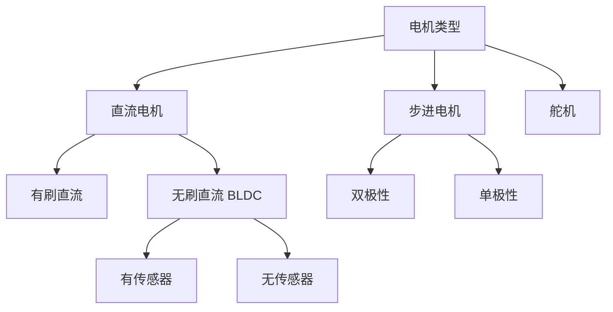
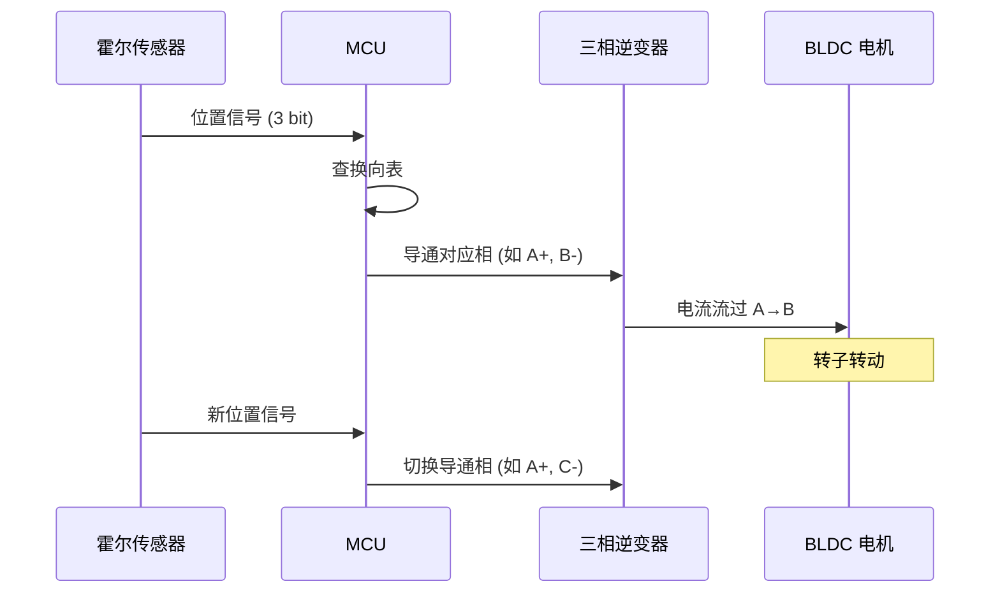

# 第八章 - PWM 波与电机驱动

## 8.1 PWM 波形简介
PWM（Pulse Width Modulation，脉宽调制）是一种通过改变脉冲占空比来调控平均功率或电压的技术。保持固定频率下，改变高电平持续时间（占空比）即可改变负载上的平均电压，从而控制电机转速或 LED 亮度等。

## 8.2 PWM 的等效原理

### 8.2.1 平均值模型

对低通响应慢的负载（如电机转子和惯性系统），PWM 在周期内的快速开关相当于一个等效直流电平，其平均值为：

$$V_{avg} = V_{cc} \times D$$

其中 $D$ 为占空比（0~1）。例如 $V_{cc}=12V, D=0.75$ 时，$V_{avg}=9V$。

### 8.2.2 低通滤波器视角

PWM 信号可以用傅里叶级数展开为直流分量加一系列高频谐波。当负载带宽远低于 PWM 频率时，高频谐波被天然的电感（电机绕组）和机械惯量（转子）滤除，负载只响应直流分量：

```text
PWM 信号频谱：

幅度
  │  ▓  DC分量 (D × Vcc)
  │  ║
  │  ║     ░ 基频分量
  │  ║     ░      ░ 二次谐波
  │  ║     ░      ░      ░ 三次谐波 ...
  ├──╫─────░──────░──────░─────────── 频率
  │  0    f_pwm  2f    3f
  │
  └─── 电机带宽截止 ───┘ ← 此范围外的被滤除
```

### 8.2.3 等效功率与 RMS

在功率计算或发热评估时，用有效值（RMS）比平均值更合适：

$$V_{RMS} = V_{cc} \times \sqrt{D}$$

$$P_{RMS} = V_{cc}^2 \times D / R$$

特别在电感较小时需注意谐波导致的附加损耗（铜损和铁损增加）。

### 8.2.4 PWM 频率对控制质量的影响

| PWM 频率范围 | 特点 | 适用场景 |
|---|---|---|
| < 1 kHz | 可听噪声（嗡嗡声）、电流纹波大 | 不推荐直接驱动电机 |
| 1~20 kHz | 良好的控制精度、可能有轻微噪声 | 有刷直流电机、步进电机驱动 |
| 20~100 kHz | 超出人耳听觉范围、开关损耗增加 | 要求静音的应用、BLDC FOC |
| > 100 kHz | 开关损耗显著、需要高速驱动器 | 特殊高频应用 |

## 8.3 如何产生 PWM 波

### 8.3.1 硬件定时器输出（推荐）

微控制器（如 STM32）定时器的 PWM 模式，硬件直接产生高精度、稳定的 PWM 并可配合 DMA/中断。优点是精度高、占用 CPU 少。

PWM 生成原理（以向上计数模式 PWM Mode 1 为例）：

```text
计数值
ARR ┤─────────────────╮         ╭─────────────────╮
    │                 │         │                 │
CCR ┤───────╮         │         │   ╭─────────────│
    │       │         │         │   │             │
  0 ┤───────┴─────────┴─────────┴───┴─────────────┤── 时间
       ▓▓▓▓▓▓▓▓▓░░░░░░░░░  ▓▓▓▓▓▓▓▓▓░░░░░░░░░
       ← 高电平 →← 低 →    ← 高电平 →← 低 →
       占空比 = CCR / ARR
```

- 计数器从 0 向上计数到 ARR，然后重载；
- 当 CNT < CCR 时输出高电平，CNT ≥ CCR 时输出低电平（PWM Mode 1）；
- 改变 CCR 即可改变占空比，改变 ARR 即可改变频率。

**频率与占空比计算公式**：

$$f_{PWM} = \frac{f_{timer}}{(PSC + 1) \times (ARR + 1)}$$

$$DutyCycle = \frac{CCR}{ARR + 1} \times 100\%$$

### 8.3.2 软件 PWM（软 PWM）

通过周期性中断或轮询翻转 IO 引脚实现。适用于简单或低频场景，但精度、抖动和 CPU 占用较差。

```c
/* 软件 PWM 伪代码：定时器中断每 tick 翻转一次 */
volatile uint16_t pwm_counter = 0;
volatile uint16_t pwm_period = 1000;
volatile uint16_t pwm_duty = 500;  // 50%

void SysTick_Handler(void) {
    pwm_counter++;
    if (pwm_counter >= pwm_period) pwm_counter = 0;
    if (pwm_counter < pwm_duty) {
        HAL_GPIO_WritePin(LED_PORT, LED_PIN, GPIO_PIN_SET);
    } else {
        HAL_GPIO_WritePin(LED_PORT, LED_PIN, GPIO_PIN_RESET);
    }
}
```

### 8.3.3 各种 PWM 生成方式对比

| 方式 | 精度 | CPU 占用 | 抖动 | 适用场景 |
|---|---|---|---|---|
| 硬件定时器 PWM | 高 | 极低 | 极小 | 电机控制、精密驱动 |
| 软件 PWM（中断翻转） | 中 | 高 | 中等 | 简单 LED 控制 |
| DMA + 定时器 | 高 | 低 | 极小 | WS2812 等特殊协议 |

### 8.3.4 高级协议

针对无刷电机（BLDC），存在 DShot、OneShot、Multishot 等高速数字协议，替代传统 50Hz 或 400Hz 的伺服 PWM，提供更低延迟与更高分辨率。

| 协议 | 类型 | 信号方式 | 分辨率 | 延迟 |
|---|---|---|---|---|
| 标准伺服 PWM | 模拟 | 1~2ms 脉宽 | ~1000 级 | 2~20ms |
| OneShot125 | 模拟 | 125~250μs 脉宽 | ~1000 级 | 250μs |
| DShot150/300/600 | 数字 | 位编码 | 2048 级 | 26~107μs |
| DShot1200 | 数字 | 位编码 | 2048 级 | 13μs |

示例（STM32 HAL 伪代码，生成 TIMx PWM）：

```c
// TIM 初始化略，确保计数频率与周期设定满足目标 PWM 频率
htim.Instance = TIM3;
htim.Init.Prescaler = 79;  // 例如 80MHz -> 1MHz
htim.Init.Period = 999;    // 1kHz PWM
HAL_TIM_PWM_Init(&htim);

sConfigOC.OCMode = TIM_OCMODE_PWM1;
sConfigOC.Pulse = 250;  // 25% duty
HAL_TIM_PWM_ConfigChannel(&htim, &sConfigOC, TIM_CHANNEL_1);
HAL_TIM_PWM_Start(&htim, TIM_CHANNEL_1);
```

## 8.4 电机分类与驱动方式

### 8.4.1 电机类型总览



### 8.4.2 有刷直流电机（Brushed DC Motor）

**工作原理**：电刷和换向器实现机械换向，电流方向与磁场交互产生转矩。

**驱动方法**：常用 H 桥（H-bridge）进行方向控制与 PWM 调速；PWM 控制电压，配合电流检测与限流保护。开关 MOSFET/晶体管需加续流二极管或使用带续流路径的桥堆。

H 桥工作原理：

```text
    Vcc                         Vcc
     │                           │
  ┌──┴──┐                    ┌──┴──┐
  │ Q1  │   ┌─────────┐      │ Q3  │
  │(高侧)├──┤  电机 M  ├──────┤(高侧)│
  └──┬──┘   └─────────┘      └──┬──┘
     │                           │
  ┌──┴──┐                    ┌──┴──┐
  │ Q2  │                    │ Q4  │
  │(低侧)│                    │(低侧)│
  └──┬──┘                    └──┬──┘
     │                           │
    GND                         GND

正转：Q1 ON + Q4 ON (Q2, Q3 OFF)
反转：Q2 ON + Q3 ON (Q1, Q4 OFF)
制动：Q2 ON + Q4 ON (低侧短路制动)
```

常用 H 桥驱动芯片：

| 芯片 | 电压范围 | 持续电流 | 特点 |
|---|---|---|---|
| L298N | 4.5~46V | 2A/通道 | 经典但效率低（双极型） |
| TB6612 | 2.5~13.5V | 1.2A/通道 | MOSFET 型，效率高 |
| DRV8871 | 6.5~45V | 3.6A | 单通道，带电流限制 |
| BTS7960 | 5.5~27V | 43A | 大电流应用 |

**优点**：驱动简单、成本低；**缺点**：有刷部件易磨损、寿命受限、EMI 较大。

### 8.4.3 无刷直流电机（BLDC / Brushless Motor）

**工作原理**：定子绕组产生旋转磁场，永磁转子跟随。无机械换向，靠电子换向器（逆变器）切换绕组电流。

**驱动方法**：三相逆变器（电子换向器），通常使用外部 ESC（电调）或 MCU+驱动器实现六步/FOC 控制。

六步换向（梯形波驱动）时序：



**FOC（Field-Oriented Control / 磁场定向控制）**：可获得更高效率、更平稳的转矩输出。核心思想是将三相电流通过 Clarke-Park 变换分解为磁场分量（Id）和转矩分量（Iq），分别独立控制。

### 8.4.4 步进电机（Stepper Motor）

**驱动方法**：步进驱动器（如 A4988、DRV8825、TMC 系列），通过细分步进与电流限制实现精确位置控制。驱动器通常接收 STEP/DIR 信号或 SPI 控制（高级驱动器）。

| 驱动器 | 细分 | 电流 | 特点 |
|---|---|---|---|
| A4988 | 1/16 | 2A | 经典低成本 |
| DRV8825 | 1/32 | 2.5A | 更高细分 |
| TMC2209 | 1/256 | 2A | 静音（StealthChop）、SPI/UART 配置 |
| TMC5160 | 1/256 | 4.5A | 高电流、内置运动控制器 |

### 8.4.5 舵机（Servo）

**驱动方法**：典型舵机内部集成直流电机与减速箱，外部通过 50Hz PWM（1~2ms）控制角度；现代数字舵机也支持高速信号或串行协议。

```text
脉宽与角度的对应关系：

  0°        90°       180°
  │         │          │
  ├─ 1ms ──┼── 1.5ms ─┼── 2ms ──┤
  │←────── 20ms 周期 (50Hz) ──────→│
```

## 8.5 行星（Y）电机及其驱动注意事项
- 行星（Y 或 Wye）连接常见于三相电机：三相绕组一端并联为公共点（中性点），另一端接三相电源或逆变器相输出。
- 与三角形（Δ）连接对比：行星在相电压更低（相电压 = 线电压 / √3），适合高压或需要较低相电流的场景；三角形更适合低压高电流场景。
- 驱动要点：三相逆变器需对三相绕组做 PWM 调制（正弦 PWM 或空间矢量 PWM），并处理换向、过流保护、死区时间等问题。带中性点的测量/监控可用于故障检测与更多控制策略。

## 8.6 驱动器硬件设计要点

### 8.6.1 MOSFET/IGBT 选型

关键参数：

| 参数 | 说明 | 选型建议 |
|---|---|---|
| $V_{DS}$ (耐压) | 漏-源最大电压 | ≥ 电源电压 × 1.5（留安全余量） |
| $I_D$ (持续电流) | 持续漏极电流 | ≥ 电机堵转电流 × 1.2 |
| $R_{DS(on)}$ | 导通电阻 | 越小越好，决定导通损耗 |
| $Q_g$ (门极电荷) | 门极充放电需求 | 影响开关速度与驱动器需求 |

导通损耗：$P_{on} = I_{RMS}^2 \times R_{DS(on)}$

开关损耗：$P_{sw} \approx \frac{1}{2} V_{DS} \times I_D \times (t_r + t_f) \times f_{sw}$

### 8.6.2 死区时间（Dead-time）

防止高低侧同时导通造成直通短路（shoot-through），特别在半桥或逆变器设计中必不可少。

```text
高侧 PWM:  ████████░░░░░░░░████████░░░░░░░░
                   ↓死区↓
低侧 PWM:  ░░░░░░░░░░████████░░░░░░░░░░████████
                   ←DT→
```

死区时间计算：$DT > t_{off(max)} - t_{on(min)} + t_{margin}$

STM32 高级定时器（TIM1/TIM8）支持硬件死区时间生成，在 `TIM_BDTRInitTypeDef` 中配置 `DeadTime` 字段。

### 8.6.3 续流/自由轮路径

电机感性负载需要合适续流路径，否则开关管关断时电感电流无处释放，产生的反向电压（$V = L \times di/dt$）可击穿开关器件。

续流方案：
- **续流二极管**：最简单，但恢复特性差可能影响高频应用；
- **同步整流**：利用 MOSFET 体二极管或主动开通低侧管，损耗更低；
- **带续流路径的集成驱动**：如 TB6612、DRV8x 系列已内置。

### 8.6.4 电流检测与限流

| 方法 | 原理 | 精度 | 成本 |
|---|---|---|---|
| 低侧电阻 ($R_{sense}$) | 测量低侧电阻压降 | 高 | 低 |
| 高侧电阻 + 差分放大 | 测量高侧电阻压降 | 高 | 中 |
| 霍尔传感器 (ACS712) | 非接触式磁通量测量 | 中 | 中 |
| 集成电流放大器 (INA240) | 专用芯片 | 高 | 中高 |

### 8.6.5 EMI/滤波

PWM 切换引入高频噪声，需要布局、滤波（LC）与共模抑制设计：
- 靠近驱动 IC 放置去耦电容（10nF 陶瓷 + 100μF 电解）；
- 电机引线短接、扭绞或屏蔽；
- 必要时在电机端子并联陶瓷电容（100nF~470nF）吸收高频分量；
- PCB 布局：大电流回路面积最小化，地平面完整。

## 8.7 工程例子：轮式机器人驱动电机
- 场景：差速驱动的两轮或四轮机器人，使用有刷直流电机或无刷直流电机。
- 常见做法（有刷 DC）:
  - 硬件：电机 + H 桥驱动器（L298、DRV8871、TB6612、或 MOSFET H 桥）。
  - 控制：主控通过 PWM 控制占空比以调速，通过 DIR/EN 或 H 桥控制方向。编码器用于闭环速度/位置控制（PID）。
  - 保护：加速度限制、过流检测、欠压锁定（UVLO）与反接保护。

示例控制伪代码：

```c
// 设置目标速度 -> 根据 PID 输出得出 PWM 占空比与方向
if (pid_output >= 0) {
  set_dir_forward();
  set_pwm(pid_output);
} else {
  set_dir_backward();
  set_pwm(-pid_output);
}
```

- 无刷 BLDC 作差速驱动时通常使用小型 ESC 或专用三相驱动器，若自己实现需注意电子换向与闭环速度控制。

## 8.8 工程例子：多旋翼（无人机）驱动
- 场景：多旋翼（四轴、六轴等）使用小型高转速 BLDC 电机与外置 ESC。
- 驱动方式：飞控通过 PWM（或更高速的数字协议如 DShot）向 ESC 发送油门信号，ESC 负责电机的换向、转速控制与低层闭环（基于背 EMF 或霍尔/传感器）。
- 特点与要求：高响应、低延迟的信号更利于飞控稳定；电调需支持足够的电流与功率（关注持续电流与峰值电流）；电源与电调需合理布局以降低干扰。

示例：ESC 控制信号
- 传统伺服 PWM：1ms(停止) ~ 2ms(全油门)，频率约 50Hz 到 400Hz（取决于 ESC）。
- DShot：数字协议，无需模拟 PWM，误差低且延迟小，广泛用于竞速与现代飞控系统。

工程注意事项：
- 电调校准、动力匹配（电机-螺旋桨-电调-电池）是保证飞行安全的关键。
- 电源布线、滤波与 BEC（如需）设计也影响系统可靠性。

## 8.9 实验与练习建议
1. 使用单片机定时器生成 PWM，控制直流电机的转速并通过编码器实现速度闭环（PID）。
2. 使用三相逆变器或 ESC 控制小型 BLDC，尝试观察不同 PWM 协议（PWM/OneShot/DShot）的响应差异。
3. 设计并测试 H 桥的热耗、开关损耗与加装电流限流保护。
4. 对比行星与三角形连接电机的相电压与性能差异（在安全范围内实验）。

## 8.10 参考资料
- 电力电子、功率半导体与电机驱动相关书籍与资料
- 各类电机驱动器与 ESC 的数据手册
- STM32、Arduino 等平台 PWM 与定时器应用示例

---

## 本章测验

<div id="exam-meta" data-exam-id="chapter8" data-exam-title="第八章 PWM波与电机驱动测验" style="display:none"></div>

<!-- mkdocs-quiz intro -->

<quiz>
1) PWM（脉宽调制）的等效平均电压计算公式是：
- [ ] Vavg = Vcc × Frequency
- [x] Vavg = Vcc × DutyCycle
- [ ] Vavg = Vcc / DutyCycle
- [ ] Vavg = Vcc × (1 - DutyCycle)

正确。PWM 的平均电压等于电源电压乘以占空比，这是驱动电机和控制 LED 亮度的基础原理。
</quiz>

<quiz>
2) 在电机驱动中，"低通响应"视角下 PWM 能等效为直流电平的原因是：
- [ ] 电机转子的电气响应很快
- [x] 电机转子和惯性系统对 PWM 高频分量响应慢，只响应平均分量
- [ ] PWM 频率远低于系统带宽
- [ ] 电机自带整流电路

正确。当 PWM 频率远高于机械系统带宽时，电感、电容和机械惯性会滤除高频分量，只响应平均电压。
</quiz>

<quiz>
3) 有刷直流电机最常用的驱动电路是：
- [ ] 单晶体管电路
- [x] H 桥（H-bridge）电路
- [ ] 三端稳压器
- [ ] 线性放大器

正确。H 桥电路可以通过控制四个开关管的导通状态，实现电机的正反转和 PWM 调速。
</quiz>

<quiz>
4) 无刷直流电机（BLDC）的驱动方式通常使用：
- [ ] H 桥电路
- [x] 三相逆变器（电子换向器）
- [ ] 单晶体管电路
- [ ] 线性电源

正确。BLDC 需要三相逆变器进行电子换向，通常配合 ESC（电调）或专用驱动器使用。
</quiz>

<quiz>
5) 舵机（Servo）的典型控制信号是：
- [x] 50Hz PWM，脉冲宽度 1~2ms 对应不同角度
- [ ] 1kHz PWM，占空比 0~100%
- [ ] 模拟电压 0~5V
- [ ] I2C 通信指令

正确。传统舵机使用 50Hz PWM 信号，1ms 对应 0 度，2ms 对应 180 度（或最大角度）。
</quiz>

<quiz>
6) 在半桥或全桥驱动电路中，死区时间（Dead-time）的作用是：
- [ ] 提高 PWM 频率
- [x] 防止上下桥臂同时导通造成电源短路
- [ ] 增加电机转矩
- [ ] 降低功耗

正确。死区时间确保一个桥臂完全关断后另一个桥臂才导通，避免直通短路。
</quiz>

<quiz>
7) 步进电机的驱动通常需要：
- [ ] 直流电压源直接连接
- [x] 步进驱动器（如 A4988、DRV8825）接收 STEP/DIR 信号
- [ ] 标准伺服 PWM 信号
- [ ] 三相逆变器

正确。步进电机需要专用驱动器，通过 STEP 脉冲控制步数，DIR 信号控制方向。
</quiz>

<quiz>
8) 以下关于行星（Y）连接电机的描述，正确的是：
- [x] 相电压 = 线电压 / √3，适合高压场景
- [ ] 相电流 = 线电流 / √3
- [ ] 只能用于 BLDC 电机，不能用于步进电机
- [ ] 比三角形连接的电机转矩更大

正确。行星连接的相电压更低，适合高压应用；三角形连接相电压等于线电压，适合低压大电流场景。
</quiz>

<quiz>
9) 多旋翼无人机的电调（ESC）通常使用什么信号接收油门指令？
- [ ] I2C 通信
- [x] PWM（或更高速的数字协议如 DShot）
- [ ] SPI 通信
- [ ] UART 串口

正确。传统 ESC 使用 50~400Hz PWM，现代竞速无人机常用 DShot 等高速数字协议。
</quiz>

<quiz>
10) 对于电机感性负载，续流路径（Freewheeling Path）的作用是：
- [ ] 提高电机转速
- [x] 在开关管关断时为电感电流提供回路，防止电压尖峰损坏器件
- [ ] 增加电机转矩
- [ ] 降低 PWM 频率

正确。电机是感性负载，电流不能突变，续流二极管或同步整流 MOSFET 提供电流回路，保护开关器件。
</quiz>

<!-- mkdocs-quiz results -->


---

（本章为综合性工程级概述，具体项目请结合目标电机、电源与驱动器手册进行设计与验证。）
