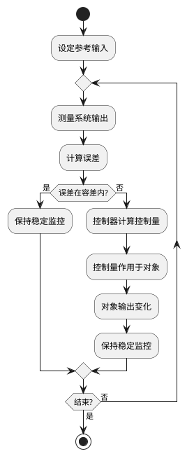

## 8 第8章 闭环控制与 PID

本章核心内容：闭环反馈控制基本理论、PID 控制器原理与分析方法、离散化与嵌入式实现要点、控制器调参方法、以及工程实例（直流电机速度闭环控制）。本章目标面向研究生层次，注重理论推导与工程实现结合，提供必要的图形与表格辅助理解，并包含可运行的核心代码片段与习题。

学习目标：

- 理解闭环控制系统的基本结构、传递函数表示与稳态/瞬态性能指标。
- 掌握 PID 控制器的作用原理、频域与时域分析以及常用调参方法（如 Ziegler–Nichols、频域整定）。
- 能够在资源受限的嵌入式平台上实现离散 PID，处理采样、反风（anti-windup）、滤波与定点实现问题。
- 能够设计并验证一个基于嵌入式系统的闭环控制工程（例：直流电机速度控制），并进行性能评估与调整。

---

### 8.1 闭环反馈控制基础

图形优先：闭环控制标准框图

```bob
                       ┌──────────────────┐
                       │   参考输入 r(t)                      │
                       │   (设定值)                           │
                       └────────┬─────────┘
                                                              │
                                ▼
                       ┌──────────────────┐
                       │     -  Σ  +     │◄──────────────────┐
                       └────────┬────────┘                    │
                                │                             │
                                ▼                             │
                       ┌─────────────────┐                    │
                       │   控制器 C(s)    │                   │
                       └────────┬────────┘                    │
                                │                             │
                                ▼                             │
                       ┌─────────────────┐                    │
                       │   控制信号 u(t)  │                   │
                       └────────┬────────┘                    │
                                │                             │
                                ▼                             │
                       ┌─────────────────┐                    │
                  ┌───►│  被控对象 G(s)  │                    │
                  │    └────────┬────────┘                    │
                  │             │                             │
                  │             ▼                             │
                  │    ┌─────────────────┐                    │
                  │    │  系统输出 y(t)   │                   │
                  │    └────────┬────────┘                    │
                  │             │                             │
                  │             └────────────────────────────┘
                                                              │
           ┌──────┴───────┐
           │   干扰 d(t)                                      │
           └──────────────┘
```

#### 8.1.1 框图详细解释

1. **参考输入 r(t)**：这是系统期望达到的目标值，也称为设定值。例如，在电机速度控制中，参考输入就是我们想要电机达到的转速（如1000 RPM）；在温度控制中，参考输入就是设定的目标温度（如60°C）。

2. **求和节点 Σ**：这个节点将参考输入与反馈信号进行比较，计算出误差信号。误差 e(t) = r(t) - y(t)。如果系统输出与目标值完全一致，误差为零。这里的负号表示反馈是负反馈，这是保证系统稳定的关键。

3. **控制器 C(s)**：控制器接收误差信号，根据特定的控制算法（如PID算法）计算出控制量。控制器的作用是根据误差大小来决定如何调整系统，使输出接近参考输入。在频域分析中，控制器用传递函数 C(s) 表示。

4. **控制信号 u(t)**：这是控制器的输出信号，直接作用于被控对象。例如，在PWM电机控制中，控制量就是PWM的占空比（0-100%）；在电压控制中，控制量就是输出电压值。

5. **被控对象 G(s)**：这是我们实际要控制的物理系统或过程。例如：直流电机、加热炉、机械臂、液压系统等。被控对象接收控制量并产生相应的输出响应。在频域分析中，被控对象用传递函数 G(s) 表示。

6. **系统输出 y(t)**：这是被控对象的实际输出值，通过传感器测量得到。例如：电机的实际转速、加热器的实际温度、机械臂的实际位置等。

7. **反馈路径**：系统输出通过反馈路径回到求和节点，与参考输入进行比较。这是闭环控制系统区别于开环控制系统的关键特征。通过反馈，系统可以根据实际输出与期望输出的差异来自动调整控制策略。

8. **干扰 d(t)**：这是外部或内部的扰动因素，会影响被控对象的输出。例如：电机负载变化、电源电压波动、环境温度变化等。闭环控制的一个主要优势就是能够抑制干扰的影响，使系统输出保持在期望值附近。

#### 8.1.2 闭环控制的工作原理



#### 8.1.3 闭环控制流程详细说明

1. **开始**：闭环控制循环的起点。

2. **设定参考输入**：确定系统的目标值 r(t)，例如电机期望转速、温度设定值等。这是控制系统的期望输出。

3. **测量系统输出**：通过传感器实时测量被控对象的实际输出 y(t)，例如电机的实际转速、当前温度等。精确的测量是闭环控制的基础。

4. **计算误差**：将参考输入与实际输出进行比较，计算误差信号 e(t) = r(t) - y(t)。误差反映了系统当前状态与目标状态的差距。

5. **误差判断**：判断误差是否在可接受的容差范围内：
   - **是**：如果误差很小或为零，说明系统输出已经接近或达到目标值，此时保持输出稳定，继续监控。
   - **否**：如果误差较大，需要控制器进行调节。

6. **控制器计算控制量**：控制器（如 PID）根据误差信号 e(t)，按照预设的控制算法计算出控制量 u(t)。控制算法决定了系统的响应特性。

7. **控制量作用于被控对象**：将计算出的控制量 u(t) 施加到被控对象上，例如改变 PWM 占空比、调整电压等。

8. **被控对象输出变化**：被控对象接收控制信号后，其输出发生相应变化，向目标值靠近。

9. **反馈与循环**：新的输出值被反馈回来，系统回到测量步骤，重复上述过程，形成持续的闭环控制循环。

10. **结束判断**：根据应用需求，判断是否需要停止控制循环。如果需要，退出循环；否则继续运行。

通过这种持续的反馈和调整，闭环控制系统能够：
- 减小或消除稳态误差
- 提高系统响应速度
- 增强系统抗干扰能力
- 改善系统稳定性

关键概念：误差、控制器、被控对象（对象模型常以传递函数 G(s) 表达）、闭环传递函数 H_cl(s) = C(s)G(s) / (1 + C(s)G(s))。性能指标包括响应时间、稳态误差、过冲、相位裕度与增益裕度等。

短文补充：通过极点-零点分析可以判断系统的稳定性与瞬态响应；Nyquist、Bode 与根轨迹是频域与复平面分析的主要工具，适合用于控制器设计与鲁棒性分析。

---

### 8.2 PID 控制器原理

PID（比例-积分-微分）控制器是工程上最常用的控制器之一，其连续时间形式为：

C(s) = K_p + K_i / s + K_d * s

图形：PID 算法功能分解

```bob
              +─────────+
              | "比例 P" |
         +───>| Kp * e  +───+
         |    +─────────+   |
         |                  v
 "误差"  |    +─────────+  +───+   "控制量"
─────>───+───>| "积分 I" +─>| Σ +──────>
         |    | Ki∫e dt  |  +───+
         |    +─────────+   ^
         |                  |
         |    +─────────+   |
         +───>| "微分 D" +───+
              | Kd de/dt |
              +─────────+
```

- 比例项 (P)：提供与误差成比例的控制作用，能减小稳态误差但可能产生稳态偏差；
- 积分项 (I)：累积误差以消除稳态误差，但会降低相位裕度并可能引起超调与振荡；
- 微分项 (D)：对误差变化率反应，改善稳态前的阻尼与响应速度，但对噪声敏感。

表格：PID 参数对系统作用简述

| 参数 | 主效应 | 风险/注意事项 |
|---|---:|---|
| Kp | 增强响应速度，降低稳态误差 | 过大引起超调或振荡 |
| Ki | 消除稳态误差 | 增大系统低频增益，可能导致震荡、积分饱和 |
| Kd | 增加阻尼，改善超调 | 对高频噪声敏感，需要滤波 |

---

### 8.3 PID 的时域与频域分析

#### 8.3.1 时域性能指标

```bob
  "y(t)"
    |
    |              .--*---.
    |            /    |    \          "超调量 M_p"
    |          /      |     \         
 1.0+ - - - /- - - - | - - - \ - - - - - - - - -*- - - - - - "稳态值"
    |       /         |       '---._   .---'
    |      /          |             '-'
    |     /           |
    |    /            |
 0.1+.. /             |
    |  /              |
    | /               |
    |/                |
    +---+---+----+----+---+---+---+---→ "t"
    0  "t_r" "t_p"       "t_s"
       "上升"  "峰值"     "调节"
       "时间"  "时间"     "时间"
```

| 指标 | 符号 | 定义 | 工程意义 |
|------|------|------|----------|
| 上升时间 | $t_r$ | 响应从 10% 上升到 90% 的时间 | 反映系统响应速度 |
| 峰值时间 | $t_p$ | 响应首次达到峰值的时间 | 反映系统振荡特性 |
| 超调量 | $M_p$ | $(y_{max} - y_{ss}) / y_{ss} \times 100\%$ | 一般要求 < 20% |
| 调节时间 | $t_s$ | 响应进入 ±2% 或 ±5% 误差带的时间 | 反映系统稳定速度 |
| 稳态误差 | $e_{ss}$ | $\lim_{t \to \infty} [r(t) - y(t)]$ | 系统精度指标 |

#### 8.3.2 频域分析要点

频域分析通过 Bode 图、Nyquist 图来评估闭环系统的稳定性与鲁棒性。

| 频域指标 | 定义 | 稳定性要求 |
|----------|------|------------|
| 增益裕度 (GM) | 开环增益达到 -180° 时的增益余量 | GM > 6 dB |
| 相位裕度 (PM) | 开环增益 = 0 dB 时相位距 -180° 的余量 | PM > 30°（一般 45°–60°） |
| 带宽频率 | 闭环幅频响应下降 -3 dB 的频率 | 带宽越大响应越快 |

```bob
  "幅值 dB"
    |
 20 +
    |  \
  0 +---\----*-------------------------→ "GM"
    |    \  / \
-20 +     \/   \
    |           \
-40 +            \
    +---------+---------+---------→ "频率 ω (log)"
           "ω_gc"    "ω_pc"
      "增益交叉频率"  "相位交叉频率"
```

---

### 8.4 PID 离散化与嵌入式实现

在嵌入式系统中，PID 控制器需要以离散形式实现。连续 PID 经过零阶保持器离散化后：

#### 8.4.1 位置式 PID

$u(k) = K_p e(k) + K_i T_s \sum_{j=0}^{k} e(j) + K_d \frac{e(k) - e(k-1)}{T_s}$

#### 8.4.2 增量式 PID

$\Delta u(k) = K_p [e(k) - e(k-1)] + K_i T_s e(k) + K_d \frac{e(k) - 2e(k-1) + e(k-2)}{T_s}$

```bob
  "位置式 vs 增量式"

  "位置式 PID"                        "增量式 PID"
+-------------------------+     +-----------------------------+
| "直接输出控制量 u(k)"    |     | "输出控制量增量 Δu(k)"      |
| "需要累加积分项"         |     | "无需累加，天然抗饱和"       |
| "适合位置控制等场景"      |     | "适合速度控制等场景"         |
| "积分饱和需额外处理"     |     | "切换无扰动"                |
+-------------------------+     +-----------------------------+
```

| 特性 | 位置式 PID | 增量式 PID |
|------|-----------|-----------|
| 输出量 | 绝对控制量 $u(k)$ | 增量 $\Delta u(k)$ |
| 积分累积 | 需要维护积分累加 | 无需积分累加 |
| 抗饱和 | 需显式 anti-windup | 天然无积分饱和 |
| 无扰切换 | 需预置初始值 | 自动平滑切换 |
| 手/自动切换 | 复杂 | 简单 |
| 适用场景 | 位置/温度控制 | 电机速度/流量控制 |

#### 8.4.3 C 语言实现：位置式 PID

```c
typedef struct {
    float Kp, Ki, Kd;       // PID 增益
    float Ts;                // 采样周期 (s)
    float integral;          // 积分累加
    float prev_error;        // 上次误差
    float output_min;        // 输出下限
    float output_max;        // 输出上限
} PID_Handle;

void PID_Init(PID_Handle *pid, float Kp, float Ki, float Kd, float Ts) {
    pid->Kp = Kp;
    pid->Ki = Ki;
    pid->Kd = Kd;
    pid->Ts = Ts;
    pid->integral = 0.0f;
    pid->prev_error = 0.0f;
    pid->output_min = -100.0f;
    pid->output_max =  100.0f;
}

float PID_Compute(PID_Handle *pid, float setpoint, float measurement) {
    float error = setpoint - measurement;

    // 积分项累加
    pid->integral += error * pid->Ts;

    // 微分项
    float derivative = (error - pid->prev_error) / pid->Ts;

    // PID 输出
    float output = pid->Kp * error
                 + pid->Ki * pid->integral
                 + pid->Kd * derivative;

    // 输出限幅
    if (output > pid->output_max) output = pid->output_max;
    if (output < pid->output_min) output = pid->output_min;

    pid->prev_error = error;
    return output;
}
```

---

### 8.5 Anti-windup 与工程化处理

#### 8.5.1 积分饱和问题

当执行器饱和（如 PWM 已达 100%）但误差仍存在时，积分项会持续累加（windup），导致控制量远超执行器能力。当误差反转后，系统需要长时间"反积分"才能恢复，造成严重超调。

```bob
  "控制量"
    |
    |                            .-------*
    |                          /          \
    |         "执行器"       /              \
    |         "饱和线" -----/--*---*---*------\----- "上限"
    |                     / /                  \
    |                   / /  "积分持续增长"       \
    |                 / /    "（windup）"           \
    |               / /                              \
    +--------+----+/-------+--------+--------+-----→ "t"
                "饱和"   "误差反转"          "恢复"
                "开始"                      "迟缓"
```

#### 8.5.2 Anti-windup 策略

| 策略 | 原理 | 实现复杂度 |
|------|------|------------|
| 积分限幅 | 限制积分项的最大/最小值 | 低 |
| 条件积分 | 仅在误差小于阈值时积累 | 低 |
| 反算法 (Back-calculation) | 用输出饱和差反向修正积分 | 中 |
| 积分分离 | 大误差时关闭积分 | 低 |

带 Anti-windup 的 PID 实现：

```c
float PID_Compute_AntiWindup(PID_Handle *pid, float sp, float meas) {
    float error = sp - meas;
    float derivative = (error - pid->prev_error) / pid->Ts;

    // 条件积分：仅在误差较小时积累
    if (fabsf(error) < pid->integral_threshold) {
        pid->integral += error * pid->Ts;
    }

    // 积分限幅
    if (pid->integral > pid->integral_max) pid->integral = pid->integral_max;
    if (pid->integral < -pid->integral_max) pid->integral = -pid->integral_max;

    float output = pid->Kp * error
                 + pid->Ki * pid->integral
                 + pid->Kd * derivative;

    // Back-calculation anti-windup
    float output_sat = output;
    if (output_sat > pid->output_max) output_sat = pid->output_max;
    if (output_sat < pid->output_min) output_sat = pid->output_min;

    pid->integral += (output_sat - output) / (pid->Ki + 1e-6f) * pid->Ts;
    pid->prev_error = error;
    return output_sat;
}
```

#### 8.5.3 微分滤波

微分项对高频噪声极为敏感，工程中通常加一阶低通滤波器：

$$D_{filtered}(k) = \alpha \cdot D_{raw}(k) + (1 - \alpha) \cdot D_{filtered}(k-1)$$

其中 $\alpha = T_s / (T_s + T_f)$，$T_f$ 为滤波时间常数（一般取 $T_d / 8$ 到 $T_d / 2$）。

另一种常用做法是微分作用于测量值而非误差（Derivative on Measurement），避免设定值跃变时的微分冲击：

```bob
  "标准微分"                   "测量值微分"
  D = d(e)/dt                  D = -d(y)/dt

  "设定值跳变"   → "微分脉冲"     "设定值跳变"   → "无微分冲击"
  "（kick）"                     "（平滑）"
```

---

### 8.6 PID 调参方法

#### 8.6.1 Ziegler-Nichols 临界比例法

这是最经典的 PID 调参方法，步骤如下：

1. 将 $K_i = 0$，$K_d = 0$，仅保留比例控制
2. 逐步增大 $K_p$ 直到系统持续等幅振荡
3. 记录此时的临界增益 $K_u$ 和振荡周期 $T_u$
4. 根据下表设定 PID 参数

| 控制器类型 | $K_p$ | $T_i$ | $T_d$ |
|-----------|-------|-------|-------|
| P | $0.50 K_u$ | — | — |
| PI | $0.45 K_u$ | $T_u / 1.2$ | — |
| PID | $0.60 K_u$ | $T_u / 2.0$ | $T_u / 8.0$ |

其中 $K_i = K_p / T_i$，$K_d = K_p \cdot T_d$。

```bob
  "Ziegler-Nichols 调参流程"

  +-------------+     +------------------+     +----------------+
  | "设 Ki=Kd=0" |---->| "增大 Kp 直到"    |---->| "记录 Ku, Tu"   |
  | "纯比例控制"  |     | "持续等幅振荡"    |     | "临界增益/周期"  |
  +-------------+     +------------------+     +-------+--------+
                                                       |
                                                       v
  +------------------+     +------------------+     +------------------+
  | "实际调试验证"    |<----| "查表计算"        |<----| "选择控制器类型"  |
  | "微调参数"        |     | "Kp, Ki, Kd"     |     | "P / PI / PID"   |
  +------------------+     +------------------+     +------------------+
```

#### 8.6.2 手动调参经验法

当无法进行临界振荡实验时，采用经验法逐步整定：

| 步骤 | 操作 | 观察目标 |
|------|------|----------|
| 1 | 设 Ki=0, Kd=0，增大 Kp | 响应速度加快但不振荡 |
| 2 | 增加 Ki（从小到大） | 消除稳态误差，注意超调 |
| 3 | 增加 Kd（从小到大） | 抑制超调，改善收敛 |
| 4 | 微调三个参数 | 综合优化各指标 |

**经验公式参考**：

- 采样周期：$T_s \leq T_u / 10$（至少为振荡周期的 1/10）
- 微分滤波常数：$T_f \approx T_d / (3 \sim 8)$

---

### 8.7 工程实例：直流电机速度闭环控制

本节以 STM32 + 有刷直流电机 + 光电编码器组成典型闭环速度控制系统为例，完整演示从硬件连接到软件实现的全流程。

#### 8.7.1 系统架构

```bob
                    +---------------+
  "目标转速"         |               |  "PWM"     +---------+
  "r(RPM)" ──────→ | "STM32 PID"   |──────────→| "H桥"    |──→ "电机 M"
                    | "控制器"       |            | "驱动"   |
                    +-------+-------+            +---------+
                            ^                         |
                            |                         v
                    +-------+-------+            +---------+
                    | "编码器计数"    |←──────────| "光电"    |
                    | "→ 转速换算"   |            | "编码器"  |
                    +---------------+            +---------+
```

#### 8.7.2 硬件参数

| 参数 | 值 | 说明 |
|------|------|------|
| MCU | STM32F103C8T6 | Blue Pill 开发板 |
| 电机 | JGA25-370 12V 有刷直流电机 | 减速比 1:21.3 |
| 编码器 | AB 相光电编码器 | 每转 11 脉冲 × 4 倍频 × 21.3 = 937 count/rev |
| 驱动 | TB6612FNG 双 H 桥驱动 | 支持正反转 + PWM 调速 |
| PWM 频率 | 20 kHz | TIM1 通道 1 |
| 编码器接口 | TIM3 编码器模式 | 4 倍频计数 |
| 控制周期 | 10 ms | TIM2 定时中断 |

#### 8.7.3 完整实现代码

```c
/* === 全局变量 === */
static PID_Handle speed_pid;
static volatile int32_t encoder_count = 0;
static float target_rpm = 0.0f;

/* === 编码器读取 === */
float Encoder_GetRPM(float Ts) {
    int16_t count = (int16_t)__HAL_TIM_GET_COUNTER(&htim3);
    __HAL_TIM_SET_COUNTER(&htim3, 0);
    // count/rev = 11 * 4 * 21.3 = 937.2
    float rpm = (float)count / 937.2f * (60.0f / Ts);
    return rpm;
}

/* === PWM 输出 === */
void Motor_SetPWM(float duty) {
    // duty: -100.0 ~ +100.0
    if (duty >= 0) {
        HAL_GPIO_WritePin(AIN1_GPIO_Port, AIN1_Pin, GPIO_PIN_SET);
        HAL_GPIO_WritePin(AIN2_GPIO_Port, AIN2_Pin, GPIO_PIN_RESET);
    } else {
        HAL_GPIO_WritePin(AIN1_GPIO_Port, AIN1_Pin, GPIO_PIN_RESET);
        HAL_GPIO_WritePin(AIN2_GPIO_Port, AIN2_Pin, GPIO_PIN_SET);
        duty = -duty;
    }
    uint16_t pulse = (uint16_t)(duty / 100.0f * htim1.Init.Period);
    __HAL_TIM_SET_COMPARE(&htim1, TIM_CHANNEL_1, pulse);
}

/* === 10ms 定时中断回调 === */
void HAL_TIM_PeriodElapsedCallback(TIM_HandleTypeDef *htim) {
    if (htim->Instance == TIM2) {
        float actual_rpm = Encoder_GetRPM(0.01f);
        float output = PID_Compute_AntiWindup(&speed_pid,
                                               target_rpm, actual_rpm);
        Motor_SetPWM(output);
    }
}

/* === 初始化 === */
void Motor_Control_Init(void) {
    PID_Init(&speed_pid, 0.5f, 2.0f, 0.01f, 0.01f);
    speed_pid.output_min = -100.0f;
    speed_pid.output_max =  100.0f;
    speed_pid.integral_max = 500.0f;
    speed_pid.integral_threshold = 200.0f;

    HAL_TIM_Encoder_Start(&htim3, TIM_CHANNEL_ALL);  // 编码器
    HAL_TIM_PWM_Start(&htim1, TIM_CHANNEL_1);        // PWM
    HAL_TIM_Base_Start_IT(&htim2);                    // 10ms 定时
}
```

#### 8.7.4 调参过程记录

以下是该系统采用手动经验法整定的实际调参记录：

| 阶段 | Kp | Ki | Kd | 响应表现 |
|------|-----|-----|-----|----------|
| 1 | 0.2 | 0 | 0 | 响应慢，稳态误差 ~80 RPM |
| 2 | 0.5 | 0 | 0 | 响应加快，稳态误差 ~30 RPM |
| 3 | 0.5 | 1.0 | 0 | 消除稳态误差，超调 ~25% |
| 4 | 0.5 | 2.0 | 0 | 收敛更快，超调 ~18% |
| 5 | 0.5 | 2.0 | 0.01 | 超调降至 ~8%，调节时间 ~0.3s |
| 最终 | 0.5 | 2.0 | 0.01 | 稳态误差 < 5 RPM，超调 < 10% |

---

### 8.8 常见工程问题与对策

| 问题 | 原因 | 解决方案 |
|------|------|----------|
| 电机不动 | 死区效应，低 PWM 不足以驱动 | 加前馈补偿死区 |
| 持续振荡 | Kp 过大或采样率不足 | 降低 Kp，提高采样率 |
| 收敛慢 | Kp 或 Ki 过小 | 增大比例或积分增益 |
| 超调严重 | 积分饱和或 Ki 过大 | 加 anti-windup，减小 Ki |
| 噪声引起抖动 | Kd 项放大编码器噪声 | 加微分低通滤波 |
| 单方向转动 | H 桥接线错误 | 检查 AIN1/AIN2 极性 |

```bob
  "死区补偿示意"

  "output"
    |          /
    |         /
    |        /
    |       /
    |    . /
    |    |/
    +----+--*---+---→ "error"
        /|  "死区"
       / |  "offset"
      /  |
     /   .
    /
```

---

### 8.9 本章小结

```bob
  +--------+     +--------+     +--------+     +--------+     +--------+
  | "闭环"  |---->| "PID"  |---->| "离散化" |---->| "调参"  |---->| "工程"  |
  | "原理"  |     | "三项"  |     | "实现"  |     | "方法"  |     | "实战"  |
  +--------+     +--------+     +--------+     +--------+     +--------+
      |              |              |              |              |
      v              v              v              v              v
  "框图"          "P-I-D"       "位置式"       "Z-N法"        "电机"
  "传递函数"      "参数作用"     "增量式"       "经验法"       "速度控制"
  "性能指标"      "频域分析"     "Anti-windup"  "微调"         "STM32"
```

本章从闭环控制基础出发，深入讲解了 PID 控制器的原理、时域/频域分析方法、离散化实现策略、Anti-windup 等工程化处理，以及 Ziegler-Nichols 和手动经验两种调参方法，最后通过 STM32 直流电机速度闭环控制的完整工程实例将理论与实践结合。

本章内容是后续第 9 章（传感器融合）、第 10 章（高级运动控制）的基础，尤其是第 10 章中的串级 PID、前馈控制和 MPC 都建立在本章的 PID 基础之上。

---

### 8.10 本章测验

1. 简述开环控制与闭环控制的本质区别，并举出各一个工程实例。

2. 对于一阶系统 $G(s) = \frac{1}{s+1}$，设计一个 PI 控制器使闭环系统无稳态误差，并分析参数选择对超调和响应速度的影响。

3. 解释位置式 PID 和增量式 PID 的区别。在电机速度控制场景中，为什么增量式更常用？

4. 什么是积分饱和（windup）？请描述至少两种 anti-windup 策略并比较其优缺点。

5. 在 STM32 上实现 PID 控制时，采样周期 $T_s$ 的选择需要考虑哪些因素？如果 $T_s$ 选取过大或过小分别会出现什么问题？
