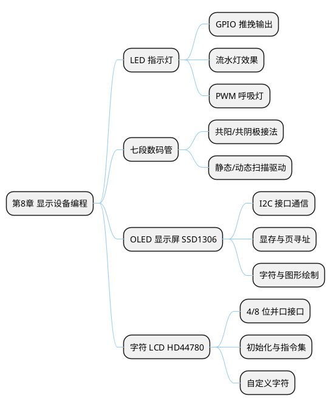
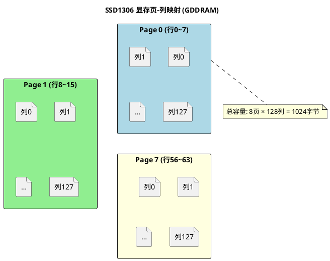
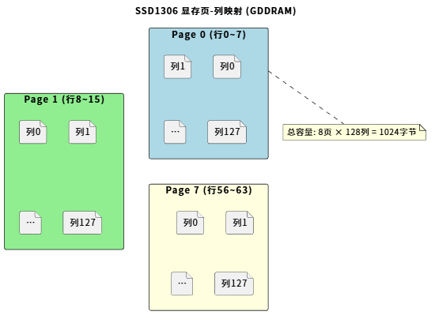
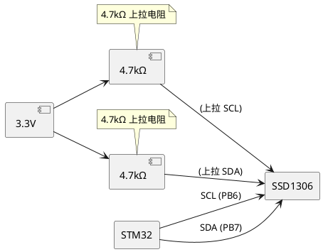
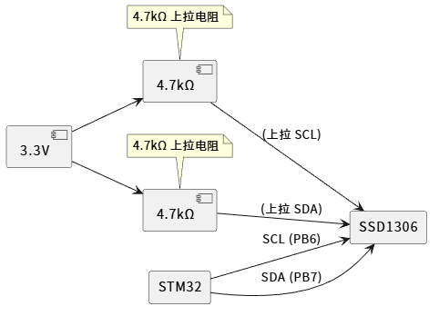
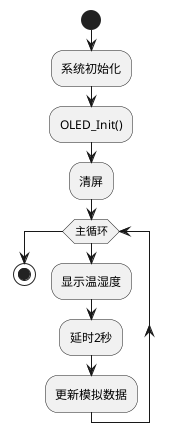
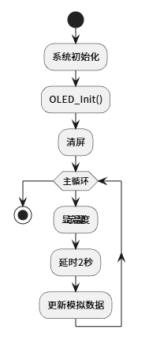
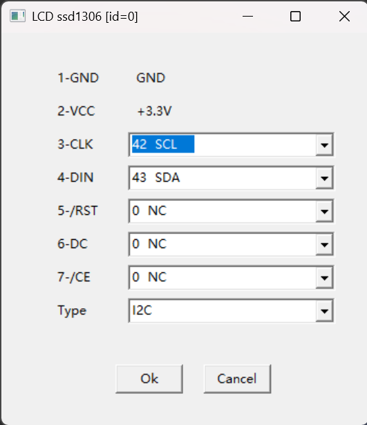
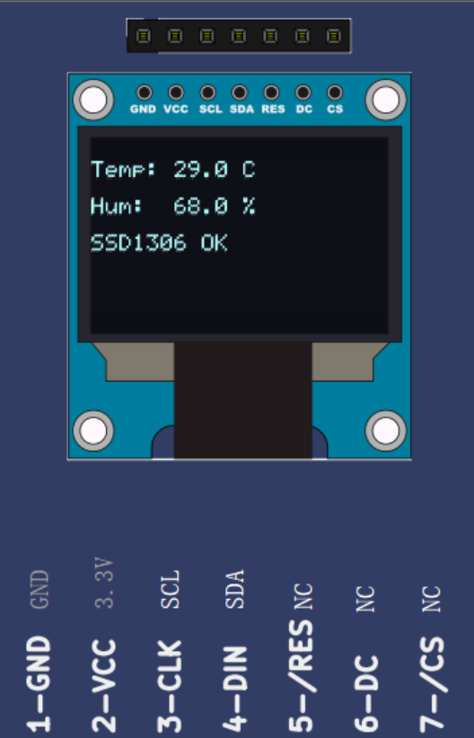

## 8 第 8 章 显示设备编程

> 显示设备是嵌入式系统向用户呈现信息的主要手段。本章介绍 LED 指示灯、七段数码管、OLED 显示屏（SSD1306）和字符 LCD（HD44780）在 STM32 上的驱动编程。

### 8.1 本章知识导图


```plantuml
@startmindmap
skinparam mindmapNodeBackgroundColor<<root>>    #1565C0
skinparam mindmapNodeFontColor<<root>>          white
skinparam mindmapNodeBackgroundColor<<l1>>      #1976D2
skinparam mindmapNodeFontColor<<l1>>            white
skinparam ArrowColor                            #90CAF9
skinparam mindmapNodeBorderColor                #90CAF9

* 第8章 显示设备编程
** LED 指示灯
*** GPIO 推挽输出
*** 流水灯效果
*** PWM 呼吸灯
** 七段数码管
*** 共阳/共阴极接法
*** 静态/动态扫描驱动
** OLED 显示屏 SSD1306
*** I2C 接口通信
*** 显存与页寻址
*** 字符与图形绘制
** 字符 LCD HD44780
*** 4/8 位并口接口
*** 初始化与指令集
*** 自定义字符
@endmindmap
```

**图 8-1** 本章知识导图：四种常用显示设备的驱动编程。
<!-- fig:ch8-1 本章知识导图：四种常用显示设备的驱动编程。 -->

### 8.2 LED 指示灯与流水灯

LED 是最简单的输出设备，通过 GPIO 推挽输出控制点亮/熄灭。

#### 8.2.1 单 LED 控制

Blue Pill 板载 LED 连接在 PC13，低电平点亮：

```c
/* 板载 LED 控制 */
HAL_GPIO_WritePin(GPIOC, GPIO_PIN_13, GPIO_PIN_RESET);  /* 点亮 */
HAL_GPIO_WritePin(GPIOC, GPIO_PIN_13, GPIO_PIN_SET);     /* 熄灭 */
HAL_GPIO_TogglePin(GPIOC, GPIO_PIN_13);                  /* 翻转 */
```

#### 8.2.2 八路流水灯

使用 PA0~PA7 驱动 8 个外接 LED：

```c
/* 流水灯效果 */
void LED_Waterfall(void)
{
    for (int i = 0; i < 8; i++) {
        /* 熄灭所有 LED */
        HAL_GPIO_WritePin(GPIOA, 0x00FF, GPIO_PIN_SET);
        /* 点亮第 i 个 LED */
        HAL_GPIO_WritePin(GPIOA, (1 << i), GPIO_PIN_RESET);
        HAL_Delay(200);
    }
}
```

#### 8.2.3 PWM 呼吸灯

利用定时器 PWM 输出实现 LED 亮度渐变（详见第 5 章定时器 PWM 内容）：

```c
/* PWM 呼吸灯 — 占空比 0→100%→0 循环 */
void LED_Breathe(TIM_HandleTypeDef *htim, uint32_t channel)
{
    for (uint16_t duty = 0; duty < 1000; duty += 10) {
        __HAL_TIM_SET_COMPARE(htim, channel, duty);
        HAL_Delay(10);
    }
    for (uint16_t duty = 1000; duty > 0; duty -= 10) {
        __HAL_TIM_SET_COMPARE(htim, channel, duty);
        HAL_Delay(10);
    }
}
```

---

### 8.3 七段数码管

七段数码管由 7 个 LED 段（a~g）和 1 个小数点（dp）组成，可显示 0~9 和部分字母。

**表 8-1** 共阴极数码管段码表
<!-- tab:ch8-1 共阴极数码管段码表 -->

| 数字 | dp g f e d c b a | 十六进制 |
|:----:|:----------------:|:--------:|
| 0 | 0 0 1 1 1 1 1 1 | 0x3F |
| 1 | 0 0 0 0 0 1 1 0 | 0x06 |
| 2 | 0 1 0 1 1 0 1 1 | 0x5B |
| 3 | 0 1 0 0 1 1 1 1 | 0x4F |
| 4 | 0 1 1 0 0 1 1 0 | 0x66 |
| 5 | 0 1 1 0 1 1 0 1 | 0x6D |
| 6 | 0 1 1 1 1 1 0 1 | 0x7D |
| 7 | 0 0 0 0 0 1 1 1 | 0x07 |
| 8 | 0 1 1 1 1 1 1 1 | 0x7F |
| 9 | 0 1 1 0 1 1 1 1 | 0x6F |

```c
/* 数码管段码表（共阴极） */
static const uint8_t seg_table[] = {
    0x3F, 0x06, 0x5B, 0x4F, 0x66,  /* 0~4 */
    0x6D, 0x7D, 0x07, 0x7F, 0x6F   /* 5~9 */
};

/* 显示一位数字 */
void SEG_Display(uint8_t digit)
{
    if (digit > 9) return;
    /* 假设 a~g 连接 PA0~PA6 */
    GPIOA->ODR = (GPIOA->ODR & 0xFF80) | seg_table[digit];
}
```

多位数码管使用动态扫描（逐位轮流点亮，利用人眼视觉暂留效应）驱动。

---

### 8.4 OLED 显示屏（SSD1306）

#### 8.4.1 学习目标

通过本节学习，读者应能够：
1. 理解 SSD1306 的内部显存结构和 I2C 通信协议。
2. 掌握使用 STM32CubeMX 配置 I2C 外设的方法。
3. 编写完整的 SSD1306 初始化、清屏、字符显示及传感器数据显示驱动代码。
4. 使用 PicsimLab 仿真平台进行硬件在环仿真验证。

#### 8.4.2 知识点

- **SSD1306**：单色 OLED 驱动芯片，支持 128×64 分辨率，内置 1024 字节 GDDRAM。
- **I2C 协议**：两线式串行总线，本实验使用 Fast Mode（400 kHz）。
- **显存映射**：8 页 × 128 列，每列 1 字节，每字节对应 8 行像素（垂直排列）。
- **控制字节**：`0x00` 表示后续为命令，`0x40` 表示后续为显存数据。

#### 8.4.3 硬件原理

##### I2C 接口连接

| OLED 引脚 | STM32F103C8T6 | 说明 |
|-----------|---------------|------|
| VCC       | 3.3V          | 电源 |
| GND       | GND           | 地线 |
| SCL       | PB6 (I2C1_SCL) | I2C 时钟 |
| SDA       | PB7 (I2C1_SDA) | I2C 数据 |

SSD1306 的 7 位 I2C 地址为 **0x3C**，写地址为 **0x78**。

##### 显存页-列映射结构


```plantuml
@startuml
title SSD1306 显存页-列映射 (GDDRAM)
skinparam componentStyle rectangle
rectangle "Page 0 (行0~7)" as p0 #LightBlue {
    file "列0" as c00
    file "列1" as c01
    file "…" as c0dot
    file "列127" as c0_127
}
rectangle "Page 1 (行8~15)" as p1 #LightGreen {
    file "列0" as c10
    file "列1" as c11
    file "…" as c1dot
    file "列127" as c1_127
}
rectangle "Page 7 (行56~63)" as p7 #LightYellow {
    file "列0" as c70
    file "列1" as c71
    file "…" as c7dot
    file "列127" as c7_127
}
p0 -[hidden]down- p1
p1 -[hidden]down- p7
note bottom of p0 : 总容量: 8页 × 128列 = 1024字节
@enduml
```


**图 8-2** SSD1306 显存页-列映射结构（PlantUML 脚本生成，上图为其渲染效果）。
##### I2C 总线电气连接
SCL 和 SDA 线均为开漏输出，必须外接 4.7kΩ 上拉电阻至 3.3V，否则通信失败。

```plantuml
@startuml
left to right direction

' 定义组件
rectangle "STM32" as mcu
rectangle "SSD1306" as oled
component "3.3V" as vcc
component "4.7kΩ" as r1
component "4.7kΩ" as r2

' I2C 总线连接
mcu --> oled : SCL (PB6)
mcu --> oled : SDA (PB7)

' 上拉电阻连接
vcc --> r1
vcc --> r2
r1 --> oled : (上拉 SCL)
r2 --> oled : (上拉 SDA)

' 可选：添加颜色说明
note top of r1 : 4.7kΩ 上拉电阻
note top of r2 : 4.7kΩ 上拉电阻
@enduml
```


**图 8-3** I2C 总线电气连接图（含上拉电阻，PlantUML 脚本生成，上图为其渲染效果）。
#### 8.4.4 软件设计与实现
工程配置（STM32CubeIDE）
创建 STM32F103C8T6 工程，启用 I2C1，模式为 Fast Mode（400 kHz）。

配置系统时钟为 HSI 8MHz。

生成代码，在 main.c 的 USER CODE 区域添加驱动函数。

核心驱动代码
```c
/* 宏定义与 I2C 写函数 */
#define OLED_ADDR (0x3C << 1)

void OLED_WriteCmd(uint8_t cmd) {
    uint8_t buf[2] = {0x00, cmd};
    HAL_I2C_Master_Transmit(&hi2c1, OLED_ADDR, buf, 2, HAL_MAX_DELAY);
}

void OLED_WriteData(uint8_t data) {
    uint8_t buf[2] = {0x40, data};
    HAL_I2C_Master_Transmit(&hi2c1, OLED_ADDR, buf, 2, HAL_MAX_DELAY);
}

/* 初始化序列（含电荷泵使能） */
void OLED_Init(void) {
    HAL_Delay(100);
    OLED_WriteCmd(0xAE); // 关显示
    OLED_WriteCmd(0xD5); OLED_WriteCmd(0x80);
    OLED_WriteCmd(0xA8); OLED_WriteCmd(0x3F);
    OLED_WriteCmd(0xD3); OLED_WriteCmd(0x00);
    OLED_WriteCmd(0x40);
    OLED_WriteCmd(0x8D); OLED_WriteCmd(0x14); // 电荷泵
    OLED_WriteCmd(0x20); OLED_WriteCmd(0x00);
    OLED_WriteCmd(0xA1);
    OLED_WriteCmd(0xC8);
    OLED_WriteCmd(0xDA); OLED_WriteCmd(0x12);
    OLED_WriteCmd(0x81); OLED_WriteCmd(0xCF);
    OLED_WriteCmd(0xD9); OLED_WriteCmd(0xF1);
    OLED_WriteCmd(0xDB); OLED_WriteCmd(0x40);
    OLED_WriteCmd(0xA4);
    OLED_WriteCmd(0xA6);
    OLED_WriteCmd(0xAF); // 开显示
}

/* 清屏 */
void OLED_Clear(void) {
    OLED_WriteCmd(0x21); OLED_WriteCmd(0x00); OLED_WriteCmd(0x7F);
    OLED_WriteCmd(0x22); OLED_WriteCmd(0x00); OLED_WriteCmd(0x07);
    for (uint16_t i = 0; i < 1024; i++) OLED_WriteData(0x00);
}

/* 显示字符（6×8 字体）*/
void OLED_ShowChar(uint8_t x, uint8_t y, char ch) {
    if (x > 122 || y > 7) return;
    OLED_WriteCmd(0xB0 + y);
    OLED_WriteCmd(0x00 + (x & 0x0F));
    OLED_WriteCmd(0x10 + ((x >> 4) & 0x0F));
    for (uint8_t i = 0; i < 6; i++)
        OLED_WriteData(font6x8[ch - 32][i]); // 需要字模数组
}

void OLED_ShowString(uint8_t x, uint8_t y, char *str) {
    while (*str) {
        OLED_ShowChar(x, y, *str);
        x += 6;
        if (x > 122) { x = 0; y++; }
        str++;
    }
}

/* 模拟传感器数据显示 */
void OLED_ShowSensorData(float temp, float humi) {
    char buf[20];
    OLED_Clear();
    sprintf(buf, "Temp: %.1f C", temp);
    OLED_ShowString(0, 0, buf);
    sprintf(buf, "Hum:  %.1f %%", humi);
    OLED_ShowString(0, 2, buf);
    OLED_ShowString(0, 4, "SSD1306 OK");
}
```
完整字体表（ASCII 32~126）需在代码中定义，因篇幅未全列。
主函数示例
```c
int main(void) {
    HAL_Init();
    SystemClock_Config();
    MX_GPIO_Init();
    MX_I2C1_Init();
    OLED_Init();
    float temp = 23.5, humi = 58.0;
    while (1) {
        OLED_ShowSensorData(temp, humi);
        HAL_Delay(2000);
        temp += 0.5; humi += 0.5;
        if (temp > 40) temp = 20;
    }
}
```

```plantuml
@startuml
start
:系统初始化;
:OLED_Init();
:清屏;
while (主循环)
  :显示温湿度;
  :延时2秒;
  :更新模拟数据;
endwhile
stop
@enduml
```


**图 8-4** 主程序流程图（PlantUML 脚本生成，上图为其渲染效果）。
**工程源码位置**：本节的完整 STM32CubeIDE 工程位于 `code_examples/OLED_SSD1306_Driver/`。
#### 8.4.5 PicsimLab 仿真验证
仿真环境搭建
打开 PicsimLab，添加 STM32F103C8T6 板卡和 SSD1306 OLED 模块。
将编译生成的.bin文件加载到虚拟 STM32 中。

按硬件连接表连线：SCL → PB6, SDA → PB7, VCC → 3.3V, GND → GND（其余引脚 NC）。


**图 8-5** PicsimLab 仿真引脚接线。
运行结果截图


**图 8-6** PicsimLab 仿真运行效果：屏幕显示温度 29.0°C、湿度 68.0% 及 “SSD1306 OK”。
结果分析
屏幕显示清晰无乱码，温度每 2 秒增加 0.5°C 并在超过 40°C 时重置，说明 I2C 通信正常，初始化序列正确，字符显示函数工作正常。
#### 8.4.6 本节小结
本节实现了基于 STM32F103C8T6 的 SSD1306 OLED I2C 驱动，包括初始化、清屏、字符显示和模拟传感器数据显示。通过 PicsimLab 仿真验证了驱动的正确性。该驱动可方便地移植到真实硬件，并扩展显示各类传感器数据。
#### 8.4.7 习题
为什么 SSD1306 初始化时必须使能电荷泵（命令 0x8D 0x14）？

在 128×64 的 OLED 上，如何计算 (x, y) 坐标对应的显存页和字节内位偏移？

如果 I2C 通信正常但屏幕全黑，可能的原因有哪些？

尝试修改代码，在 OLED 上显示一个简单的温度折线图。


---

### 8.5 字符 LCD（HD44780）

HD44780 是经典的字符 LCD 控制芯片，支持 16×2 或 20×4 字符显示，使用 4 位或 8 位并口通信。

#### 8.5.1 接口定义

**表 8-3** HD44780 LCD 引脚定义（4 位模式）
<!-- tab:ch8-3 HD44780 LCD 引脚定义（4 位模式） -->

| LCD 引脚 | 功能 | STM32 连接 |
|----------|------|-----------|
| RS | 寄存器选择（0=命令, 1=数据） | PA4 |
| RW | 读/写选择（通常接 GND 只写） | GND |
| E | 使能信号（下降沿锁存数据） | PA5 |
| D4~D7 | 4 位数据线 | PA0~PA3 |
| V0 | 对比度调节 | 电位器中间抽头 |

#### 8.5.2 初始化与常用操作

```c
/* HD44780 4-bit 模式驱动（简化版） */

static void LCD_SendNibble(uint8_t nibble)
{
    GPIOA->ODR = (GPIOA->ODR & 0xFFF0) | (nibble & 0x0F);
    HAL_GPIO_WritePin(GPIOA, GPIO_PIN_5, GPIO_PIN_SET);   /* E=1 */
    delay_us(1);
    HAL_GPIO_WritePin(GPIOA, GPIO_PIN_5, GPIO_PIN_RESET); /* E=0 */
    delay_us(50);
}

static void LCD_SendByte(uint8_t data, uint8_t is_data)
{
    HAL_GPIO_WritePin(GPIOA, GPIO_PIN_4,
                      is_data ? GPIO_PIN_SET : GPIO_PIN_RESET);
    LCD_SendNibble(data >> 4);    /* 高 4 位 */
    LCD_SendNibble(data & 0x0F);  /* 低 4 位 */
}

void LCD_Init(void)
{
    HAL_Delay(50);
    LCD_SendNibble(0x03); HAL_Delay(5);
    LCD_SendNibble(0x03); HAL_Delay(1);
    LCD_SendNibble(0x03);
    LCD_SendNibble(0x02);         /* 切换到 4-bit 模式 */
    LCD_SendByte(0x28, 0);        /* 4-bit, 2 行, 5x8 字体 */
    LCD_SendByte(0x0C, 0);        /* 显示开，光标关 */
    LCD_SendByte(0x06, 0);        /* 光标右移 */
    LCD_SendByte(0x01, 0);        /* 清屏 */
    HAL_Delay(2);
}

void LCD_SetCursor(uint8_t row, uint8_t col)
{
    uint8_t addr = (row == 0) ? col : (0x40 + col);
    LCD_SendByte(0x80 | addr, 0);
}

void LCD_Print(const char *str)
{
    while (*str) LCD_SendByte(*str++, 1);
}
```

> 在 PicSimlab 中可直接添加 LCD 16×2 虚拟组件进行仿真验证。

---

### 8.6 本章小结

本章介绍了四种嵌入式常用显示设备的驱动编程：

- **LED 指示灯**：GPIO 推挽输出控制，PWM 呼吸灯效果
- **七段数码管**：段码编码与动态扫描驱动
- **SSD1306 OLED**：I2C 通信、页寻址显存、帧缓冲区图形绘制
- **HD44780 字符 LCD**：4 位并口模式初始化与字符显示

这些显示设备构成了嵌入式系统"输出"环节的重要组成部分，与传感器（第 7 章）配合可实现完整的数据采集-显示链路。

---

### 8.7 习题

1. 说明共阳极和共阴极数码管的区别，各自的段码有何不同？
2. SSD1306 OLED 采用页寻址模式时，如何在屏幕坐标 (30, 20) 处设置一个像素？
3. 比较 I2C 接口 OLED 和 SPI 接口 OLED 的优缺点。
4. 设计一个温室监控显示方案：在 OLED 上显示温度、湿度和超声波液位值，要求每秒刷新一次。
5. HD44780 LCD 的 4 位模式比 8 位模式节省了哪些 GPIO？在引脚资源紧张时这有何意义？
