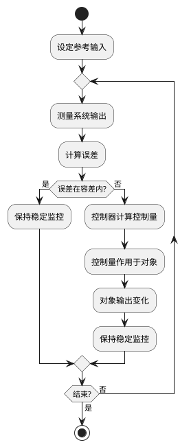
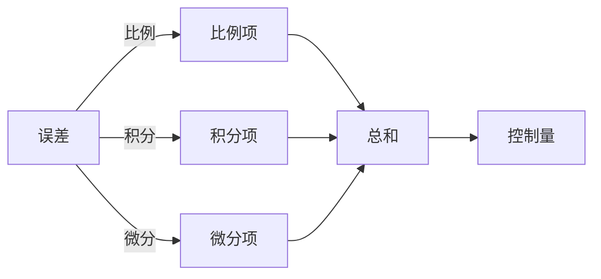
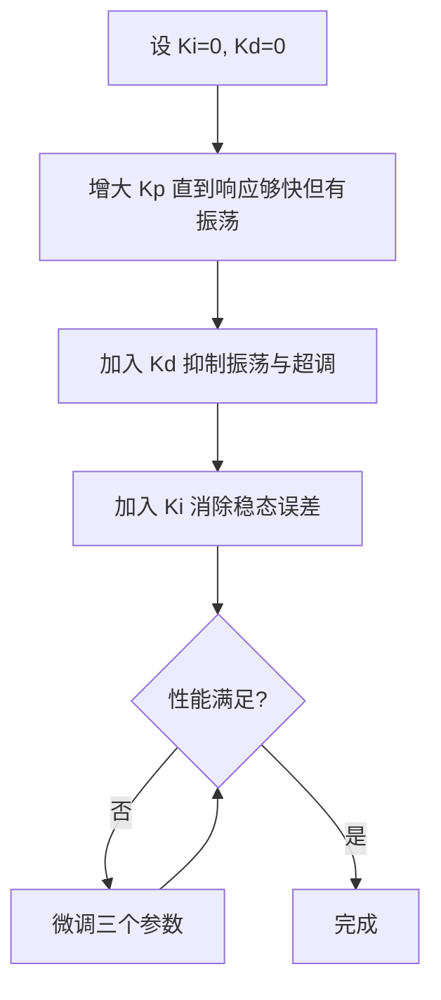
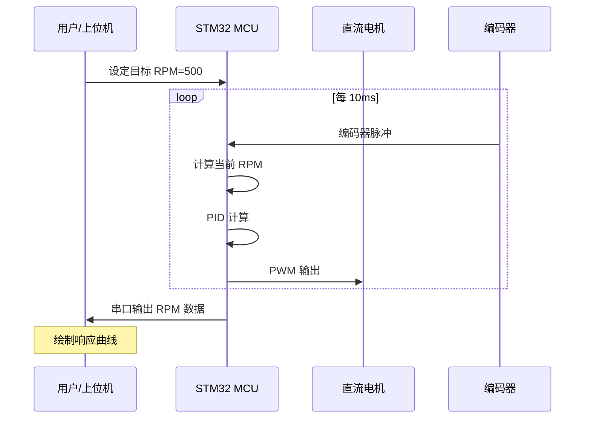
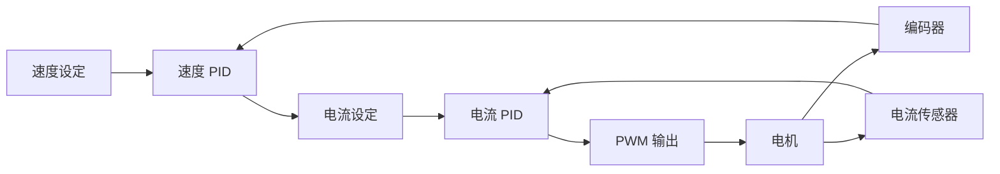

# 第9章 闭环控制与 PID

本章核心内容：闭环反馈控制基本理论、PID 控制器原理与分析方法、离散化与嵌入式实现要点、控制器调参方法、以及工程实例（直流电机速度闭环控制）。本章目标面向研究生层次，注重理论推导与工程实现结合，提供必要的图形与表格辅助理解，并包含可运行的核心代码片段与习题。

学习目标：

- 理解闭环控制系统的基本结构、传递函数表示与稳态/瞬态性能指标。
- 掌握 PID 控制器的作用原理、频域与时域分析以及常用调参方法（如 Ziegler–Nichols、频域整定）。
- 能够在资源受限的嵌入式平台上实现离散 PID，处理采样、反风（anti-windup）、滤波与定点实现问题。
- 能够设计并验证一个基于嵌入式系统的闭环控制工程（例：直流电机速度控制），并进行性能评估与调整。

---

## 9.1 闭环反馈控制基础

图形优先：闭环控制标准框图

```text
                       ┌─────────────────┐
                       │   参考输入 r(t)  │
                       │   (设定值)       │
                       └────────┬────────┘
                                │
                                ▼
                       ┌─────────────────┐
                       │     -  Σ  +     │◄──────────────────┐
                       └────────┬────────┘                   │
                                │                            │
                                ▼                            │
                       ┌─────────────────┐                   │
                       │   控制器 C(s)    │                   │
                       └────────┬────────┘                   │
                                │                            │
                                ▼                            │
                       ┌─────────────────┐                   │
                       │   控制信号 u(t)  │                   │
                       └────────┬────────┘                   │
                                │                            │
                                ▼                            │
                       ┌─────────────────┐                   │
                  ┌───►│  被控对象 G(s)  │                   │
                  │    └────────┬────────┘                   │
                  │             │                            │
                  │             ▼                            │
                  │    ┌─────────────────┐                   │
                  │    │  系统输出 y(t)   │                   │
                  │    └────────┬────────┘                   │
                  │             │                            │
                  │             └────────────────────────────┘
                  │
           ┌──────┴──────┐
           │   干扰 d(t) │
           └─────────────┘
```

### 框图详细解释

1. **参考输入 r(t)**：这是系统期望达到的目标值，也称为设定值。例如，在电机速度控制中，参考输入就是我们想要电机达到的转速（如1000 RPM）；在温度控制中，参考输入就是设定的目标温度（如60°C）。

2. **求和节点 Σ**：这个节点将参考输入与反馈信号进行比较，计算出误差信号。误差 e(t) = r(t) - y(t)。如果系统输出与目标值完全一致，误差为零。这里的负号表示反馈是负反馈，这是保证系统稳定的关键。

3. **控制器 C(s)**：控制器接收误差信号，根据特定的控制算法（如PID算法）计算出控制量。控制器的作用是根据误差大小来决定如何调整系统，使输出接近参考输入。在频域分析中，控制器用传递函数 C(s) 表示。

4. **控制信号 u(t)**：这是控制器的输出信号，直接作用于被控对象。例如，在PWM电机控制中，控制量就是PWM的占空比（0-100%）；在电压控制中，控制量就是输出电压值。

5. **被控对象 G(s)**：这是我们实际要控制的物理系统或过程。例如：直流电机、加热炉、机械臂、液压系统等。被控对象接收控制量并产生相应的输出响应。在频域分析中，被控对象用传递函数 G(s) 表示。

6. **系统输出 y(t)**：这是被控对象的实际输出值，通过传感器测量得到。例如：电机的实际转速、加热器的实际温度、机械臂的实际位置等。

7. **反馈路径**：系统输出通过反馈路径回到求和节点，与参考输入进行比较。这是闭环控制系统区别于开环控制系统的关键特征。通过反馈，系统可以根据实际输出与期望输出的差异来自动调整控制策略。

8. **干扰 d(t)**：这是外部或内部的扰动因素，会影响被控对象的输出。例如：电机负载变化、电源电压波动、环境温度变化等。闭环控制的一个主要优势就是能够抑制干扰的影响，使系统输出保持在期望值附近。

### 闭环控制的工作原理



### 闭环控制流程详细说明

1. **开始**：闭环控制循环的起点。

2. **设定参考输入**：确定系统的目标值 r(t)，例如电机期望转速、温度设定值等。这是控制系统的期望输出。

3. **测量系统输出**：通过传感器实时测量被控对象的实际输出 y(t)，例如电机的实际转速、当前温度等。精确的测量是闭环控制的基础。

4. **计算误差**：将参考输入与实际输出进行比较，计算误差信号 e(t) = r(t) - y(t)。误差反映了系统当前状态与目标状态的差距。

5. **误差判断**：判断误差是否在可接受的容差范围内：
   - **是**：如果误差很小或为零，说明系统输出已经接近或达到目标值，此时保持输出稳定，继续监控。
   - **否**：如果误差较大，需要控制器进行调节。

6. **控制器计算控制量**：控制器（如 PID）根据误差信号 e(t)，按照预设的控制算法计算出控制量 u(t)。控制算法决定了系统的响应特性。

7. **控制量作用于被控对象**：将计算出的控制量 u(t) 施加到被控对象上，例如改变 PWM 占空比、调整电压等。

8. **被控对象输出变化**：被控对象接收控制信号后，其输出发生相应变化，向目标值靠近。

9. **反馈与循环**：新的输出值被反馈回来，系统回到测量步骤，重复上述过程，形成持续的闭环控制循环。

10. **结束判断**：根据应用需求，判断是否需要停止控制循环。如果需要，退出循环；否则继续运行。

通过这种持续的反馈和调整，闭环控制系统能够：
- 减小或消除稳态误差
- 提高系统响应速度
- 增强系统抗干扰能力
- 改善系统稳定性

关键概念：误差、控制器、被控对象（对象模型常以传递函数 G(s) 表达）、闭环传递函数 H_cl(s) = C(s)G(s) / (1 + C(s)G(s))。性能指标包括响应时间、稳态误差、过冲、相位裕度与增益裕度等。

短文补充：通过极点-零点分析可以判断系统的稳定性与瞬态响应；Nyquist、Bode 与根轨迹是频域与复平面分析的主要工具，适合用于控制器设计与鲁棒性分析。

---

## 9.2 PID 控制器原理

PID（比例-积分-微分）控制器是工程上最常用的控制器之一，其连续时间形式为：

C(s) = K_p + K_i / s + K_d * s

图形：PID 算法功能分解



- 比例项 (P)：提供与误差成比例的控制作用，能减小稳态误差但可能产生稳态偏差；
- 积分项 (I)：累积误差以消除稳态误差，但会降低相位裕度并可能引起超调与振荡；
- 微分项 (D)：对误差变化率反应，改善稳态前的阻尼与响应速度，但对噪声敏感。

表格：PID 参数对系统作用简述

| 参数 | 主效应 | 风险/注意事项 |
|---|---:|---|
| Kp | 增强响应速度，降低稳态误差 | 过大引起超调或振荡 |
| Ki | 消除稳态误差 | 增大系统低频增益，可能导致震荡、积分饱和 |
| Kd | 增加阻尼，改善超调 | 对高频噪声敏感，需要滤波 |

---

## 9.3 PID 的时域与频域分析

### 9.3.1 时域性能指标

对于阶跃响应，常用以下指标评价闭环系统性能：

| 指标 | 定义 | 期望方向 |
|---|---|---|
| 上升时间 $t_r$ | 响应从 10% 上升到 90%（或 0→100%）所需时间 | 越短越好（快速性） |
| 峰值时间 $t_p$ | 响应第一次达到峰值的时间 | 越短越好 |
| 超调量 $M_p$ | 峰值与稳态值之差占稳态值的百分比 | 越小越好（通常 < 20%） |
| 调节时间 $t_s$ | 响应进入稳态值 ±2%（或 ±5%）范围后不再超出的时间 | 越短越好 |
| 稳态误差 $e_{ss}$ | 系统输出最终值与参考输入的差 | 越接近零越好 |

PID 各参数对这些指标的影响：

| 增大参数 | $t_r$ | $M_p$ | $t_s$ | $e_{ss}$ |
|---|---|---|---|---|
| $K_p$ | 减小 | 增大 | 变化不定 | 减小 |
| $K_i$ | 减小 | 增大 | 增大 | 消除 |
| $K_d$ | 变化不大 | 减小 | 减小 | 无直接影响 |

### 9.3.2 频域性能指标

频域分析通过开环传递函数 $L(j\omega) = C(j\omega) \cdot G(j\omega)$ 的 Bode 图或 Nyquist 图来评估闭环性能：

- **增益裕度 $G_m$**：在相位为 -180° 时，增益距 0 dB 的裕量。$G_m > 0$ 表示稳定，工程上通常要求 $G_m \geq 6$ dB。
- **相位裕度 $\phi_m$**：在增益为 0 dB（增益交叉频率 $\omega_{gc}$）时，相位距 -180° 的裕量。$\phi_m > 0$ 表示稳定，工程上通常要求 $30° \leq \phi_m \leq 60°$。
- **带宽 $\omega_{BW}$**：闭环增益下降至 -3 dB 对应的频率，反映系统的响应速度。

PID 控制器在频域中的作用：
- P 项提升全频段增益；
- I 项在低频段提供高增益（消除稳态误差），但会降低相位裕度；
- D 项在中高频段提供相位超前（增加相位裕度），但放大高频噪声。

### 9.3.3 根轨迹简述

通过绘制闭环极点随参数（如 $K_p$）变化的轨迹，可以直观判断系统稳定性与动态特性：
- 极点在左半平面 → 稳定；
- 极点实部越负 → 衰减越快（调节时间越短）；
- 极点虚部越大 → 振荡频率越高（可能增大超调）。

---

## 9.4 PID 离散化与嵌入式实现

在数字系统（MCU）中，PID 控制器必须从连续域转换为离散域。

### 9.4.1 离散 PID 公式

设采样周期为 $T_s$，第 $k$ 次采样时的误差为 $e[k] = r[k] - y[k]$。

**位置式 PID**（直接输出控制量）：

$$u[k] = K_p \cdot e[k] + K_i \cdot T_s \sum_{j=0}^{k} e[j] + K_d \cdot \frac{e[k] - e[k-1]}{T_s}$$

**增量式 PID**（输出控制量的增量，常用于执行器有积分特性的场景）：

$$\Delta u[k] = K_p \cdot (e[k] - e[k-1]) + K_i \cdot T_s \cdot e[k] + K_d \cdot \frac{e[k] - 2e[k-1] + e[k-2]}{T_s}$$

$$u[k] = u[k-1] + \Delta u[k]$$

### 9.4.2 采样周期选择

采样周期 $T_s$ 的选择直接影响控制质量：

- **过长**：控制器无法及时响应扰动，系统可能不稳或响应慢；
- **过短**：微分项噪声放大、CPU 负担增加、量化噪声比例增大；
- **经验准则**：$T_s$ 通常取被控系统主时间常数的 1/10 ~ 1/20，或取期望闭环带宽对应周期的 1/5 ~ 1/10。

### 9.4.3 积分饱和与 Anti-Windup

当控制量 $u[k]$ 达到执行器极限（如 PWM 占空比 0~100%）时，积分项仍在累加误差，导致"积分饱和"（Integral Windup），表现为：超调增大、恢复时间延长。

常用 Anti-Windup 策略：

**1) 积分限幅（Clamping）**

```c
// 当输出饱和时，停止积分累加
if (u_raw > U_MAX || u_raw < U_MIN) {
    // 仅当误差方向与饱和方向相同时才阻止积分
    if ((e * integral) > 0) {
        // 不累加积分
    }
} else {
    integral += e * Ts;
}
```

**2) 反馈修正（Back-Calculation）**

当输出饱和时，将饱和差值反馈给积分器以快速退饱和：

$$\text{integral} = \text{integral} + T_s \cdot e[k] + \frac{T_s}{T_t} \cdot (u_{\text{sat}} - u_{\text{raw}})$$

其中 $T_t$ 为反馈时间常数（通常取 $T_t = \sqrt{T_i \cdot T_d}$），$u_{\text{sat}}$ 为实际输出（饱和后），$u_{\text{raw}}$ 为算法原始输出。

### 9.4.4 微分滤波

纯微分项 $K_d \cdot \frac{de}{dt}$ 对高频噪声极度敏感。工程上常在微分项加入一阶低通滤波：

$$D_{\text{filtered}}[k] = \alpha \cdot D_{\text{filtered}}[k-1] + (1-\alpha) \cdot K_d \cdot \frac{e[k] - e[k-1]}{T_s}$$

其中 $\alpha = \frac{\tau}{\tau + T_s}$，$\tau$ 为滤波时间常数（通常取 $\tau \approx T_d / N$, $N = 5 \sim 20$）。

另一种常用方法是**对被控量求微分**而非对误差求微分（Derivative on Measurement），避免设定值突变引起的微分冲击：

$$D[k] = -K_d \cdot \frac{y[k] - y[k-1]}{T_s}$$

### 9.4.5 完整的嵌入式 PID 实现

```c
typedef struct {
    float Kp, Ki, Kd;
    float Ts;             // 采样周期 (s)
    float integral;       // 积分累积
    float prev_error;     // 上一次误差
    float prev_meas;      // 上一次测量值 (用于 D-on-measurement)
    float d_filtered;     // 滤波后的微分项
    float out_min, out_max; // 输出限幅
    float alpha;          // 微分滤波系数
} PID_t;

void PID_Init(PID_t *pid, float Kp, float Ki, float Kd,
              float Ts, float out_min, float out_max, float d_filter_tau) {
    pid->Kp = Kp;
    pid->Ki = Ki;
    pid->Kd = Kd;
    pid->Ts = Ts;
    pid->integral = 0.0f;
    pid->prev_error = 0.0f;
    pid->prev_meas = 0.0f;
    pid->d_filtered = 0.0f;
    pid->out_min = out_min;
    pid->out_max = out_max;
    pid->alpha = d_filter_tau / (d_filter_tau + Ts);
}

float PID_Update(PID_t *pid, float setpoint, float measurement) {
    float error = setpoint - measurement;

    /* 比例项 */
    float P = pid->Kp * error;

    /* 积分项（暂存，待 anti-windup 判断后决定是否累加） */
    float integral_new = pid->integral + pid->Ki * pid->Ts * error;

    /* 微分项 (D-on-measurement + 滤波) */
    float d_raw = -pid->Kd * (measurement - pid->prev_meas) / pid->Ts;
    pid->d_filtered = pid->alpha * pid->d_filtered + (1.0f - pid->alpha) * d_raw;
    float D = pid->d_filtered;

    /* 原始输出 */
    float u_raw = P + integral_new + D;

    /* 输出限幅 */
    float u_sat = u_raw;
    if (u_sat > pid->out_max) u_sat = pid->out_max;
    if (u_sat < pid->out_min) u_sat = pid->out_min;

    /* Anti-windup: clamping — 仅当未饱和时更新积分 */
    if (u_raw == u_sat) {
        pid->integral = integral_new;
    }
    /* 若饱和且误差方向加剧饱和，则不更新积分 */

    /* 保存状态 */
    pid->prev_error = error;
    pid->prev_meas = measurement;

    return u_sat;
}
```

代码要点说明：
- 使用 D-on-measurement 避免设定值阶跃引起的微分冲击；
- 微分项经一阶低通滤波抑制噪声；
- Anti-windup 采用 clamping 策略；
- 输出限幅对应执行器（如 PWM 占空比）的物理范围。

---

## 9.5 PID 调参方法

### 9.5.1 Ziegler-Nichols 临界比例法

步骤：
1. 将 $K_i = 0$, $K_d = 0$，只保留比例控制；
2. 逐步增大 $K_p$ 至系统出现**持续等幅振荡**，记此时 $K_p = K_u$（临界增益），振荡周期为 $T_u$；
3. 按下表选取 PID 参数：

| 控制器类型 | $K_p$ | $T_i$ | $T_d$ |
|---|---|---|---|
| P | $0.5 K_u$ | — | — |
| PI | $0.45 K_u$ | $T_u / 1.2$ | — |
| PID | $0.6 K_u$ | $T_u / 2$ | $T_u / 8$ |

其中 $K_i = K_p / T_i$, $K_d = K_p \cdot T_d$。

注意：Ziegler-Nichols 方法给出的参数通常较为激进（约 25% 超调），工程中常需在此基础上微调。

### 9.5.2 Ziegler-Nichols 阶跃响应法

适用于不便于使系统振荡的场合：
1. 在开环下给系统加阶跃输入，记录 S 形响应曲线；
2. 在拐点处做切线，求出**纯滞后时间 $L$**（切线与时间轴交点到阶跃时刻的距离）和**时间常数 $T$**（切线斜率的倒数乘以增益）；
3. 按 $K_p = \frac{1.2T}{KL}$, $T_i = 2L$, $T_d = 0.5L$ 选取参数（$K$ 为系统静态增益）。

### 9.5.3 手动调参经验法

适用于大多数嵌入式工程场景：



**经验口诀**：先比例后微分再积分；比例管快慢，微分管振荡，积分管偏差。

### 9.5.4 软件自动整定（Auto-Tuning）

基于继电反馈（Relay Feedback）的自整定：
1. 在控制器位置放置一个继电器（bang-bang），强制系统产生极限环振荡；
2. 从振荡中提取 $K_u$ 和 $T_u$；
3. 用 Ziegler-Nichols 表计算初始参数。

该方法可嵌入固件中，在上电或指令触发时自动完成调参。

---

## 9.6 工程实例：直流电机速度闭环控制

### 9.6.1 系统架构

```text
┌────────────────────────────────────────────────────────────────────┐
│                     直流电机速度闭环控制系统                        │
├────────────────────────────────────────────────────────────────────┤
│                                                                    │
│  ┌──────────┐    ┌──────────┐    ┌──────────┐    ┌──────────┐    │
│  │ 速度设定  │───►│   PID    │───►│  PWM     │───►│ H桥驱动  │    │
│  │ (RPM)    │    │ 控制器   │    │ 生成     │    │ + 电机   │    │
│  └──────────┘    └──────────┘    └──────────┘    └──────────┘    │
│                        ▲                               │          │
│                        │                               │          │
│                   ┌──────────┐                   ┌──────────┐    │
│                   │ 速度计算  │◄──────────────────│ 编码器   │    │
│                   │ (RPM)    │                   │ (反馈)   │    │
│                   └──────────┘                   └──────────┘    │
│                                                                    │
└────────────────────────────────────────────────────────────────────┘
```

### 9.6.2 硬件连接

| 组件 | 连接 | 说明 |
|---|---|---|
| STM32 TIMx CH1 | H桥 PWM 输入 | PWM 调速 |
| STM32 GPIOa/b | H桥 DIR 输入 | 方向控制 |
| 编码器 A 相 | STM32 TIMy CH1 | 编码器接口模式 |
| 编码器 B 相 | STM32 TIMy CH2 | 编码器接口模式 |
| STM32 TIMz | — | 固定周期中断触发 PID 计算（如 10ms） |

### 9.6.3 速度计算

编码器脉冲转换为 RPM：

$$\text{RPM} = \frac{\Delta \text{count}}{N_{\text{PPR}} \times \text{gear\_ratio}} \times \frac{60}{T_s}$$

其中 $\Delta\text{count}$ 是采样周期内的编码器计数变化量，$N_{\text{PPR}}$ 是编码器每转脉冲数，$T_s$ 是采样周期（秒）。

### 9.6.4 完整工程代码

```c
/* motor_pid_control.c
 * 直流电机速度闭环控制 — 基于 STM32 HAL + 编码器 + PID
 */

#include "stm32f4xx_hal.h"
#include <math.h>

/* ---- 硬件参数 ---- */
#define ENCODER_PPR      1024    // 编码器每转脉冲数
#define GEAR_RATIO       30      // 减速比
#define CONTROL_FREQ_HZ  100     // PID 控制频率 (Hz)
#define CONTROL_TS       (1.0f / CONTROL_FREQ_HZ)
#define PWM_MAX          999     // TIM ARR 值 (对应 100% 占空比)

/* ---- PID 结构体 (复用 9.4 节定义) ---- */
extern PID_t speed_pid;

/* ---- 全局变量 ---- */
static volatile float target_rpm = 0.0f;
static volatile float current_rpm = 0.0f;
static volatile int32_t encoder_last = 0;

/* ---- 编码器读取 ---- */
int32_t Encoder_GetDelta(TIM_HandleTypeDef *htim_enc) {
    int32_t cnt = (int32_t)__HAL_TIM_GET_COUNTER(htim_enc);
    int32_t diff = cnt - encoder_last;
    /* 处理 16 位计数器溢出 */
    if (diff > 32767)  diff -= 65536;
    if (diff < -32768) diff += 65536;
    encoder_last = cnt;
    return diff;
}

/* ---- 速度计算 ---- */
float Encoder_CalcRPM(int32_t delta) {
    return (float)delta / (ENCODER_PPR * GEAR_RATIO) * 60.0f * CONTROL_FREQ_HZ;
}

/* ---- 电机驱动 ---- */
void Motor_SetPWM(TIM_HandleTypeDef *htim_pwm, uint32_t channel,
                  float duty_percent) {
    if (duty_percent > 100.0f) duty_percent = 100.0f;
    if (duty_percent < -100.0f) duty_percent = -100.0f;

    if (duty_percent >= 0) {
        HAL_GPIO_WritePin(DIR_PORT, DIR_PIN_A, GPIO_PIN_SET);
        HAL_GPIO_WritePin(DIR_PORT, DIR_PIN_B, GPIO_PIN_RESET);
    } else {
        HAL_GPIO_WritePin(DIR_PORT, DIR_PIN_A, GPIO_PIN_RESET);
        HAL_GPIO_WritePin(DIR_PORT, DIR_PIN_B, GPIO_PIN_SET);
        duty_percent = -duty_percent;
    }
    uint32_t ccr = (uint32_t)(duty_percent / 100.0f * PWM_MAX);
    __HAL_TIM_SET_COMPARE(htim_pwm, channel, ccr);
}

/* ---- 定时器中断回调：PID 控制主循环 ---- */
void HAL_TIM_PeriodElapsedCallback(TIM_HandleTypeDef *htim) {
    if (htim->Instance == TIM6) {  // 控制定时器
        /* 1. 读取编码器并计算当前速度 */
        int32_t delta = Encoder_GetDelta(&htim_encoder);
        current_rpm = Encoder_CalcRPM(delta);

        /* 2. PID 计算 */
        float output = PID_Update(&speed_pid, target_rpm, current_rpm);

        /* 3. 驱动电机 */
        Motor_SetPWM(&htim_pwm, TIM_CHANNEL_1, output);
    }
}

/* ---- 初始化 ---- */
void MotorControl_Init(void) {
    PID_Init(&speed_pid,
             2.0f,    // Kp
             0.5f,    // Ki
             0.01f,   // Kd
             CONTROL_TS,
             -100.0f, // out_min (反转)
             100.0f,  // out_max (正转)
             0.01f);  // 微分滤波 tau

    encoder_last = (int32_t)__HAL_TIM_GET_COUNTER(&htim_encoder);

    /* 启动编码器模式 */
    HAL_TIM_Encoder_Start(&htim_encoder, TIM_CHANNEL_ALL);
    /* 启动 PWM */
    HAL_TIM_PWM_Start(&htim_pwm, TIM_CHANNEL_1);
    /* 启动控制定时器（固定 10ms 中断） */
    HAL_TIM_Base_Start_IT(&htim_control);
}
```

### 9.6.5 控制效果分析

典型的阶跃响应实验流程：



调参建议：
1. 令 $K_i = 0, K_d = 0$，增大 $K_p$ 使电机快速响应但不严重振荡（如 RPM 围绕目标值上下波动 ±10%）；
2. 加入 $K_d$ 抑制振荡，观察超调是否收敛；
3. 加入 $K_i$ 消除稳态偏差，注意 Anti-Windup 生效以避免启动时的大超调；
4. 用串口或示波器观察 RPM 曲线，反复微调至满意（上升时间 < 0.5s，超调 < 10%，稳态误差 < 1%）。

---

## 9.7 进阶：改进型 PID 与实际工程考量

### 9.7.1 积分分离

当误差较大时关闭积分项（防止大偏差时积分快速饱和），仅在误差进入小范围后启用积分：

```c
if (fabsf(error) < INTEGRAL_THRESHOLD) {
    integral += Ki * Ts * error;
}
```

### 9.7.2 变速积分

根据误差大小，动态调整积分增益权重：误差大时权重低，误差小时权重高。

### 9.7.3 不完全微分（带限微分）

在传递函数形式中将理想微分 $K_d s$ 替换为 $\frac{K_d s}{1 + T_f s}$（$T_f = T_d / N$），等效于 9.4.4 节的微分滤波方法，是工程标准做法。

### 9.7.4 前馈补偿

在已知被控对象模型或可预估负载变化时，加入前馈项以减小控制器的工作量：

$$u[k] = u_{\text{PID}}[k] + u_{\text{FF}}[k]$$

例如在电机速度控制中，已知稳态 RPM 与 PWM 占空比的近似线性关系，可直接计算前馈占空比，PID 只负责补偿偏差。

### 9.7.5 串级控制（Cascade PID）

常用于电机控制中的速度环+电流环双闭环：
- 外环（速度环）：输出为期望电流；
- 内环（电流环）：输出为 PWM 占空比。
- 内环响应须显著快于外环（通常快 5~10 倍）。



### 9.7.6 定点实现注意事项

在无 FPU 的 MCU（如 Cortex-M0）上，浮点运算极慢。可采用定点数（Q 格式）实现 PID：
- 选择合适的 Q 格式（如 Q16.16 或 Q8.24），保证精度与动态范围；
- 注意乘法溢出（使用 64 位中间变量）和除法截断；
- 积分累加器使用更宽的数据类型以避免精度损失。

---

## 9.8 本章小结

- 闭环控制通过反馈信号缩小误差，是自动控制的核心范式。
- PID 控制器以其结构简单、适用面广成为工程界最常用的控制器。
- 嵌入式实现需关注：离散化方法、采样周期、Anti-Windup、微分滤波与定点精度。
- 调参是 PID 应用的关键环节：Ziegler-Nichols 给出初值，手动经验法做精调。
- 在复杂工程中可考虑前馈补偿、串级控制、积分分离等改进手段。

---

## 9.9 参考资料

- Karl J. Åström & Tore Hägglund, *PID Controllers: Theory, Design, and Tuning*, ISA.
- STM32 HAL 库参考手册与定时器/编码器应用笔记
- FreeRTOS 定时任务与 PID 实现案例
- Brett Beauregard, *Arduino PID Library*（开源 PID 实现参考）

---

## 本章测验

<div id="exam-meta" data-exam-id="chapter9" data-exam-title="第九章 闭环控制与PID测验" style="display:none"></div>

<!-- mkdocs-quiz intro -->

<quiz>
1) 在闭环控制系统中，误差信号 e(t) 的计算方式为：
- [ ] e(t) = y(t) + r(t)
- [x] e(t) = r(t) - y(t)
- [ ] e(t) = r(t) × y(t)
- [ ] e(t) = y(t) - r(t)

正确。误差信号为参考输入减去实际输出，即 e(t) = r(t) - y(t)。
</quiz>

<quiz>
2) PID 控制器中，积分项（I）的主要作用是：
- [ ] 提高系统响应速度
- [ ] 抑制高频噪声
- [x] 消除稳态误差
- [ ] 增加系统阻尼

正确。积分项通过累积误差来消除稳态偏差；但过大的积分增益会引起超调和振荡。
</quiz>

<quiz>
3) 关于 Anti-Windup（抗积分饱和），以下哪些说法是正确的？
- [x] 积分饱和发生在控制量达到执行器限制时积分项继续累加
- [x] Clamping 方法在输出饱和时停止积分累加
- [x] Back-Calculation 方法将饱和差值反馈给积分器
- [ ] Anti-Windup 仅在使用增量式 PID 时需要考虑

正确。积分饱和既可能发生在位置式也可能发生在增量式 PID 中；Clamping 和 Back-Calculation 是两种经典的 Anti-Windup 策略。
</quiz>

<quiz>
4) 使用 Ziegler-Nichols 临界比例法调参 PID 时，以下步骤哪个是正确的？
- [ ] 同时调节 Kp、Ki、Kd 使系统稳定
- [x] 先令 Ki=0、Kd=0，增大 Kp 至系统出现持续等幅振荡，记录临界增益和振荡周期
- [ ] 先设定 Ki 使稳态误差为零，再调节 Kp
- [ ] 仅通过仿真确定参数，无需实际系统测试

正确。Ziegler-Nichols 临界比例法的核心步骤是：纯比例控制下找到临界振荡点，获取临界增益 Ku 和振荡周期 Tu，再按经验公式计算 PID 参数。
</quiz>

<quiz>
5) 在嵌入式 PID 实现中，"D-on-Measurement"（对被控量求微分而非对误差求微分）的优势是：
- [x] 避免设定值突变时微分项产生巨大冲击（微分冲击/derivative kick）
- [ ] 提高微分项的噪声抑制能力
- [ ] 简化代码实现
- [ ] 提高积分项的精度

正确。当设定值阶跃变化时，误差的微分会产生瞬间极大值（微分冲击），而对测量值求微分可以避免这个问题，因为测量值通常是连续变化的。
</quiz>

<quiz>
6) 离散 PID 中采样周期 Ts 过短可能导致哪些问题？
- [x] 微分项噪声被放大
- [x] 量化噪声占比增大
- [x] CPU 计算负担增加
- [ ] 系统响应变慢

正确。过短的采样周期会放大微分噪声和量化误差，也增加 CPU 的计算频率负担。系统响应变慢通常是采样周期过长的问题。
</quiz>

<quiz>
7) 在直流电机速度闭环控制中，编码器的作用是：
- [ ] 提供电机电流信息
- [x] 提供电机转速/位置的反馈信号
- [ ] 控制电机的旋转方向
- [ ] 生成 PWM 信号

正确。编码器将电机的机械旋转转换为脉冲信号，通过计数脉冲可以计算转速和位置，作为闭环控制的反馈。
</quiz>

<quiz>
8) 串级 PID 控制（如电机的速度环+电流环）要求内环响应速度应：
- [ ] 与外环相同
- [ ] 比外环更慢
- [x] 比外环快 5~10 倍
- [ ] 与外环无关

正确。内环必须显著快于外环，这样外环才能假设内环近似即时跟踪其指令，否则会导致耦合与不稳定。
</quiz>

<quiz>
9) 关于相位裕度，以下描述正确的是：
- [x] 相位裕度是在增益交叉频率处，相位距 -180° 的裕量
- [ ] 相位裕度越大系统响应越快
- [x] 工程上通常要求相位裕度在 30° 到 60° 之间
- [ ] 相位裕度为负值时系统一定稳定

正确。相位裕度衡量系统的稳定性裕量，在增益交叉频率处定义；通常 30°~60° 可以兼顾稳定性和响应速度;负值表示系统不稳定。
</quiz>

<quiz>
10) 对于以下改进型 PID 技术，匹配正确的是：
- [x] 积分分离：误差大时关闭积分，误差小时启用
- [x] 前馈补偿：利用被控对象的已知模型直接计算控制量，减轻 PID 负担
- [ ] 微分滤波：用于消除稳态误差
- [x] 不完全微分：在微分项加入低通滤波以抑制高频噪声

正确。微分滤波用于抑制噪声而非消除稳态误差（那是积分项的作用）；其余三项的匹配均正确。
</quiz>

<!-- mkdocs-quiz results -->


---

（本章涵盖从理论到嵌入式落地的完整闭环 PID 控制工程链路，建议结合第八章 PWM 与电机驱动和第七章定时器知识进行综合实验。）
