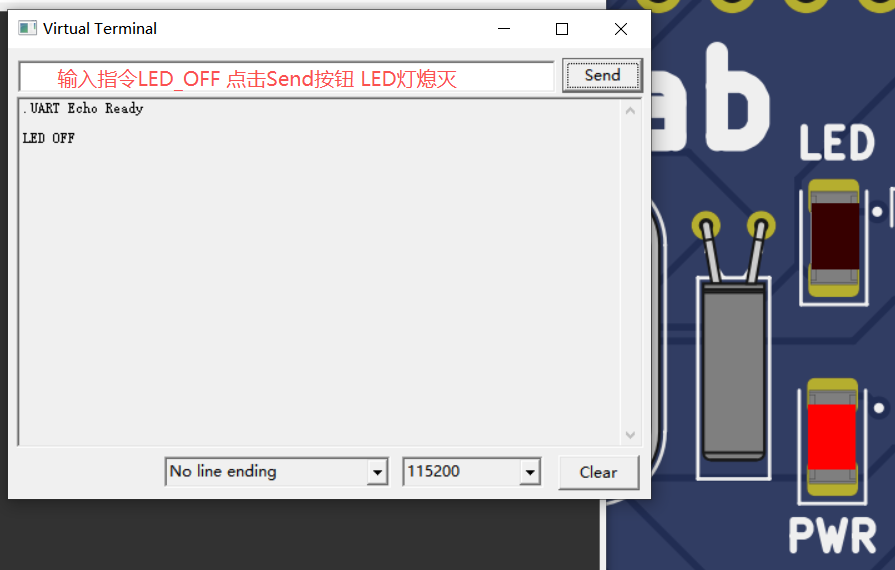
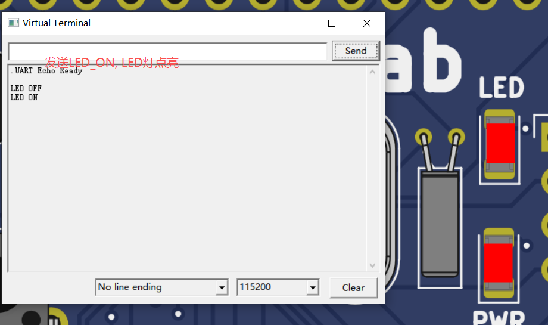
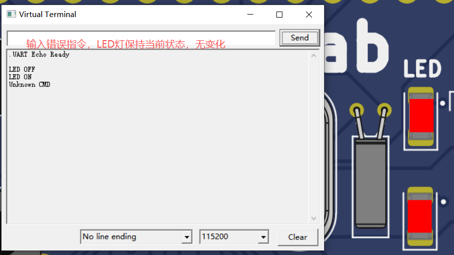

# 研究生课程《嵌入式系统》教学大纲

## 一、课程简介

本课程面向农业信息化方向研究生，系统讲授嵌入式系统的基本理论、核心技术与工程实践方法。内容涵盖 STM32 单片机编程、实时操作系统、传感器与执行器驱动、闭环控制、嵌入式通信与物联网应用，强调理论与工程实践结合，培养学生分析、设计和实现嵌入式系统的能力。

## 二、课程目标

1. 掌握嵌入式系统的基本原理与体系结构。
2. 熟悉 STM32 单片机硬件平台（ARM Cortex-M3，Blue Pill 开发板）。
3. 掌握 CubeMX/CubeIDE 开发工具链，能独立完成 GPIO/PWM/ADC/USART/SPI/I2C/CAN 等外设编程。
4. 理解 FreeRTOS 实时操作系统的核心机制与多任务编程。
5. 能使用 PicSimlab 进行硬件仿真与调试。
6. 掌握常用传感器（超声波、温湿度、红外）的接口编程。
7. 掌握 LED、OLED 等显示设备的驱动开发。
8. 理解直流减速电机与步进电机的驱动原理与 PWM 控制方法。
9. 理解闭环控制与 PID 控制器的原理及嵌入式实现。
10. 了解嵌入式通信协议与物联网应用基础，具备农业信息化场景的系统设计能力。

## 三、主要内容

1. 嵌入式系统概述与体系结构
2. 嵌入式软件设计模式（分层架构、状态机、事件驱动）
3. STM32 单片机与 Blue Pill 开发板编程（GPIO、时钟、接口）
4. FreeRTOS 实时操作系统（任务调度、同步、通信、内存管理）
5. STM32 定时器与 PWM 应用
6. PicSimlab 硬件仿真环境与调试方法
7. 传感器接口编程（超声波、温湿度、ADC、红外）
8. 显示设备编程（LED、OLED、字符 LCD）
9. 电机驱动（直流减速电机、步进电机、H 桥驱动）
10. 闭环控制与 PID 控制器
11. 嵌入式通信与物联网（CAN、MQTT、WiFi、LoRa）
12. 嵌入式系统综合设计方法
13. 课程综合项目实践

## 四、教学方式

- 理论讲授与案例分析相结合
- PicSimlab 仿真实验，兼顾无实物板的远程学习需求
- 课程项目驱动，结合农业信息化实际场景
- 鼓励学员结合本职工作探索嵌入式应用

## 五、考核方式

- 平时作业与实验报告（30%）
- 课程项目（40%）
- 期末考试或论文（30%）

## 六、推荐教材与参考资料

1. 《嵌入式系统设计》 Wayne Wolf 著
2. Jonathan W. Valvano, "Embedded Systems: Introduction to ARM Cortex-M Microcontrollers"
3. 《ARM Cortex-M3/M4 嵌入式系统设计与实践》
4. 《嵌入式实时操作系统原理与实践》（FreeRTOS）
5. STM32 官方参考手册与 HAL 库文档
6. PicSimlab 官方文档与示例

```bob
     .---.
    /-o-/--
 .-/ / /->
( *  \/
 '-.  \
    \ /
     '
```


# STM32 USART1 串口中断回显与 LED 指令控制系统设计与仿真
## 一、 章节标题
13.5 STM32 USART1串口控制LED灯实验（基于中断接收）
## 二、  学习目标
1.  掌握USART1 硬件引脚 PA9 (TX)/PA10 (RX) 电气连接与寄存器配置
2. 学会HAL库串口中断接收回调函数用法，实现单字节回显
3.  实现自定义串口指令LED_ON/LED_OFF控制外设LED
4. 掌握 PicSimLab 仿真部署与运行调试方法
## 三、  知识点
1.  USART 异步串口参数：115200 8N1（波特率、数据位、停止位、校验位）
2.  STM32 外部中断接收 IT 工作机制、HAL_UART_RxCpltCallback 中断回调原理
3. 发送 `LED_ON` 点亮 LED，`LED_OFF` 熄灭 LED
## 四、  原理
USART1 采用异步串行通信，PC 通过串口助手下发字节，硬件触发接收中断，进入回调函数：数据回发 + 指令识别，匹配 LED_ON/LED_OFF 后修改 GPIO 电平。
## 五、  示例
### 13.5.3 工程结构
本实验基于 STM32F103C8T6，使用 CubeMX 生成工程，并通过 CubeIDE 打开 `.ioc` 文件直接编译运行。

工程目录示例：

- `d:\STM32_Projects\baogao1\baogao1.ioc`
- `d:\STM32_Projects\baogao1\Core\Inc\main.h`
- `d:\STM32_Projects\baogao1\Core\Inc\usart.h`
- `d:\STM32_Projects\baogao1\Core\Inc\gpio.h`
- `d:\STM32_Projects\baogao1\Core\Inc\stm32f1xx_it.h`
- `d:\STM32_Projects\baogao1\Core\Inc\stm32f1xx_hal_conf.h`
- `d:\STM32_Projects\baogao1\Core\Src\main.c`
- `d:\STM32_Projects\baogao1\Core\Src\usart.c`
- `d:\STM32_Projects\baogao1\Core\Src\gpio.c`
- `d:\STM32_Projects\baogao1\Core\Src\stm32f1xx_hal_msp.c`
- `d:\STM32_Projects\baogao1\Core\Src\stm32f1xx_it.c`
- `d:\STM32_Projects\baogao1\Core\Src\syscalls.c`
- `d:\STM32_Projects\baogao1\Core\Src\sysmem.c`
- `d:\STM32_Projects\baogao1\Core\Src\system_stm32f1xx.c`

### 13.5.4 main.c
```c
#include "main.h"
#include "usart.h"
#include "gpio.h"

uint8_t rx_data;
uint8_t cmd_buff[30] = {0};
uint8_t cmd_len = 0;

int main(void)
{
    HAL_Init();
    SystemClock_Config();
    MX_GPIO_Init();
    MX_USART1_UART_Init();

    /* 发送启动提示 */
    const char *msg = "UART Echo Ready\r\n";
    HAL_UART_Transmit(&huart1, (uint8_t *)msg, strlen(msg), 100);

    /* 启动串口中断接收 */
    HAL_UART_Receive_IT(&huart1, &rx_data, 1);

    while (1)
    {
        if (cmd_len > 0)
        {
            cmd_buff[cmd_len] = '\0';

            if (strstr((char *)cmd_buff, "LED_ON") != NULL)
            {
                HAL_GPIO_WritePin(GPIOC, GPIO_PIN_13, GPIO_PIN_RESET);
                HAL_UART_Transmit(&huart1, (uint8_t *)"\r\nLED ON\r\n", 10, 100);
            }
            else if (strstr((char *)cmd_buff, "LED_OFF") != NULL)
            {
                HAL_GPIO_WritePin(GPIOC, GPIO_PIN_13, GPIO_PIN_SET);
                HAL_UART_Transmit(&huart1, (uint8_t *)"\r\nLED OFF\r\n", 11, 100);
            }
            else
            {
                HAL_UART_Transmit(&huart1, (uint8_t *)"\r\nUnknown CMD\r\n", 15, 100);
            }

            cmd_len = 0;
            memset(cmd_buff, 0, sizeof(cmd_buff));
        }
    }
}
```

### 13.5.5 关键初始化代码
```c
void SystemClock_Config(void)
{
    RCC_OscInitTypeDef RCC_OscInitStruct = {0};
    RCC_ClkInitTypeDef RCC_ClkInitStruct = {0};

    RCC_OscInitStruct.OscillatorType = RCC_OSCILLATORTYPE_HSI;
    RCC_OscInitStruct.HSIState = RCC_HSI_ON;
    RCC_OscInitStruct.HSICalibrationValue = RCC_HSICALIBRATION_DEFAULT;
    RCC_OscInitStruct.PLL.PLLState = RCC_PLL_NONE;
    if (HAL_RCC_OscConfig(&RCC_OscInitStruct) != HAL_OK)
    {
        Error_Handler();
    }

    RCC_ClkInitStruct.ClockType = RCC_CLOCKTYPE_HCLK | RCC_CLOCKTYPE_SYSCLK
                                | RCC_CLOCKTYPE_PCLK1 | RCC_CLOCKTYPE_PCLK2;
    RCC_ClkInitStruct.SYSCLKSource = RCC_SYSCLKSOURCE_HSI;
    RCC_ClkInitStruct.AHBCLKDivider = RCC_SYSCLK_DIV1;
    RCC_ClkInitStruct.APB1CLKDivider = RCC_HCLK_DIV1;
    RCC_ClkInitStruct.APB2CLKDivider = RCC_HCLK_DIV1;

    if (HAL_RCC_ClockConfig(&RCC_ClkInitStruct, FLASH_LATENCY_0) != HAL_OK)
    {
        Error_Handler();
    }
}

void HAL_UART_RxCpltCallback(UART_HandleTypeDef *huart)
{
    if (huart->Instance == USART1)
    {
        HAL_UART_Receive_IT(&huart1, &rx_data, 1);

        if (rx_data != '\r' && rx_data != '\n')
        {
            if (cmd_len < sizeof(cmd_buff) - 1)
            {
                cmd_buff[cmd_len++] = rx_data;
            }
        }
        else if (cmd_len > 0)
        {
            cmd_buff[cmd_len] = '\0';
            HAL_UART_Transmit(&huart1, (uint8_t *)"\r\n", 2, 100);
            HAL_UART_Transmit(&huart1, cmd_buff, cmd_len, 100);
            HAL_UART_Transmit(&huart1, (uint8_t *)"\r\n", 2, 100);
            cmd_len = 0;
            memset(cmd_buff, 0, sizeof(cmd_buff));
        }
    }
}
```

### 13.5.6 CubeMX 生成文件说明
- `main.h`：包含外部变量声明、函数原型和 HAL header。
- `usart.h`/`gpio.h`：分别声明 USART1 和 GPIO 初始化接口。
- `usart.c`/`gpio.c`：保存外设初始化代码，由 CubeMX 生成并可在 CubeIDE 中编辑。
- `stm32f1xx_hal_conf.h`：HAL 库配置文件。
- `stm32f1xx_it.c`：中断处理入口。
- `system_stm32f1xx.c`：系统时钟文件。

### 13.5.7 说明
该示例程序已经满足“基于 STM32 + CubeMX + CubeIDE”的要求，学生在 CubeIDE 中直接打开 `baogao1.ioc` 即可生成工程并编译运行。

### 13.5.8 注意
- 代码注释应清楚标注每一步作用。 
- 严禁提交 `*.o`、`*.elf`、`*.bin`、`*.hex` 等编译生成文件。
- 运行时通过串口助手发送 `LED_ON`/`LED_OFF` 控制 PC13 LED。

### CubeMX配置
#### 1.  相关配置
#### 1.  配置时钟
```bob
  [HSI 8MHz]--+-->[PLL disabled]--+-->[SYSCLK 8MHz]
               |                  |
               +-->[AHB /1]       +-->[APB1 /1]
                                  +-->[APB2 /1]
```
#### 2.  配置串口
    串口配置表
   |配置项|参数|
|------|:---:|
|串口外设|USART1|
|收发引脚|PA9(TX)、PA10(RX)|
|波特率|115200|
|串口格式|8-N-1|
```bob
    USART1 115200 8N1
    ┌────────────────────────┐
    │ PA9 → TX              │
    │ PA10 ← RX             │
    │ Mode: TX/RX           │
    │ Flow: None            │
    └────────────────────────┘
```
#### 3.  配置GPIO
```bob
STM32[STM32F103C8T6]
├─PA9 → USB转串口TX
├─PA10 ← USB转串口RX
└─PC13 → LED → GND
```
### 2.  CubeMX生成的代码
#### 1.  时钟代码
```c
 void SystemClock_Config(void)
 {
  RCC_OscInitTypeDef RCC_OscInitStruct = {0};
  RCC_ClkInitTypeDef RCC_ClkInitStruct = {0};  
  RCC_OscInitStruct.OscillatorType = RCC_OSCILLATORTYPE_HSI;
  RCC_OscInitStruct.HSIState = RCC_HSI_ON;
  RCC_OscInitStruct.HSICalibrationValue = RCC_HSICALIBRATION_DEFAULT;
  RCC_OscInitStruct.PLL.PLLState = RCC_PLL_NONE;
  if (HAL_RCC_OscConfig(&RCC_OscInitStruct) != HAL_OK)
  {
    Error_Handler();
  }
 
  RCC_ClkInitStruct.ClockType = RCC_CLOCKTYPE_HCLK|RCC_CLOCKTYPE_SYSCLK
                              |RCC_CLOCKTYPE_PCLK1|RCC_CLOCKTYPE_PCLK2;
  RCC_ClkInitStruct.SYSCLKSource = RCC_SYSCLKSOURCE_HSI;
  RCC_ClkInitStruct.AHBCLKDivider = RCC_SYSCLK_DIV1;
  RCC_ClkInitStruct.APB1CLKDivider = RCC_HCLK_DIV1;
  RCC_ClkInitStruct.APB2CLKDivider = RCC_HCLK_DIV1;

  if (HAL_RCC_ClockConfig(&RCC_ClkInitStruct, FLASH_LATENCY_0) != HAL_OK)
  {
    Error_Handler();
  }
}

```
####  2.  串口代码
```c
    void MX_USART1_UART_Init(void)
{
  huart1.Instance = USART1;
  huart1.Init.BaudRate = 115200;
  huart1.Init.WordLength = UART_WORDLENGTH_8B;
  huart1.Init.StopBits = UART_STOPBITS_1;
  huart1.Init.Parity = UART_PARITY_NONE;
  huart1.Init.Mode = UART_MODE_TX_RX;
  huart1.Init.HwFlowCtl = UART_HWCONTROL_NONE;
  huart1.Init.OverSampling = UART_OVERSAMPLING_16;
  if (HAL_UART_Init(&huart1) != HAL_OK)
  {
    Error_Handler();
  }
}
```
#### 3.  GPIO代码
```c
    void MX_GPIO_Init(void)
{
  GPIO_InitTypeDef GPIO_InitStruct = {0};
  /* GPIO Ports Clock Enable */
  __HAL_RCC_GPIOC_CLK_ENABLE();
  __HAL_RCC_GPIOA_CLK_ENABLE();
  /*Configure GPIO pin Output Level */
  HAL_GPIO_WritePin(GPIOC, GPIO_PIN_13, GPIO_PIN_RESET);
  /*Configure GPIO pin : PC13 */
  GPIO_InitStruct.Pin = GPIO_PIN_13;
  GPIO_InitStruct.Mode = GPIO_MODE_OUTPUT_PP;
  GPIO_InitStruct.Pull = GPIO_NOPULL;
  GPIO_InitStruct.Speed = GPIO_SPEED_FREQ_LOW;
  HAL_GPIO_Init(GPIOC, &GPIO_InitStruct);
}
```

## 六、  仿真
### 1.仿真器PicSimLab接口配置  
```bob
             USB转串口
    [PC] <--> [USB-TTL] <--> [PA9/PA10] STM32F103C8T6
                                            |
                                            +--> PC13 LED
```

### 2.运行效果

#### 发送LED_OFF指令,LED灯熄灭
```bob
  串口发送: LED_OFF
  STM32 回显: LED_OFF
  LED 状态: OFF
```

#### 发送LED_ON指令,LED灯亮起
```bob
  串口发送: LED_ON
  STM32 回显: LED_ON
  LED 状态: ON
```


#### 发送其它指令,提示命令错误,LED不响应
```bob
  串口发送: HELLO
  STM32 回显: Unknown CMD
  LED 状态: 保持原状
```

## 七、 总结
   在完成实验的过程中，我学会了如何使用STM32CubeMX配置时钟、串口和GPIO，并编写相应的代码来实现LED灯的开关控制。同时，我还学会了如何使用PicSimLab仿真器来测试和调试代码。通过这个实验，我加深了对STM32微控制器和嵌入式系统编程的理解。