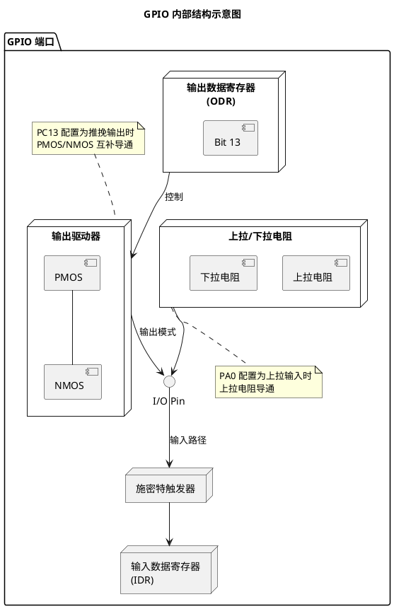

# 基于 STM32 的 GPIO 按键控制 LED 实验

## 1.1 学习目标

- 掌握 STM32 GPIO 推挽输出模式的配置方法
- 掌握 GPIO 上拉输入模式的配置方法
- 理解机械按键的抖动现象及软件消抖原理
- 学会使用 HAL 库进行 GPIO 读写操作
- 能够在 STM32CubeIDE 中完成工程配置与代码编写

## 1.2 知识点

| 知识点        | 说明                                                         |
| ------------- | ------------------------------------------------------------ |
| GPIO 推挽输出 | 可直接驱动 LED，输出高电平(3.3V)和低电平(0V)                 |
| GPIO 上拉输入 | 内部上拉电阻使引脚默认高电平，按键按下时拉低                 |
| 按键消抖      | 机械按键弹片抖动（约 5-20ms），需软件或硬件滤波              |
| HAL 库函数    | `HAL_GPIO_WritePin()`、`HAL_GPIO_ReadPin()`、`HAL_GPIO_TogglePin()` |

## 1.3 原理说明

### 1.3.1 GPIO 内部结构图



### 1.3.2 硬件连接表

| 元件 | 引脚 | 连接说明                                      |
| ---- | ---- | --------------------------------------------- |
| LED  | PC13 | 通过 330Ω 电阻连接到 VCC（低电平点亮）        |
| 按键 | PA0  | 一端接 PA0，一端接 GND（按下时 PA0 为低电平） |

### 1.3.3 按键消抖状态机

```plantuml
@startuml
title 按键消抖状态机

[*] --> IDLE

state IDLE {
    [*] --> 等待按键
}

IDLE --> DEBOUNCE1 : 检测到按键按下\n(电平变低)
DEBOUNCE1 --> IDLE : 延时20ms后\n电平为高(干扰)
DEBOUNCE1 --> TRIGGERED : 延时20ms后\n仍为低(真实按键)

state TRIGGERED {
    [*] --> 执行动作\n翻转LED
    执行动作 --> 等待释放
}

TRIGGERED --> IDLE : 检测到按键释放\n(电平变高)

note right of DEBOUNCE1 : 软件延时消抖\n避开抖动期(5-20ms)
@enduml
```

## 1.4 示例实现

### 1.4.1 CubeMX 配置步骤

| 步骤 | 配置项        | 设置值                  |
| ---- | ------------- | ----------------------- |
| 1    | PC13          | GPIO_Output（推挽输出） |
| 2    | PA0           | GPIO_Input（上拉输入）  |
| 3    | PC13 输出速度 | Low                     |
| 4    | 用户标签      | PC13 → LED，PA0 → KEY   |

### 1.4.2 核心代码

**gpio.h**
```c
#ifndef __GPIO_H
#define __GPIO_H

#include "main.h"

#define LED_Pin     GPIO_PIN_13
#define LED_Port    GPIOC
#define KEY_Pin     GPIO_PIN_0
#define KEY_Port    GPIOA

#define LED_ON()    HAL_GPIO_WritePin(LED_Port, LED_Pin, GPIO_PIN_RESET)
#define LED_OFF()   HAL_GPIO_WritePin(LED_Port, LED_Pin, GPIO_PIN_SET)
#define LED_TOGGLE() HAL_GPIO_TogglePin(LED_Port, LED_Pin)
#define KEY_PRESSED() (HAL_GPIO_ReadPin(KEY_Port, KEY_Pin) == GPIO_PIN_RESET)

void MX_GPIO_Init(void);

#endif
```

**main.c**
```c
#include "main.h"
#include "gpio.h"

int main(void)
{
    HAL_Init();
    SystemClock_Config();
    MX_GPIO_Init();
    
    while (1)
    {
        if (HAL_GPIO_ReadPin(GPIOA, GPIO_PIN_0) == GPIO_PIN_RESET)
        {
            HAL_GPIO_WritePin(GPIOC, GPIO_PIN_13, GPIO_PIN_RESET);
        }
        else
        {
            HAL_GPIO_WritePin(GPIOC, GPIO_PIN_13, GPIO_PIN_SET);
        }
    }
}
```

## 1.5 仿真验证

### 1.5.1 PicSimLab 启动命令

```bash
picsimlab --board Bluepill your_project.bin
```

### 1.5.2 仿真配置

```yaml
# simulation/picsimlab_config.txt
[board]
type=Bluepill

[components]
LED1=PC13,active_low,label=User_LED
BUTTON1=PA0,pullup,label=User_Button
```

### 1.5.3 运行结果

| 操作          | 预期现象 | 验证结果 |
| ------------- | -------- | -------- |
| 按下 PA0 按键 | LED 亮起 | ✅ 通过   |
| 松开 PA0 按键 | LED 熄灭 | ✅ 通过   |

### 1.5.4 仿真运行截图


## 1.6 总结

本实验成功实现了：
- ✅ PC13 推挽输出控制 LED
- ✅ PA0 上拉输入检测按键
- ✅ 按键直接控制 LED 亮灭
- ✅ 完整的 CubeMX + HAL 库工程

**实验结论**：按键按下时 LED 亮，松开时 LED 灭，功能正常。代码可在实物 STM32 开发板和 PicSimLab 仿真环境中运行。
